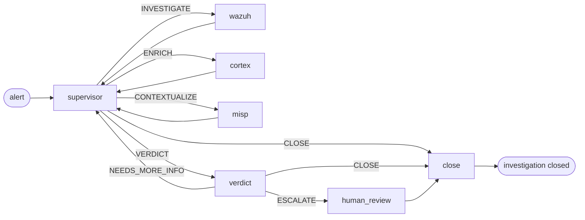

# AI pipeline

What happens between "an alert lands" and "a verdict gets written." SocTalk's triage layer is a LangGraph state machine, a supervisor that routes work to specialist worker nodes, then a verdict node that decides whether the case needs human review.

This page is the mental model. The code lives in [`src/soctalk/graph/`](https://github.com/soctalk/soctalk/tree/main/src/soctalk/graph), [`src/soctalk/supervisor/`](https://github.com/soctalk/soctalk/tree/main/src/soctalk/supervisor), and [`src/soctalk/workers/`](https://github.com/soctalk/soctalk/tree/main/src/soctalk/workers).

## Nodes

| Node | Purpose | Model used |
|---|---|---|
| **supervisor** | Decides what to do next. Pure routing, does no domain work itself. | fast model |
| **wazuh_worker** | Pulls the alert in context, extracts observables (IPs, hashes, users, processes), correlates with recent alerts in the same tenant. | fast model |
| **cortex_worker** | Sends observables to Cortex analyzers (VirusTotal, AbuseIPDB, etc.) for reputation/enrichment. | fast model |
| **misp_worker** | Looks up observables against MISP threat-intel feeds for known campaign / actor context. | fast model |
| **verdict** | Reasons over everything the workers gathered. Outputs `escalate | close | needs_more_info` + confidence + a short rationale. | **reasoning model** |
| **human_review** | Pauses the run; emits a review request to the dashboard queue and/or Slack. Waits on a `HumanDecision` (`approve | reject | more_info`). | (humans) |
| **thehive_worker** | Optional, on the human-review path: exports the case to TheHive (case + observables) synchronously via MCP before close. See [TheHive](/integrate/thehive) for exactly what's exported and the V1 caveats (no outbox/retry). | (deterministic) |
| **close** | Generates the closure report and writes the disposition (`close_fp | escalate | leave_open`). **In V1 the close node itself does not post to outbound integrations**: TheHive export happens in the dedicated `thehive_worker` node above, and Slack webhook posting from close is not wired. Further outbound integration from the close node is on the roadmap. | fast model |

## Supervisor routing

The supervisor's only job is to pick the next node. Its decision space is a fixed 5-element enum:

| Decision | Means |
|---|---|
| `INVESTIGATE` | I don't know enough about this alert yet. Run the Wazuh worker. |
| `ENRICH` | I have observables I haven't reputation-checked. Run Cortex. |
| `CONTEXTUALIZE` | The observables look interesting; check for known campaigns/actors. Run MISP. |
| `VERDICT` | I have enough. Hand to the verdict node. |
| `CLOSE` | This is a clear-cut case (e.g., obvious false positive or already-resolved alert). Skip the verdict node. |

The supervisor never invokes external tools itself. It reads the accumulated `SecOpsState` (alerts, observables, prior worker outputs, verdicts) and outputs one of the five decisions. Most cases cycle supervisor → worker → supervisor → worker → supervisor → VERDICT, three to six hops total.

## Verdict node

The reasoning model gets the whole accumulated state, original alert, every worker's findings, all observables with their enrichment, prior verdict attempts (if `NEEDS_MORE_INFO` looped). It outputs:

| Field | Type |
|---|---|
| `decision` | `escalate | close | needs_more_info` |
| `confidence` | enum: `low | medium | high` |
| `rationale` | short markdown |
| `evidence_strength` | `weak | moderate | strong | conclusive` |
| `verdict` | `benign | suspicious | malicious | unknown` |
| `impact` | `low | medium | high | critical` |

`escalate` always goes through `human_review`. `close` skips human review and goes straight to `close`. `needs_more_info` returns to the supervisor with a prompt suggesting what's still missing.

## Human review gate

`human_review` pauses the run. The case appears in the [Review queue](/mssp-ui#reviews-human-in-the-loop) on the dashboard and (if Slack is configured) on the [Slack two-way HIL](/human-review). The human picks:

| Decision | Effect on the case |
|---|---|
| `approve` | Pending review marked completed + feedback audited. **Not** auto-resumed; analyst follow-up. |
| `reject` | Case closes as `auto_closed_fp`. Terminal, graph is not re-invoked. |
| `more_info` | Review marked `info_requested` with the questions list. **Not** auto-resumed; analyst follow-up. |

The human's identity, timestamp, and rationale are appended to the case's append-only `case_events` log.

## Run lifecycle

A "run" is one execution of the graph against one case. Status enum:

| Status | Means |
|---|---|
| `active` | Graph is executing. |
| `waiting_on_gate` | Paused at `human_review`. |
| `paused` | Manually paused by an MSSP admin. |
| `halted_budget` | Hit the per-run token budget. Normal V1 runs pick up `tokens_budget = 200,000` from the `case_runs` row (model default). The `SOCTALK_CASE_RUN_TOKEN_BUDGET` env (default 15,000) is only used as a fallback when the row has no value set. |
| `completed` | Graph reached `close` and wrote a disposition. |
| `failed` | Graph errored or external tool unreachable. |

Token budgets are tracked per-run, per-tenant, and install-wide. See [Observability](/observability) for the metrics, [LLM providers](/integrate/llm-providers) for the cost knobs.

## The runs-worker process

Each tenant has its own `runs-worker` pod (in the `tenant-<slug>` namespace) that consumes the queue:

1. Calls `POST /api/internal/worker/runs/claim` for a run assigned to its tenant.
2. Builds the LangGraph from the chart of nodes.
3. `ainvoke()` against the graph, posting `POST /api/internal/worker/runs/{run_id}/heartbeat` every 20 s.
4. On completion, posts the final state and disposition to `POST /api/internal/worker/runs/{run_id}/complete`.

The runs-worker is the only per-tenant compute pod, keeping it in the tenant namespace means an over-budget tenant can't starve the rest of the install for compute. The supervisor + worker + verdict logic itself is stateless; the heavy lifting is the LLM calls (out of cluster, billed to the tenant's configured provider).

## Source pointers

| Concept | File |
|---|---|
| Graph builder + routing | [`src/soctalk/graph/builder.py`](https://github.com/soctalk/soctalk/blob/main/src/soctalk/graph/builder.py) |
| Supervisor logic | [`src/soctalk/supervisor/node.py`](https://github.com/soctalk/soctalk/blob/main/src/soctalk/supervisor/node.py) |
| Verdict node | [`src/soctalk/supervisor/verdict.py`](https://github.com/soctalk/soctalk/blob/main/src/soctalk/supervisor/verdict.py) |
| Worker nodes | [`src/soctalk/workers/`](https://github.com/soctalk/soctalk/tree/main/src/soctalk/workers) |
| Closure / disposition | [`src/soctalk/graph/close.py`](https://github.com/soctalk/soctalk/blob/main/src/soctalk/graph/close.py) |
| Runs worker loop | [`src/soctalk/runs_worker/main.py`](https://github.com/soctalk/soctalk/blob/main/src/soctalk/runs_worker/main.py) |
| State schema | [`src/soctalk/models/state.py`](https://github.com/soctalk/soctalk/blob/main/src/soctalk/models/state.py) |
