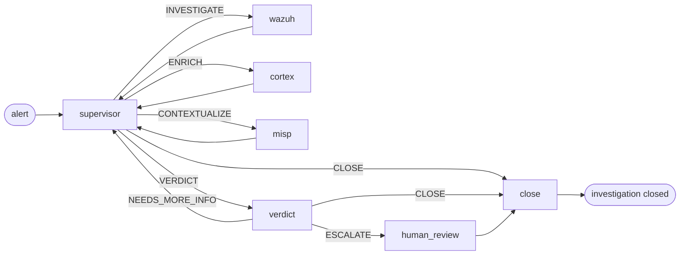

# KI-Pipeline

Was zwischen "eine Warnung trifft ein" und "ein Verdikt wird geschrieben" passiert. Die Triage-Schicht von SocTalk ist eine LangGraph-Zustandsmaschine, ein Supervisor, der Arbeit an spezialisierte Worker-Knoten weiterleitet, gefolgt von einem Verdikt-Knoten, der entscheidet, ob der Fall eine menschliche Prüfung benötigt.

Diese Seite ist das mentale Modell. Der Code liegt in [`src/soctalk/graph/`](https://github.com/soctalk/soctalk/tree/main/src/soctalk/graph), [`src/soctalk/supervisor/`](https://github.com/soctalk/soctalk/tree/main/src/soctalk/supervisor) und [`src/soctalk/workers/`](https://github.com/soctalk/soctalk/tree/main/src/soctalk/workers).

## Knoten

| Knoten | Zweck | Verwendetes Modell |
|---|---|---|
| **supervisor** | Entscheidet, was als Nächstes zu tun ist. Reines Routing, verrichtet selbst keine Facharbeit. | schnelles Modell |
| **wazuh_worker** | Ruft die Warnung im Kontext ab, extrahiert Observables (IPs, Hashes, Benutzer, Prozesse) und korreliert sie mit aktuellen Warnungen desselben Mandanten. | schnelles Modell |
| **cortex_worker** | Sendet Observables an Cortex-Analyzer (VirusTotal, AbuseIPDB usw.) zur Reputationsprüfung/Anreicherung. | schnelles Modell |
| **misp_worker** | Schlägt Observables gegen MISP-Threat-Intel-Feeds nach, um bekannten Kampagnen-/Akteur-Kontext zu finden. | schnelles Modell |
| **verdict** | Argumentiert über alles, was die Worker gesammelt haben. Gibt `escalate | close | needs_more_info` + Konfidenz + eine kurze Begründung aus. | **Reasoning-Modell** |
| **human_review** | Pausiert den Lauf; sendet eine Prüfungsanfrage an die Dashboard-Warteschlange und/oder an Slack. Wartet auf eine `HumanDecision` (`approve | reject | more_info`). |, (Menschen) |
| **close** | Erzeugt den Abschlussbericht und schreibt die Disposition (`close_fp | escalate | leave_open`). **In V1 postet der close-Knoten nicht an ausgehende Integrationen.** Kein Graph-Knoten postet in V1 derzeit an TheHive (der `thehive_worker`-Knoten, der in früheren Entwürfen erwähnt wurde, ist nicht in den V1-Graph-Builder verdrahtet). Auch das Posten per Slack-Webhook aus close ist nicht verdrahtet. Die ausgehende Integration vom close-Knoten steht auf der Roadmap. | schnelles Modell |

## Supervisor-Routing

Die einzige Aufgabe des Supervisors ist es, den nächsten Knoten auszuwählen. Sein Entscheidungsraum ist ein festes Enum mit 5 Elementen:

| Entscheidung | Bedeutung |
|---|---|
| `INVESTIGATE` | Ich weiß noch nicht genug über diese Warnung. Führe den Wazuh-Worker aus. |
| `ENRICH` | Ich habe Observables, deren Reputation ich noch nicht geprüft habe. Führe Cortex aus. |
| `CONTEXTUALIZE` | Die Observables sehen interessant aus; prüfe auf bekannte Kampagnen/Akteure. Führe MISP aus. |
| `VERDICT` | Ich habe genug. Übergib an den Verdikt-Knoten. |
| `CLOSE` | Dies ist ein eindeutiger Fall (z. B. offensichtlicher Falsch-Positiv oder bereits gelöste Warnung). Überspringe den Verdikt-Knoten. |

Der Supervisor ruft selbst niemals externe Tools auf. Er liest den akkumulierten `SecOpsState` (Warnungen, Observables, vorherige Worker-Ausgaben, Verdikte) und gibt eine der fünf Entscheidungen aus. Die meisten Fälle durchlaufen den Zyklus supervisor → worker → supervisor → worker → supervisor → VERDICT, insgesamt drei bis sechs Sprünge.

## Verdikt-Knoten

Das Reasoning-Modell erhält den gesamten akkumulierten Zustand, die ursprüngliche Warnung, die Erkenntnisse jedes Workers, alle Observables mit ihrer Anreicherung sowie vorherige Verdikt-Versuche (falls eine `NEEDS_MORE_INFO`-Schleife durchlaufen wurde). Es gibt aus:

| Feld | Typ |
|---|---|
| `decision` | `escalate | close | needs_more_info` |
| `confidence` | Enum: `low | medium | high` |
| `rationale` | kurzes Markdown |
| `evidence_strength` | `weak | moderate | strong | conclusive` |
| `verdict` | `benign | suspicious | malicious | unknown` |
| `impact` | `low | medium | high | critical` |

`escalate` läuft immer über `human_review`. `close` überspringt die menschliche Prüfung und geht direkt zu `close`. `needs_more_info` kehrt zum Supervisor zurück, mit einem Prompt, der vorschlägt, was noch fehlt.

## Gate für menschliche Prüfung

`human_review` pausiert den Lauf. Der Fall erscheint in der [Prüfungs-Warteschlange](/de-de/mssp-ui#reviews-human-in-the-loop) im Dashboard und (falls Slack konfiguriert ist) im [Slack-Zwei-Wege-HIL](/de-de/human-review). Der Mensch wählt:

| Entscheidung | Auswirkung auf den Fall |
|---|---|
| `approve` | Ausstehende Prüfung als abgeschlossen markiert + Feedback auditiert. Wird **nicht** automatisch fortgesetzt; Nachbearbeitung durch Analyst. |
| `reject` | Fall wird als `auto_closed_fp` geschlossen. Terminal, der Graph wird nicht erneut aufgerufen. |
| `more_info` | Prüfung als `info_requested` mit der Fragenliste markiert. Wird **nicht** automatisch fortgesetzt; Nachbearbeitung durch Analyst. |

Die Identität, der Zeitstempel und die Begründung des Menschen werden an das nur-anfügbare `case_events`-Log des Falls angehängt.

## Lauf-Lebenszyklus

Ein "Lauf" ist eine Ausführung des Graphen gegen einen Fall. Status-Enum:

| Status | Bedeutung |
|---|---|
| `active` | Der Graph wird ausgeführt. |
| `waiting_on_gate` | Pausiert bei `human_review`. |
| `paused` | Manuell von einem MSSP-Administrator pausiert. |
| `halted_budget` | Das Token-Budget pro Lauf wurde erreicht. Normale V1-Läufe übernehmen `tokens_budget = 200,000` aus der `case_runs`-Zeile (Modell-Standard). Die Umgebungsvariable `SOCTALK_CASE_RUN_TOKEN_BUDGET` (Standard 15,000) wird nur als Fallback verwendet, wenn die Zeile keinen Wert gesetzt hat. |
| `completed` | Der Graph hat `close` erreicht und eine Disposition geschrieben. |
| `failed` | Der Graph hat einen Fehler ausgelöst oder ein externes Tool war nicht erreichbar. |

Token-Budgets werden pro Lauf, pro Mandant und installationsweit verfolgt. Siehe [Observability](/de-de/observability) für die Metriken und [LLM-Provider](/de-de/integrate/llm-providers) für die Kosten-Stellschrauben.

## Der runs-worker-Prozess

Jeder Mandant hat seinen eigenen `runs-worker`-Pod (im Namespace `tenant-<slug>`), der die Warteschlange abarbeitet:

1. Ruft `POST /api/internal/worker/runs/claim` für einen seinem Mandanten zugewiesenen Lauf auf.
2. Baut den LangGraph aus der Knoten-Chart auf.
3. `ainvoke()` gegen den Graphen, wobei alle 20 s `POST /api/internal/worker/runs/{run_id}/heartbeat` gepostet wird.
4. Nach Abschluss postet er den Endzustand und die Disposition an `POST /api/internal/worker/runs/{run_id}/complete`.

Der runs-worker ist der einzige Compute-Pod pro Mandant, ihn im Mandanten-Namespace zu halten bedeutet, dass ein Mandant, der sein Budget überschreitet, dem Rest der Installation keine Compute-Ressourcen entziehen kann. Die Supervisor-, Worker- und Verdikt-Logik selbst ist zustandslos; die Schwerarbeit sind die LLM-Aufrufe (außerhalb des Clusters, abgerechnet über den konfigurierten Provider des Mandanten).

## Quell-Verweise

| Konzept | Datei |
|---|---|
| Graph-Builder + Routing | [`src/soctalk/graph/builder.py`](https://github.com/soctalk/soctalk/blob/main/src/soctalk/graph/builder.py) |
| Supervisor-Logik | [`src/soctalk/supervisor/node.py`](https://github.com/soctalk/soctalk/blob/main/src/soctalk/supervisor/node.py) |
| Verdikt-Knoten | [`src/soctalk/supervisor/verdict.py`](https://github.com/soctalk/soctalk/blob/main/src/soctalk/supervisor/verdict.py) |
| Worker-Knoten | [`src/soctalk/workers/`](https://github.com/soctalk/soctalk/tree/main/src/soctalk/workers) |
| Abschluss / Disposition | [`src/soctalk/graph/close.py`](https://github.com/soctalk/soctalk/blob/main/src/soctalk/graph/close.py) |
| Runs-Worker-Schleife | [`src/soctalk/runs_worker/main.py`](https://github.com/soctalk/soctalk/blob/main/src/soctalk/runs_worker/main.py) |
| Zustands-Schema | [`src/soctalk/models/state.py`](https://github.com/soctalk/soctalk/blob/main/src/soctalk/models/state.py) |
