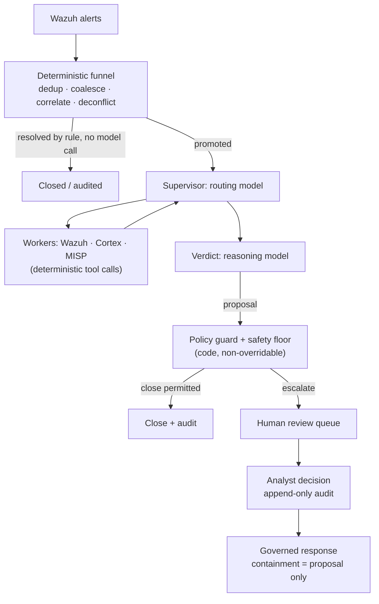

# AI-Triage für Wazuh-Warnungen: Was in Produktion funktioniert (und was nicht)

Jeder Wazuh-Betreiber hatte schon dieselbe Idee: Der Manager produziert Tausende Warnungen pro Tag, die meisten davon sind Rauschen, und ein LLM ist sehr gut darin, eine Warnung zu lesen und zu sagen „das ist ein Brute-Force-Versuch“ oder „das ist ein Cron-Job“. Also verdrahten Sie einen Webhook von Wazuh mit einem Workflow-Tool, werfen das Alert-JSON in einen Prompt und posten die Antwort des Modells irgendwohin.

Dieser Prototyp funktioniert. In Produktion scheitert er trotzdem — auf vorhersehbare Weise. Dieser Leitfaden erklärt warum, und beschreibt die Architektur, die standhält, wenn AI-Triage von Wazuh-Warnungen unbeaufsichtigt gegen ein reales Warnungsvolumen laufen muss — die Architektur, die SocTalk implementiert.

## Warum „jede Warnung in ein LLM leiten“ scheitert

Das naive Muster — Wazuh-Webhook → LLM-Prompt → Verdikt — hat drei strukturelle Probleme, von denen sich keines durch besseres Prompting beheben lässt.

**Kosten skalieren mit dem Rauschen, nicht mit dem Signal.** Ein einzelner Scan kann Tausende Warnungen erzeugen. Wenn jede rohe Warnung einen Modellaufruf kostet, sind Ihre Ausgaben proportional dazu, wie laut Ihre Umgebung ist — und der Kostendruck treibt Sie zu schwächeren Modellen genau in den Fällen, in denen Urteilsvermögen am wichtigsten ist.

**Das Modell hat keinen Kontext und keine Untergrenze.** Ein LLM, das eine einzelne Warnung isoliert liest, hat keine Erinnerung daran, was ein Analyst gestern entschieden hat, kein Bild vom Zustand der Organisation selbst — es kann also eine genehmigte Änderung nicht von einem Angriff unterscheiden, der eine byte-identische Warnung erzeugt — und keine Garantie, dass es nicht selbstsicher über einen echten Kompromittierungsindikator hinweg schließt. Ein halluziniertes „gutartig“-Verdikt zu einem echten Einbruch ist kein Qualitätsproblem, das Sie in irgendeiner Rate tolerieren können; es ist eine unterdrückte Detektion.

**Es gibt weder Audit-Trail noch Gate.** Ein Workflow, der das Verdikt des Modells direkt in einen Kanal postet, hat keine Aufzeichnung darüber, auf welchen Beweisen das Verdikt beruhte, keine Prüferidentität und keinen Mechanismus, der verhindert, dass ein schlechtes Verdikt zu einem geschlossenen Fall wird.

Fairerweise: Der Webhook-Prototyp ist ein guter Weg, sich selbst davon zu überzeugen, dass LLMs über Warnungen schlussfolgern können. Was fehlt, ist die *Architektur um* das Modell herum.

## Die Architektur, die funktioniert: ein deterministischer Trichter vor jedem Modellaufruf

Die erste Korrektur ist kontraintuitiv: Der Großteil einer AI-Triage-Pipeline sollte keine AI sein. In SocTalk ist die Ingest-Ebene serverseitig und vollständig deterministisch — kein Modell berührt sie:

- **Deduplizierung** verwirft wiedereingespielte Ereignisse mit einer bereits gesehenen ID.
- **Koaleszierung** fasst wiederholte Warnungen derselben Regel auf demselben Asset innerhalb eines Fünf-Minuten-Fensters zu einem einzigen Fall zusammen — ein Burst einer Detektion wird ein Fall, nicht Tausende.
- **Entitätskorrelation** hängt eine neue Warnung, die eine starke Entität (Host, Datei-Hash) mit einer aktiven Untersuchung teilt, als Beweis an diese an, statt einen frischen, kontextlosen Lauf zu starten.
- **Engagement-Dekonfliktion** gleicht deklarierte Pentest- und Red-Team-Fenster nach Quelle, Host, Technik und Zeit ab — genehmigtes Testen wird markiert und auditiert, nie automatisch geschlossen, und Tester-Aktivität außerhalb des Scopes wird zwingend einem Menschen vorgelegt.
- **Deterministisches Schließen** erledigt Falsch-Positive mit niedrigem Schweregrad und hoher Konfidenz per Regel, ohne Modellaufruf.

Viele Warnungen erreichen nie ein Modell. Was übrig bleibt, wird zu einer Untersuchung befördert, und selbst dann wird das Modell nur in zwei Rollen konsultiert: ein **Supervisor**, der die Untersuchung routet (Host-Kontext aus Wazuh ziehen, Observable-Reputation über Cortex-Analyzer prüfen, MISP-Threat-Intel nachschlagen — alles deterministische Tool-Aufrufe, deren Ergebnisse das Modell nur *liest*), und ein **Verdikt**-Knoten, in dem ein Reasoning-Modell alles Gesammelte abwägt und `escalate`, `close` oder `needs_more_info` mit Konfidenz, Begründung und Beweisstärke vorschlägt.

## Guardrails als Daten, Verdikte hinter Code-Gates

Die zweite Korrektur: Das Verdikt des Modells ist ein Vorschlag, kein Commit. SocTalks Regel lautet: *„Das LLM schlägt vor; ein deterministisches Gate entscheidet.“*

[Triage-Richtlinien](/de-de/triage-policies) sind Daten — deklarative Regeln, ausgeführt von einem einzigen Interpreter — und wirken an vier Gates: einem Resolver, einem Pre-Decision-Gate (ein Verdikt ist erst zulässig, wenn die erforderlichen Beweisschritte gelaufen sind), einem Post-Verdikt-Guard und einem **Safety Floor**. Der Floor liegt auf Code-Ebene und ist nicht überschreibbar, durchgesetzt an drei unabhängigen Punkten (Worker, Server, Ingest). Kein automatisches Schließen kann über einen bekannten IOC, einen widerlegten Autorisierungsdatensatz, einen unverifizierten Indikator, einen aktiven verwandten Vorfall oder einen Kill Switch hinweg feuern — und nicht jenseits der Volumengrenze (Standard: 500 automatische Schließungen pro 24 Stunden). Kill Switches (`SOCTALK_AUTO_CLOSE_KILL` installationsweit oder pro Mandant) verwandeln jedes automatische Schließen sofort in eine Beförderung — der Hebel, nach dem Sie mitten im Vorfall greifen.

Die Eigenschaft, die von Mandanten verfasste Richtlinien sicher macht: Sie können die Triage nur **strenger** machen, nie laxer. Ein Guardrail-Override darf eine Entscheidung nur die Leiter `close < needs_more_info < escalate` hinauf anheben; Unterdrückung ist in der Bedingungssprache nicht ausdrückbar. Diese ist in einer Sandbox eingeschlossen — Bäume mit einem einzigen Operator über einem dokumentierten State-Contract, kein Attributzugriff, keine Funktionsaufrufe, ungültige Richtlinien werden bei der Validierung als Ganzes abgelehnt. Eine fehlkonfigurierte oder feindselige Richtlinie kann nicht zum Kanal für die Unterdrückung von Detektionen werden.

## Human-in-the-Loop ist eine harte Eigenschaft, keine Einstellung

Jedes `escalate`-Verdikt durchläuft die menschliche Prüfung. Es gibt keinen Bypass: Einen reinen AI-„Auto-Approve“-Modus implementiert SocTalk nicht (das Entfernen des Gates ist ein Roadmap-Punkt, geplant als admin-beschränkter, auditierter Schalter — kein stiller Standard). In V1 ist die Prüfoberfläche die Dashboard-Queue, die die vollständige Begründung der AI und die Observable-Beweise samt Anreicherung zeigt. Analystenentscheidungen — genehmigen, ablehnen, mehr Informationen — schreiben Append-only-Audit-Zeilen mit Identität, Zeitstempel und Begründung, nach dem Absenden nie mehr editierbar. Ein vorgeschlagenes Schließen, das ein sensibles Asset berührt (etwa einen PCI-klassifizierten Host), wird selbst bei hoher Modellkonfidenz für die menschliche Freigabe zurückgehalten.

Dieselbe Haltung gilt für die Response: Eine Eindämmungsaktion wie das Isolieren eines Endpoints oder das Deaktivieren eines Kontos wird *immer* als Vorschlag erhoben, den zuerst ein Analyst genehmigt. Das Modell führt nie eigenständig eine Eindämmungsaktion aus, und der Versand geschieht serverseitig, nie aus der Schleife des Modells heraus. SocTalk ist ein Copilot, kein Analystenersatz — der Wert liegt in der Kompression: Dasselbe Analystenteam kann das 5–10-fache Warnungsvolumen bewältigen, weil Routinefälle automatisch schließen und nur die unklaren die menschliche Prüfung erreichen.

## Kosten-Engineering

Weil der Trichter viele Warnungen ohne Modellaufruf auflöst, folgen die Kosten der Mehrdeutigkeit statt dem Volumen. Die verbleibenden Hebel:

- **Fast/Reasoning-Split.** Routing und Worker nutzen ein schnelles Modell; nur das Verdikt nutzt ein Reasoning-Modell. Standard ist `claude-sonnet-4-20250514` für beide, pro Mandant überschreibbar (`SOCTALK_FAST_MODEL` / `SOCTALK_REASONING_MODEL`).
- **Token-Budgets pro Lauf.** Jeder Lauf trägt ein Token-Budget (Modellstandard 200.000), verfolgt pro Lauf, pro Mandant und installationsweit. Eine außer Kontrolle geratene Untersuchung hält an, statt unbegrenzt Kosten zu verursachen.
- **Was kostet das?** Stark variabel, aber als Größenordnung: grob **9 $/Tag pro Mandant** bei ~30 Warnungen/Tag auf einem günstigen OpenAI-kompatiblen Setup, mit einem billigeren schnellen Modell 5–10× weniger. Behandeln Sie das als erste Schätzung, nicht als Angebot.
- **Option ohne Token-Kosten.** Betreiben Sie alles lokal mit [Ollama](/de-de/integrate/ollama): kein Cloud-LLM, keine Kosten pro Token, die Daten bleiben auf Ihrer Infrastruktur. Wählen Sie ein tool-fähiges Modell (qwen2.5, llama3.1, mistral-nemo) — und rechnen Sie damit, dass CPU-Inferenz mit Minuten pro Untersuchung langsam ist; nutzen Sie einen GPU-Host für brauchbare Latenz.

## Eigenes LLM mitbringen (BYO LLM)

SocTalks Laufzeit unterstützt zwei Provider: `anthropic` (Claude) und `openai` — gemeint ist OpenAI oder jeder OpenAI-kompatible Endpunkt: Azure OpenAI, vLLM, Ollama, LiteLLM. Provider, Modell, Basis-URL und API-Schlüssel sind alle **pro Mandant** überschreibbar, und ein Kunde kann für die Abrechnungsisolation seinen eigenen Schlüssel mitbringen — gemountet in den runs-worker des Mandanten als Kubernetes Secret im eigenen Namespace dieses Mandanten. (Eine dokumentierte V1-Ausnahme gilt: Der Schlüssel liegt zusätzlich im Klartext in der SocTalk-Datenbank, `IntegrationConfig.llm_api_key_plain` — siehe [Secrets](/de-de/reference/secrets) zur Sicherheitslage und zu Rotationsempfehlungen.) Das Modell sieht immer nur den aktuellen Untersuchungszustand (Warnungsinhalt, Observables, Worker-Ausgaben); für eine striktere Haltung richten Sie den Mandanten auf einen On-Prem-Endpunkt. Details unter [LLM-Provider](/de-de/integrate/llm-providers).

## So sieht das in SocTalk aus

SocTalk ist eine Apache-2.0-lizenzierte, AI-first SOC-Plattform für MSPs und MSSPs: ein dedizierter Wazuh-Stack pro Kunde auf Ihrem eigenen Kubernetes, hinter einer Control Plane, mit der obigen Triage-Pipeline pro Mandant. Zum Vertiefen:

- [So funktioniert es](/de-de/how-it-works) — die vollständige Pipeline-Geschichte: der deterministische Trichter, die zwei Modellrollen, der Safety Floor an drei Stellen.
- [AI-Pipeline](/de-de/ai-pipeline) — die LangGraph-State-Machine: Supervisor, Worker, Verdikt, Lauf-Lebenszyklus.
- [Triage-Richtlinien](/de-de/triage-policies) — deterministische Guardrails im No-Code-Editor verfassen, Shadow-then-Activate.
- [Menschliche Prüfung](/de-de/human-review) — die Prüf-Queue und der Entscheidungskontrakt für Analysten.

Oder überspringen Sie das Lesen: Die [Demo-VM](/de-de/quickstart-vm) liefert Ihnen in etwa fünf Minuten eine laufende mandantenfähige Installation mit einem bereits onboardeten Demo-Mandanten.
