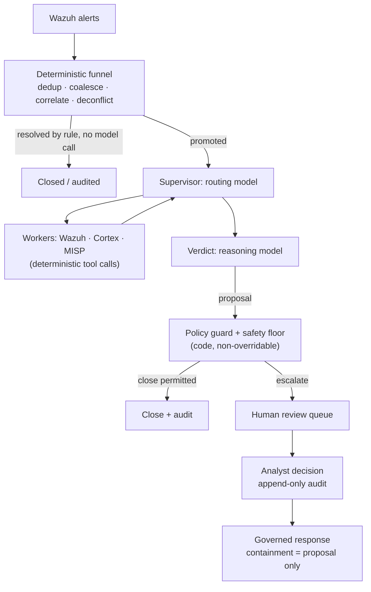

# AI-Triage für Wazuh-Warnungen: was in der Produktion funktioniert (und was nicht)

Jeder Wazuh-Betreiber hatte schon dieselbe Idee: Der Manager erzeugt Tausende Warnungen pro Tag, die meisten davon sind Rauschen, und ein LLM ist sehr gut darin, eine Warnung zu lesen und zu sagen „das ist ein Brute-Force-Versuch“ oder „das ist ein Cronjob“. Also verdrahtet man einen Webhook von Wazuh zu einem Workflow-Tool, packt das JSON der Warnung in einen Prompt und postet die Antwort des Modells irgendwohin.

Dieser Prototyp funktioniert. In der Produktion scheitert er trotzdem, auf vorhersehbare Weise. Dieser Leitfaden erklärt, warum, und beschreibt die Architektur, die standhält, wenn AI-Triage von Wazuh-Warnungen unbeaufsichtigt gegen ein echtes Warnungsvolumen laufen muss. Es ist die Architektur, die SocTalk implementiert.

## Warum „jede Warnung an ein LLM leiten“ scheitert

Das naive Muster (Wazuh-Webhook → LLM-Prompt → Verdikt) hat drei strukturelle Probleme, von denen keines durch besseres Prompting behoben wird.

**Die Kosten skalieren mit dem Rauschen, nicht mit dem Signal.** Ein einzelner Scan kann Tausende Warnungen erzeugen. Wenn jede rohe Warnung einen Modellaufruf kostet, sind Ihre Ausgaben proportional dazu, wie laut Ihre Umgebung ist, und der Kostendruck treibt Sie zu schwächeren Modellen genau in den Fällen, in denen Urteilsvermögen am wichtigsten ist.

**Das Modell hat keinen Kontext und keine Untergrenze.** Ein LLM, das eine Warnung isoliert liest, hat keine Erinnerung daran, was ein Analyst gestern entschieden hat, und kein Bild vom eigenen Zustand der Organisation. Es kann daher eine genehmigte Änderung nicht von einem Angriff unterscheiden, der eine byte-identische Warnung erzeugt. Nichts garantiert, dass es nicht selbstbewusst über einen echten Kompromittierungsindikator hinweg schließt, und ein halluziniertes „gutartig“-Verdikt zu einem echten Einbruch ist eine unterdrückte Erkennung; keine Rate davon ist tolerierbar.

**Es gibt keinen Audit-Trail und kein Gate.** Ein Workflow, der das Verdikt des Modells direkt in einen Kanal postet, hat keine Aufzeichnung darüber, auf welchen Belegen das Verdikt beruhte, keine Prüferidentität und keinen Mechanismus, der ein schlechtes Verdikt davon abhält, zu einem geschlossenen Fall zu werden.

Der Webhook-Prototyp bleibt eine gute Methode, sich selbst davon zu überzeugen, dass LLMs über Warnungen schlussfolgern können. Was fehlt, ist die Architektur um das Modell herum.

## Die Architektur, die funktioniert: ein deterministischer Trichter vor jedem Modellaufruf

Die erste Korrektur ist kontraintuitiv: Der Großteil einer AI-Triage-Pipeline sollte nicht AI sein. In SocTalk ist die Ingest-Ebene serverseitig und vollständig deterministisch; kein Modell berührt sie:

- **Deduplizierung** verwirft erneut eingespielte Ereignisse mit einer bereits gesehenen ID.
- **Zusammenführung (Coalescing)** gruppiert wiederholte Warnungen derselben Regel auf demselben Asset innerhalb eines Fünf-Minuten-Fensters zu einem einzigen Fall. Aus einem Schwall einer einzigen Erkennung wird ein Fall statt Tausender.
- **Entitätskorrelation** hängt eine neue Warnung, die eine starke Entität (Host, Datei-Hash) mit einer aktiven Untersuchung teilt, als Beleg an diese an, statt einen frischen, kontextfreien Lauf zu starten.
- **Engagement-Dekonfliktion** gleicht deklarierte Pentest- und Red-Team-Fenster nach Quelle, Host, Technik und Zeit ab. Genehmigtes Testen wird markiert und auditiert, nie automatisch geschlossen, und Tester-Aktivität außerhalb des Scopes wird zwingend an einen Menschen übergeben.
- **Deterministisches Schließen** erledigt Falsch-Positive mit niedrigem Schweregrad und hoher Konfidenz per Regel, ohne Modellaufruf.

Viele Warnungen erreichen nie ein Modell. Was übrig bleibt, wird zu einer Untersuchung befördert, und selbst dann wird das Modell nur in zwei Rollen konsultiert: als **Supervisor**, der die Untersuchung routet (Host-Kontext aus Wazuh ziehen, Reputation von Observables über Cortex-Analyzer prüfen, MISP-Threat-Intel nachschlagen; alles deterministische Tool-Aufrufe, deren Ergebnisse das Modell nur *liest*), und als **Verdikt**-Knoten, in dem ein Reasoning-Modell alles Gesammelte abwägt und `escalate`, `close` oder `needs_more_info` mit Konfidenz, Begründung und Belegstärke vorschlägt.

## Guardrails als Daten, Verdikte hinter einem Code-Gate

Die zweite Korrektur behandelt das Verdikt des Modells als Vorschlag, den nur ein deterministisches Gate in eine verbindliche Entscheidung verwandeln kann. SocTalks Regel lautet: *„Das LLM schlägt vor; ein deterministisches Gate entscheidet.“*

[Triage-Richtlinien](/de-de/triage-policies) sind Daten, deklarative Regeln, die ein einziger Interpreter ausführt und die an vier Gates wirken: einem Resolver, einem Gate vor der Entscheidung (ein Verdikt ist erst zulässig, wenn die erforderlichen Beleg-Schritte gelaufen sind), einem Guard nach dem Verdikt und einer **Sicherheitsuntergrenze**. Die Untergrenze liegt auf Code-Ebene und ist nicht überschreibbar, durchgesetzt an drei unabhängigen Punkten (Worker, Server, Ingest). Kein automatisches Schließen kann über einen bekannten IOC, einen widersprochenen Autorisierungsdatensatz, einen unverifizierten Indikator, einen aktiven verwandten Vorfall, einen Kill-Switch oder über die Volumenobergrenze hinweg feuern (Standard: 500 automatische Schließungen pro 24 Stunden). Kill-Switches (`SOCTALK_AUTO_CLOSE_KILL` installationsweit oder pro Mandant) verwandeln jedes automatische Schließen sofort in eine Beförderung. Das ist der Hebel, nach dem Sie mitten im Vorfall greifen.

Die Eigenschaft, die von Mandanten verfasste Richtlinien sicher macht: Sie können die Triage nur **strenger** machen, nie lockerer. Eine Guardrail-Übersteuerung darf eine Entscheidung nur die Leiter `close < needs_more_info < escalate` hinauf anheben; Unterdrückung ist in der Bedingungssprache nicht ausdrückbar. Die Sprache läuft in einer Sandbox: Bäume mit einem einzigen Operator über einem dokumentierten State-Contract, kein Attributzugriff, keine Funktionsaufrufe, ungültige Richtlinien werden bei der Validierung als Ganzes abgelehnt. Eine fehlkonfigurierte oder feindselige Richtlinie kann nicht zu einem Kanal für die Unterdrückung von Erkennungen werden.

## Human-in-the-loop ist eine harte Eigenschaft

Jedes `escalate`-Verdikt durchläuft menschliche Prüfung. Es gibt keinen Bypass: Ein rein AI-getriebener „Auto-Approve“-Modus ist in SocTalk nicht implementiert (das Entfernen des Gates steht auf der Roadmap, geplant als admin-beschränkter, auditierter Schalter statt als stiller Standard). In V1 ist die Prüfoberfläche die Queue im Dashboard, die die vollständige Begründung der AI und die Observable-Belege samt Anreicherung zeigt. Analystenentscheidungen (genehmigen, ablehnen oder mehr Informationen anfordern) schreiben append-only Audit-Zeilen mit Identität, Zeitstempel und Begründung, nach dem Absenden nie mehr editierbar. Ein vorgeschlagenes Schließen, das ein sensibles Asset berührt (etwa einen PCI-klassifizierten Host), wird für menschliche Freigabe zurückgehalten, selbst wenn das Modell zuversichtlich ist.

Dieselbe Haltung gilt für die Response: Eine Eindämmungsaktion wie das Isolieren eines Endpunkts oder das Deaktivieren eines Kontos wird *immer* als Vorschlag erhoben, den zuerst ein Analyst genehmigt. Das Modell führt nie von sich aus eine Eindämmungsaktion aus, und der Versand geschieht serverseitig, nie aus der Schleife des Modells heraus. SocTalk arbeitet als Copilot, nicht als Ersatz für Analysten. Der Wert liegt in der Kompression: Dasselbe Analystenteam kann das 5- bis 10-Fache des Warnungsvolumens bewältigen, weil Routinefälle automatisch schließen und nur die unklaren Fälle die menschliche Prüfung erreichen.

## Kosten-Engineering

Weil der Trichter viele Warnungen ohne Modellaufruf auflöst, folgen die Kosten der Mehrdeutigkeit statt dem Volumen. Die verbleibenden Hebel:

- **Aufteilung in schnelles und Reasoning-Modell.** Routing und Worker nutzen ein schnelles Modell; nur das Verdikt nutzt ein Reasoning-Modell. Standard ist `claude-sonnet-4-20250514` für beide, überschreibbar pro Mandant (`SOCTALK_FAST_MODEL` / `SOCTALK_REASONING_MODEL`).
- **Token-Budgets pro Lauf.** Jeder Lauf trägt ein Token-Budget (Modellstandard 200.000), verfolgt pro Lauf, pro Mandant und installationsweit. Eine ausufernde Untersuchung stoppt, statt unbegrenzt weiter abzurechnen.
- **Ausgaben in der Praxis.** Stark variabel, aber als Größenordnung: grob **9 $ pro Tag und Mandant** bei ~30 Warnungen/Tag auf einem günstigen OpenAI-kompatiblen Setup, mit einem billigeren schnellen Modell 5- bis 10-mal weniger. Behandeln Sie das als erste Schätzung, nicht als verbindliches Angebot.
- **Option ohne Token-Kosten.** Vollständig lokal mit [Ollama](/de-de/integrate/ollama): kein Cloud-LLM, keine Kosten pro Token, die Daten bleiben auf Ihrer Infrastruktur. Wählen Sie ein tool-fähiges Modell (qwen2.5, llama3.1, mistral-nemo), und rechnen Sie damit, dass CPU-Inferenz mit Minuten pro Untersuchung langsam ist; nutzen Sie einen GPU-Host für brauchbare Latenz.

## Bring your own LLM

SocTalks Laufzeit unterstützt zwei Provider: `anthropic` (Claude) und `openai`, was OpenAI selbst oder jeden OpenAI-kompatiblen Endpunkt wie Azure OpenAI, vLLM, Ollama und LiteLLM abdeckt. Provider, Modell, Basis-URL und API-Schlüssel sind alle **pro Mandant** überschreibbar, und ein Kunde kann zur Abrechnungsisolation seinen eigenen Schlüssel mitbringen, gemountet in den runs-worker des Mandanten als Kubernetes Secret im eigenen Namespace dieses Mandanten. (Eine dokumentierte V1-Ausnahme gilt: Der Schlüssel liegt zusätzlich im Klartext in der SocTalk-Datenbank, `IntegrationConfig.llm_api_key_plain`; siehe [Secrets](/de-de/reference/secrets) für die Sicherheitslage und Empfehlungen zur Rotation.) Das Modell sieht immer nur den aktuellen Untersuchungszustand (Warnungstext, Observables, Worker-Ausgaben); für eine strengere Haltung richten Sie den Mandanten auf einen On-Prem-Endpunkt. Details unter [LLM-Provider](/de-de/integrate/llm-providers).

## Wie das in SocTalk aussieht

SocTalk ist eine AI-first SOC-Plattform unter Apache 2.0 für MSPs und MSSPs: ein dedizierter Wazuh-Stack pro Kunde auf Ihrem eigenen Kubernetes, hinter einer Control Plane, mit der oben beschriebenen Triage-Pipeline pro Mandant. Zum Vertiefen:

- [Funktionsweise](/de-de/how-it-works) erzählt die vollständige Pipeline-Geschichte: der deterministische Trichter, die zwei Modellrollen, die Sicherheitsuntergrenze an drei Stellen.
- [AI-Pipeline](/de-de/ai-pipeline) behandelt die LangGraph-State-Machine: Supervisor, Worker, Verdikt, Lauf-Lebenszyklus.
- [Triage-Richtlinien](/de-de/triage-policies) zeigt, wie Sie deterministische Guardrails im No-Code-Editor verfassen, erst im Shadow-Modus, dann aktiviert.
- [Menschliche Prüfung](/de-de/human-review) dokumentiert die Prüf-Queue und den Entscheidungsvertrag für Analysten.

Oder überspringen Sie das Lesen: Die [Demo-VM](/de-de/quickstart-vm) bringt Ihnen in etwa fünf Minuten eine laufende mandantenfähige Installation mit einem bereits eingerichteten Demo-Mandanten.
