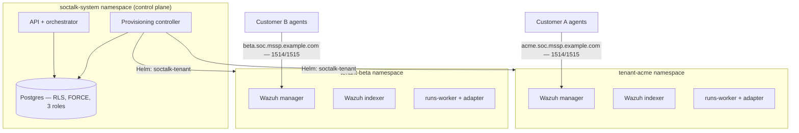

# Mandantenfähiges Wazuh für MSSPs: Architekturmuster, die Mandanten wirklich isolieren

Wazuh bietet keine native Mandantenfähigkeit. Es gibt kein „Tenant"-Objekt im Manager, keine kundenbezogene Grenze im Regelwerk und keine kundenbezogene Eingrenzung des `authd`-Enrollments. Jeder MSSP, der auf Wazuh standardisiert, baut Mandantenfähigkeit letztlich darum herum — und das gewählte Muster bestimmt Ihre Isolationsgarantien, Ihre Onboarding-Geschwindigkeit und Ihre Kostenuntergrenze pro Kunde.

Dieser Leitfaden behandelt, was ein MSSP von einem mandantenfähigen Wazuh-Deployment tatsächlich braucht, die drei Muster, die Teams in der Praxis ausprobieren, und was produktionsreife Isolation über das SIEM selbst hinaus erfordert. Es ist die Architektur, die SocTalk als Open Source (Apache 2.0) implementiert; die durchgängig verlinkten Referenzseiten dokumentieren das ausgelieferte V1-Verhalten und enthalten explizite „V1 deployment notes" überall dort, wo ein Abschnitt stattdessen die Zielarchitektur beschreibt.

## Was ein MSSP braucht und Wazuh nicht liefert

Drei Anforderungen tauchen in jedem MSSP-Deployment-Gespräch auf:

1. **Isolation, die Sie in einem Security-Review des Kunden verteidigen können.** „Kunde A kann die Warnungen von Kunde B nicht lesen" muss auf der Datenebene, der Netzwerkebene und der Agent-Enrollment-Ebene gelten — nicht nur im Dashboard.
2. **Onboarding-Geschwindigkeit.** Wenn das Provisionieren eines neuen Kunden-SOC eine Woche manuelle Arbeit bedeutet, skaliert das Muster nicht über eine Handvoll Kunden hinaus.
3. **Kostenkontrolle pro Mandant.** Sie müssen wissen, was ein Kunde an RAM, CPU und Festplatte kostet, es deckeln und verhindern, dass ein lauter Mandant die anderen aushungert.

## Die drei Muster, die MSSPs ausprobieren

### Muster 1: gemeinsamer Manager, Trennung auf Index-Ebene

Ein Wazuh-Manager, die Agents aller Kunden dagegen enrollt, die Trennung erfolgt nachgelagert — OpenSearch-Dashboards-Mandantenfähigkeit für Dashboard-Objekte, Index-Patterns und Security-Rollen für die Lese-Eingrenzung. Dies ist das Muster, das die meisten Threads zu Wazuh-Mandantenfähigkeit beschreiben, weil es das einzige ist, das Sie bauen können, ohne Wazuhs eigenes Tooling zu verlassen.

Das Problem: Die Trennung ist ein leseseitiger Filter, keine Grenze. Der Manager selbst ist geteilt: ein Regelwerk, ein `authd`-Secret, eine API, ein Upgrade-Fenster für alle. Eine falsch konfigurierte Rolle exponiert alle Kunden auf einmal, und kundenspezifische Regelpakete oder Aufbewahrungsrichtlinien sind unmöglich, ohne die übrigen zu beeinflussen.

### Muster 2: Manager pro Mandant auf VMs

Eine VM (oder VM-Gruppe) pro Kunde, mit dediziertem Manager und Indexer. Die Isolation ist real — getrennte Prozesse, Festplatten und Zugangsdaten. Hier landen MSSPs, nachdem das Shared-Manager-Muster sie gebissen hat. Der Preis ist operativ: Onboarding bedeutet Maschinen provisionieren, Upgrades bedeuten jede VM anzufassen, und die Ressourcenuntergrenze pro Mandant ist eine vollständige VM ohne gemeinsames Scheduling, um ungenutzte Kapazität zurückzugewinnen. Es funktioniert bei 5 Kunden und schmerzt bei 30.

### Muster 3: Manager pro Mandant auf Kubernetes, hinter einer Control Plane

Jeder Kunde erhält einen dedizierten Wazuh-Manager, -Indexer und ein Dashboard im eigenen Kubernetes-Namespace, mit einer ResourceQuota und einer LimitRange, die den Fußabdruck deckeln. Eine Control Plane besitzt den Lebenszyklus: Onboarding rendert ein Helm-Release pro Mandant, der Rückbau entfernt es, und der Mandantenzustand liegt in einer Datenbank statt in einer Tabellenkalkulation. Die Isolation kommt aus der Namespace-Grenze plus NetworkPolicy; die Dichte daraus, dass der Scheduler Mandanten auf gemeinsame Nodes packt.

### Die Trade-offs, ehrlich betrachtet

| | Gemeinsamer Manager + Index-Trennung | Manager pro Mandant auf VMs | Manager pro Mandant auf Kubernetes |
|---|---|---|---|
| Isolationsgrenze | Leseseitige Filter auf gemeinsamen Daten | Maschinengrenze | Namespace + NetworkPolicy + Quota |
| Wirkungsradius einer Kompromittierung | Alle Kunden | Ein Kunde | Ein Kunde |
| Regeln / Aufbewahrung / Upgrades pro Mandant | Nein | Ja | Ja |
| Onboarding eines Kunden | Schnell (Konfigurationsänderung) | Langsam (Maschinen provisionieren) | Schnell, wenn automatisiert (Helm-Release) |
| Dichte / Kosten pro Mandant | Am besten | Am schlechtesten | Gut (vom Scheduler gepackt, per Quota gedeckelt) |
| Erforderliche operative Kompetenz | Wazuh + OpenSearch-Security | Fleet-/VM-Automatisierung | Kubernetes |
| Flottenbetrieb ab 30+ Mandanten | Entfällt (ein Stack) | Schmerzhaft | Beherrschbar mit einer Control Plane |

Von den dreien ist Muster 3 dasjenige, das sowohl echte Isolation als auch Onboarding-Geschwindigkeit liefern kann — aber nur, wenn die Control Plane existiert. Namespaces allein sind eine Namenskonvention, keine Sicherheitsgrenze. Der Rest dieses Leitfadens behandelt, was die Grenze real macht.

## Produktionsreife Isolation ist mehr als das SIEM

Ein Wazuh-Stack pro Mandant isoliert die SIEM-Daten. Eine MSSP-Plattform hat außerdem mandantenübergreifenden Zustand — Fälle, Prüf-Warteschlangen, Audit-Logs, Integrationskonfigurationen — und diese Schicht braucht ihre eigene Durchsetzung.

### Datenebene: Postgres Row-Level Security, erzwungen und getestet

Filterung per `WHERE tenant_id = ?` auf Anwendungsebene ist nur eine vergessene Klausel von einem mandantenübergreifenden Leck entfernt. Die Datenbank sollte die Mandantentrennung selbst durchsetzen. Das Muster:

- Jede mandantenbezogene Tabelle trägt RLS-Richtlinien, die an eine transaktionsbezogene `app.current_tenant_id`-Einstellung gebunden sind. Ein nicht gesetzter Kontext liefert **null Zeilen** — defensive Null, kein Leck.
- `FORCE ROW LEVEL SECURITY` auf jeder mandantenbezogenen Tabelle, sodass selbst der Tabelleneigentümer (die Migrationsrolle) der Richtlinie unterliegt. Standardmäßig nimmt Postgres Eigentümer aus; eine Migration, die Mandantendaten liest, könnte andernfalls unbemerkt Mandantengrenzen überschreiten.
- Eine Aufteilung in drei Rollen: ein Migrationseigentümer, eine RLS-unterworfene Laufzeitrolle und eine abgetrennte `BYPASSRLS`-Rolle, die auditierten mandantenübergreifenden Pfaden vorbehalten ist. Keine Anwendung verbindet sich als Superuser.
- Isolationstests in der CI — Endpoint-Proben, rohes SQL unter der App-Rolle, Worker ohne Kontext, Proben mit der Eigentümerrolle, mandantenübergreifende Event-Streams. SocTalk führt sieben solcher Tests aus, alle müssen bestehen; keiner ist optional.
- Idempotenzschlüssel mit dem Scope `UNIQUE (tenant_id, idempotency_key)`, sodass die Alert-Pipelines zweier Kunden dieselbe externe Alert-ID emittieren können, ohne zu kollidieren.

Vollständige Richtlinienvorlagen, Rollen-DDL und die Testsuite: [Postgres RLS](/de-de/reference/postgres-rls).

### Netzwerkebene: NetworkPolicy pro Namespace

Die Namespace-Grenze bedeutet nichts ohne ein durchsetzendes CNI — das Standard-Flannel von K3s setzt NetworkPolicy überhaupt nicht durch. Die Zielhaltung ist eine Default-Deny-Basis pro Mandanten-Namespace mit expliziten Freigaben: Verkehr innerhalb des Namespace, DNS, Control-Plane-Zugriff auf die Data-Plane-Ports des Mandanten und Agent-Ingress auf 1514/1515. Verkehr von Mandant zu Mandant und allgemeiner Mandanten-Egress sind blockiert.

SocTalk verwendet Cilium als unterstütztes CNI (NetworkPolicy-Durchsetzung, FQDN-basierter Egress für per Hostname adressierte LLM-Endpunkte, Hubble-Flow-Observability zum Debuggen von Isolationsfragen). Beachten Sie den V1-Vorbehalt: Die vollständig FQDN-gepinnte Egress-Allowlist pro Mandant ist das Design-Ziel, und das aktuelle Chart rendert einfachere Richtlinien — permissiven Control-Plane-Egress und breiten TCP/443-Egress für den Worker pro Mandant. Die gerenderten Templates liegen im Repository; lesen Sie das [NetworkPolicy-Design](/de-de/reference/network-policy) für die ausgelieferten Richtlinien wie auch die Zielarchitektur.

### Agent-Enrollment: Endpunkte und Secrets pro Mandant

Der subtilste Fehlermodus: Der Agent von Kunde A registriert sich beim Manager von Kunde B. Wazuhs Agent-Protokoll auf 1514/TCP ist ein proprietärer verschlüsselter Stream, kein Standard-TLS — es gibt kein SNI zum Routen, weshalb hostname-inspizierende L4-Proxys stillschweigend brechen. Das Routing muss über die Zieladresse erfolgen: Jeder Mandant erhält einen eigenen DNS-Namen (`acme.soc.mssp.example.com`), der auf einen L4-Endpunkt pro Mandant auflöst, mit einem Fallback auf einen Port pro Mandant, wenn IPs knapp sind.

Enrollment-Secrets sind mandantenbezogen: Das gemeinsame `authd`-Secret jedes Mandanten liegt im Namespace dieses Mandanten, sodass ein Agent mit dem Secret von Mandant A sich nur beim Manager von A registrieren kann — die Adressierung routet ihn dorthin und der Manager verifiziert das Secret. In V1 sind LoadBalancer- und DNS-Provisionierung manuelle MSSP-Verkabelung, nicht automatisiert. Details und das Enrollment-Runbook: [Wazuh agent ingress](/de-de/reference/wazuh-ingress).

## Kapazität: was ein Mandant kostet

Die Zahlen, nach denen MSSPs zuerst fragen, aus SocTalks Dimensionierungsarbeit:

- **Fußabdruck pro Mandant (voller Stack):** ~8 GB RAM-Request (~16 GB Limit), ~2,2 vCPU-Request, ~120 GB Festplatte. Die dauerhafte Nutzung folgt den Requests; Limits sind Burst-Obergrenzen.
- **Der Engpass ist meist der Wazuh-Indexer pro Mandant** — jeder ist ein Java-Prozess mit eigenem Heap. Planen Sie ~6–8 GB RAM und ~1,5 vCPU pro Produktionsmandant.
- **Die Festplatte wird von der Ingest-Rate getrieben:** grob 5 GB/Tag an Index bei dauerhaft 10 Warnungen/Sek.; das Standard-Indexer-PVC ist 50 GB mit 30 Tagen Hot-Retention.
- **Getestete Skalierung:** bis zu ~50 Mandanten auf einem 3-Node-Cluster (16 vCPU / 64 GB pro Node). Größere Einzelinstallationsprofile sind dokumentiert, aber in diesem Release nicht validiert — planen Sie ohne eigene Tests nicht über diese Zahl hinaus auf einer Installation.

Referenz-Host-Profile und die Formel für die maximale Mandantenzahl pro Node: [Sizing](/de-de/reference/sizing) und die [Skalierungs-FAQ](/de-de/faq#does-it-scale-to-n-customers).

## Wie SocTalk dieses Muster paketiert

SocTalk ist eine Open-Source-Implementierung (Apache 2.0, keine Aufspaltung in Community/Enterprise) von Muster 3: eine Control Plane, ein `soctalk-tenant`-Helm-Release pro Kunde, auf Ihrem eigenen Kubernetes 1.30+ — K3s, EKS, AKS oder GKE.

Das Onboarding durchläuft eine Provisionierungssequenz in neun Phasen — Preflight, Secret-Erzeugung, Namespace mit Quotas, Helm-Installationen, Readiness-Polling — wobei jede Phase ein Lifecycle-Event emittiert und aus `degraded` idempotent wiederholbar ist. Der Mandantenzustand ist eine serverseitig erzwungene Zustandsmaschine (`pending → provisioning → active`, mit den Zuständen suspended, decommissioning, archived und purged; ungültige Übergänge liefern 409). Drei Onboarding-Profile decken Demos (`poc`), Produktion (`persistent`) und BYO-Wazuh ab (`provided`, bei dem SocTalk sich mit dem bestehenden Stack eines Kunden verbindet, statt einen zu deployen). Der Rückbau entfernt die Data Plane, behält aber die Mandantenzeile und die Audit-Historie.

Der vollständige Lebenszyklus — Zustände, Phasen, Quotas, Wiederherstellungspfade — steht in [Tenant lifecycle](/de-de/tenant-lifecycle). Zum Ausführen: Der [Installationsleitfaden](/de-de/install) deckt einen Produktionscluster in etwa einer Stunde ab, und die [Demo-VM](/de-de/quickstart-vm) bootet eine funktionierende mandantenfähige Installation mit einem Demo-Mandanten in etwa fünf Minuten.
