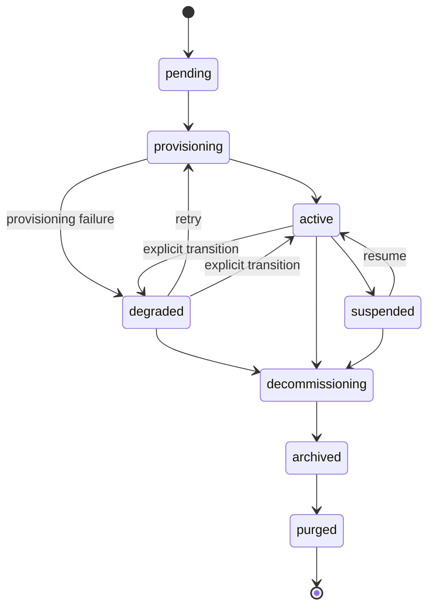

# Mandanten-Lebenszyklus

Was mit einem Kunden-SOC vom "Onboarding" bis zum "Purge" geschieht. Diese Seite ist das operatorseitige Gegenstück zu [Chart Contract](/de-de/reference/chart-contract) (das die Umsetzung der On-the-Wire-Werte dokumentiert) und [Täglicher Betrieb](/de-de/operations) (das die Runbook-Seite dokumentiert).

## Mandanten-Zustandsautomat



Übergänge nach `degraded` erfolgen **ausschließlich über den Fehlerpfad des Provisioning-Controllers** (eine Phase hat einen `ProvisionError` ausgelöst). Es gibt keinen API-Endpunkt, um einen Mandanten manuell als `degraded` zu markieren, keine automatische Degradierungsschleife, die das Heartbeat-Alter des Adapters überwacht, und keine metrikbasierte Degradierung. Die Metrik `soctalk_tenant_adapter_heartbeat_age_seconds` aktualisiert sich bei Heartbeats, wirkt aber nicht auf den Mandantenzustand zurück. Übergänge zurück nach `active` erfolgen als Nebeneffekt einer erfolgreichen `:retry`-Neuprovisionierung.

| Zustand | Bedeutung | Was läuft |
|---|---|---|
| `pending` | Onboarding akzeptiert, der Controller hat mit der Provisionierung noch nicht begonnen. | nichts in `tenant-<slug>` |
| `provisioning` | Der Controller erstellt den Namespace, die Secrets und installiert den Mandanten-Chart per Helm. | teilweise, Pods erscheinen |
| `active` | Der Mandant wechselte nach `active`, nachdem der Provisioning-Controller gesehen hat, dass die Data-Plane-Pods den Ready-Zustand erreicht haben. | Wazuh manager + indexer + dashboard + soctalk-adapter + runs-worker |
| `degraded` | Der Provisioning-Controller hat den Mandanten nach einem Provisionierungsfehler als `degraded` markiert (oder ein Operator hat manuell umgeschaltet). **Die Plattform schaltet derzeit nicht automatisch active→degraded auf Basis des Adapter-Heartbeat-Alters**; die Metrik `soctalk_tenant_adapter_heartbeat_age_seconds` dient Ihrem Alerting | unbestimmt; Pods prüfen |
| `suspended` | Der MSSP-Admin hat den Mandanten in der Datenbank als suspendiert markiert. **Workloads werden durch die Suspend-Aktion selbst in diesem Release NICHT herunterskaliert**: das erfordert die manuelle Notfall-Deaktivierungsprozedur (siehe [Täglicher Betrieb → Notfall-Deaktivierung](/de-de/operations#emergency-disable-a-tenant-immediately)). Das Zustandsflag verhindert, dass neue Untersuchungen eingeplant werden. | unverändert, Pods laufen weiter, sofern der Operator sie nicht herunterskaliert |
| `decommissioning` | Abbau läuft. Helm-Release wird deinstalliert, PVCs werden gelöscht. | schrumpfend |
| `archived` | Helm-Release entfernt; PVCs gelöscht; die Mandantenzeile bleibt zu Audit-Zwecken erhalten. | nichts |
| `purged` | Mandantenzeile hart gelöscht. | nichts, nur Audit-Log-Einträge bleiben erhalten |

Zulässige Übergänge werden in `TenantController.VALID_TRANSITIONS` erzwungen. Der Versuch, einen Mandanten im Zustand `decommissioning` zu suspendieren, liefert HTTP 409 mit einer Liste gültiger Folgezustände.

## Provisionierungsschritte

Die Methode `provision()` des Controllers läuft in neun geordneten Phasen ab. Jede Phase erzeugt eine `TenantLifecycleEvent`-Zeile, die auf der Mandanten-Detailseite (Tabelle „Lifecycle Events") sichtbar ist.

| # | Ereignis | Was passiert |
|---|---|---|
| 1 | `preflight_ok` | Pre-Flight-Checks (Cluster-Voraussetzungen, Namenskonflikte) bestehen. |
| 2 | `secrets_minted` | Erzeugung mandantenspezifischer Secrets (`authd`, JWT-Signierung, Postgres). |
| 3 | `namespace_ready` | Erstellen von `tenant-<slug>` mit Labels, ResourceQuota, LimitRange. |
| 4 | `secrets_applied` | Secrets als `Secret/*`-Objekte in den neuen Namespace einbringen. |
| 5 | `helm_applied` (tenant chart) | Installation des `soctalk-tenant`-Charts (adapter + runs-worker + ingress). Der tenant_admin-Benutzer wird als Teil dieses Schritts automatisch bereitgestellt (inline `_mint_tenant_admin_user`). |
| 6 | `helm_applied` (Wazuh chart) | Installation des eigenständigen Wazuh-Charts (manager/indexer/dashboard). Die Payload der Ereigniszeile gibt an, welcher Chart angewendet wurde. |
| 7 | `workloads_ready` | Abfragen, bis alle Data-Plane-Pods Ready sind. |
| 8 | `integration_config_written` | Schreiben mandantenspezifischer Integrationskonfigurationen (LLM, TheHive-URLs usw.) in die Datenbank. |
| 9 | `active` | Zustandsübergang nach `active`. |

Ein Fehler in einer beliebigen Phase überführt den Mandanten nach `degraded`, wobei der Fehler in der Ereigniszeile festgehalten wird. **Retry Provisioning** (`POST /api/mssp/tenants/{id}:retry`) ist ein gültiger Übergang von `degraded` zurück nach `provisioning` (und ist von `pending` aus **nicht** zulässig, `pending → provisioning` erfolgt nur automatisch, wenn der Controller den ersten Versuch startet). `provision()` ist in jeder Phase idempotent.

## Profile

Das Profil wird zum Onboarding-Zeitpunkt gewählt und ist **für die Lebensdauer des Mandanten festgelegt**. Ein Profilwechsel erfordert `decommission` + Neuerstellung.

### `poc`

Für Evaluierungen, Demos und kurzlebige Pilotprojekte.

- StorageClass: `local-path` (k3s-Standard; keine echte Persistenzgarantie)
- Wazuh-Indexer-JVM-Heap: 512 MiB
- Resource Requests am unteren Ende der Chart-Bereiche
- Keine Backup-Hooks verdrahtet

Dies ist das Profil, das das [Demo-VM-Image](/de-de/quickstart-vm) für seinen mitgelieferten `demo`-Mandanten verwendet.

### `persistent`

Für produktive Kunden-SOCs.

- StorageClass: was die Installation als Standard markiert (Longhorn, Rook/Ceph, Cloud-Provider-CSI)
- Wazuh-Indexer-JVM-Heap: chartseitiger Standard (typischerweise 2–4 GiB)
- Resource Requests/Limits für Dauerlast dimensioniert
- Backup-Hooks werden berücksichtigt, sofern konfiguriert

Wählen Sie `persistent` für alles Kundenseitige. Der Standard ist `poc`, falls nicht angegeben, was der falsche Standard für einen echten Kunden ist.

### `provided`

Für Mandanten, die ihren eigenen extern bereitgestellten Wazuh-Stack mitbringen ("BYO-SIEM"). Der Mandanten-Chart installiert nur den SocTalk-Adapter + runs-worker; kein Wazuh/TheHive/Cortex läuft innerhalb des Mandanten-Namespace.

- StorageClass: irrelevant, nur die Checkpoint-PVC des Adapters wird bereitgestellt
- Wazuh: das eigene Deployment des Mandanten, über das Netzwerk erreichbar via Indexer (:9200) und Manager-API-URLs (:55000), die beim Onboarding angegeben werden
- Verbindungsmaterial für das externe SIEM (`wazuh_indexer_url`, `wazuh_api_url`, Basic-Auth-Credentials) ist beim Onboarding **erforderlich** und wird serverseitig validiert (422, falls unvollständig)
- Mandantenspezifische LLM-Credentials sind beim Onboarding ebenfalls **erforderlich** (kein installationsweiter Fallback für `provided`)
- Eine Cilium-FQDN-Egress-Allowlist wird automatisch aus den angegebenen Indexer-/API-Hostnamen abgeleitet

Wählen Sie `provided`, wenn der Kunde bereits Wazuh betreibt und möchte, dass SocTalk es an Ort und Stelle abfragt. Siehe das [MSSP-Pilot-Tutorial → §3.1](/de-de/mssp-pilot#_3-1-run-the-create-customer-wizard) für die Assistenten-Durchsprache (der External-SIEM-Schritt) und [§3.4](/de-de/mssp-pilot#_3-4-coordinating-external-wazuh-creds-for-provided-tenants) für die vorgelagerte Koordinationsarbeit.

## Ressourcenkontingente

Jeder `tenant-<slug>`-Namespace erhält bei der Erstellung eine `ResourceQuota` und eine `LimitRange`, dimensioniert auf den erwarteten Footprint des Profils. Siehe [Sizing](/de-de/reference/sizing).

| Profil | CPU Requests | CPU Limits | Memory Requests | Memory Limits | PVCs | Pods |
|---|---|---|---|---|---|---|
| `poc` | 2 | 4 | 4 Gi | 8 Gi | 4 | 20 |
| `persistent` | 2 | 5 | 6 Gi | 12 Gi | 6 | 30 |
| `provided` | 1 | 2 | 2 Gi | 4 Gi | 2 | 10 |

(Die genauen Zahlen befinden sich in `_profile_tenant_overrides` in [`render.py`](https://github.com/soctalk/soctalk/blob/main/src/soctalk/core/provisioning/render.py).)

Wenn eine reale Workload das Profilbudget überschreitet (z. B. der Wazuh-Indexer verlangsamt sich bei starker Ingest-Last), erhöhen Sie die ResourceQuota per `helm upgrade` mit überschriebenen Werten. Bearbeiten Sie das ResourceQuota-Objekt nicht direkt, das nächste Chart-Upgrade überschreibt es.

## Wiederherstellungspfade

### Mandant nach Onboarding in `pending` steckengeblieben

Der Controller ist abgestürzt oder wurde mitten in der Provisionierung neu geplant, bevor die erste Phase lief. Ein Retry ist direkt aus `pending` nicht zulässig, warten Sie zuerst, bis der Provisionierungsversuch nach `degraded` übergeht (in den Lifecycle Events sichtbar), und klicken Sie dann auf der Mandanten-Detailseite auf **Retry Provisioning** (oder `POST /api/mssp/tenants/{id}:retry`). Die Provisionierung wird ab Phase 1 fortgesetzt; jede Phase ist idempotent.

### Mandant länger als 15 Minuten in `provisioning`

Meist ein hängender Pod (ImagePullBackOff, PVC `Pending`, ResourceQuota zu klein). Siehe [Täglicher Betrieb, Mandant hängt in der Provisionierung](/de-de/operations#tenant-stuck-in-provisioning).

### Mandant in `degraded`

In V1 wird `degraded` nur nach einem **Provisionierungsfehler** erreicht, nicht bei Heartbeat-Verlust. Befindet sich ein Mandant in `degraded`, ist der Provisioning-Controller an einem der 9 obigen Schritte gescheitert, lesen Sie die Lifecycle-Event-Zeile, um zu sehen, an welchem. Die Data Plane (Wazuh) läuft je nach fehlgeschlagenem Schritt möglicherweise noch. Siehe [Täglicher Betrieb, Mandant im Zustand degraded](/de-de/operations#tenant-in-degraded-state).

### Mandant in `suspended`

Das haben Sie bewusst getan. Nehmen Sie den Betrieb über die UI oder `POST /api/mssp/tenants/<id>:resume` wieder auf, beachten Sie jedoch, dass in diesem Release **resume nur den DB-Zustand aktualisiert**, es stellt die Replica-Anzahl nicht wieder her. Wenn Sie Workloads während der Suspendierung (über den Notfall-Deaktivierungs-Flow) auf null skaliert haben, müssen Sie sie von Hand wieder hochskalieren.

### Mandant länger als 30 Minuten in `decommissioning`

Hängende Helm-Deinstallation. Meist ein Finalizer auf einer PVC, der nie ausgeführt wurde. `helm uninstall tenant-<slug> -n tenant-<slug> --no-hooks` und Finalizer manuell entfernen:

```bash
kubectl -n tenant-<slug> get pvc -o name | \
  xargs -I {} kubectl -n tenant-<slug> patch {} -p '{"metadata":{"finalizers":null}}' --type=merge
```

Anschließend das Decommission erneut auslösen. Dokumentieren Sie dies im Audit-Log, damit die Nachvollziehbarkeit intakt bleibt.

## Decommission vs. Purge

`decommission` baut die Data Plane ab und überführt den Mandanten nach `archived`: die Mandantenzeile und die Audit-Historie bleiben erhalten. `purged` ist der terminale Endzustand im Zustandsautomaten (`archived → purged`), aber es gibt in diesem Release **keinen `:purge`-API-Endpunkt**. Heute erfordert der Übergang nach `purged` eine Aktualisierung auf Datenbankebene; ein admin-gesperrter `POST /api/mssp/tenants/{id}:purge` ist auf der Roadmap. Bis er ausgeliefert wird, belassen Sie dekommissionierte Mandanten in `archived` und behandeln Sie archivierte Zeilen als langfristige Aufbewahrungsfläche.

## Quellverweise

| Konzept | Datei |
|---|---|
| Mandanten-Zustands-Enum + Übergänge | [`src/soctalk/core/tenancy/models.py`](https://github.com/soctalk/soctalk/blob/main/src/soctalk/core/tenancy/models.py) |
| Provisioning-Controller | [`src/soctalk/core/provisioning/controller.py`](https://github.com/soctalk/soctalk/blob/main/src/soctalk/core/provisioning/controller.py) |
| Onboard-API + Payload | [`src/soctalk/core/api/tenants.py`](https://github.com/soctalk/soctalk/blob/main/src/soctalk/core/api/tenants.py) |
| Lifecycle-Events-Tabelle | [`src/soctalk/core/tenancy/models.py`](https://github.com/soctalk/soctalk/blob/main/src/soctalk/core/tenancy/models.py) |
