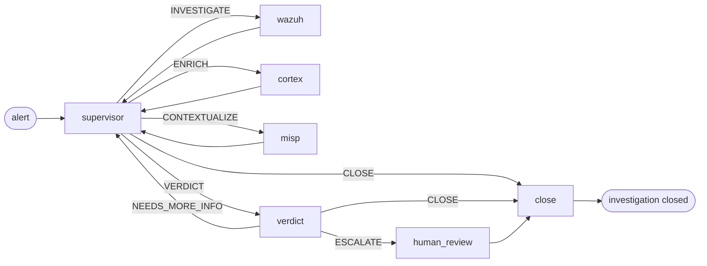

# Pipeline de AI

Qué ocurre entre "llega una alerta" y "se escribe un veredicto". La capa de triaje de SocTalk es una máquina de estados de LangGraph: un supervisor que enruta el trabajo a nodos worker especialistas y, luego, un nodo de veredicto que decide si el caso necesita revisión humana.

Esta página es el modelo mental. El código vive en [`src/soctalk/graph/`](https://github.com/soctalk/soctalk/tree/main/src/soctalk/graph), [`src/soctalk/supervisor/`](https://github.com/soctalk/soctalk/tree/main/src/soctalk/supervisor) y [`src/soctalk/workers/`](https://github.com/soctalk/soctalk/tree/main/src/soctalk/workers).

## Nodos

| Nodo | Propósito | Modelo usado |
|---|---|---|
| **supervisor** | Decide qué hacer a continuación. Enrutamiento puro: no realiza trabajo de dominio por sí mismo. | modelo rápido |
| **wazuh_worker** | Recupera la alerta en contexto, extrae observables (IP, hashes, usuarios, procesos), la correlaciona con alertas recientes del mismo tenant. | modelo rápido |
| **cortex_worker** | Envía los observables a los analizadores de Cortex (VirusTotal, AbuseIPDB, etc.) para reputación/enriquecimiento. | modelo rápido |
| **misp_worker** | Busca los observables en los feeds de inteligencia de amenazas de MISP para obtener contexto de campañas/actores conocidos. | modelo rápido |
| **verdict** | Razona sobre todo lo que reunieron los workers. Produce `escalate | close | needs_more_info` + confianza + una justificación breve. | **modelo de razonamiento** |
| **human_review** | Pausa la ejecución; emite una solicitud de revisión a la cola del dashboard y/o a Slack. Espera una `HumanDecision` (`approve | reject | more_info`). |, (humanos) |
| **close** | Genera el informe de cierre y escribe la disposición (`close_fp | escalate | leave_open`). **En V1, el nodo close no publica en integraciones salientes.** Actualmente ningún nodo del grafo publica en TheHive en V1 (el nodo `thehive_worker` referenciado en borradores anteriores no está cableado en el constructor del grafo V1). La publicación por webhook de Slack desde close tampoco está cableada. La integración saliente desde el nodo close está en el roadmap. | modelo rápido |

## Enrutamiento del supervisor

El único trabajo del supervisor es elegir el siguiente nodo. Su espacio de decisión es un enum fijo de 5 elementos:

| Decisión | Significa |
|---|---|
| `INVESTIGATE` | Aún no sé lo suficiente sobre esta alerta. Ejecuta el worker de Wazuh. |
| `ENRICH` | Tengo observables cuya reputación no he verificado. Ejecuta Cortex. |
| `CONTEXTUALIZE` | Los observables se ven interesantes; verifica si hay campañas/actores conocidos. Ejecuta MISP. |
| `VERDICT` | Tengo suficiente. Pasa al nodo de veredicto. |
| `CLOSE` | Este es un caso claro (p. ej., un falso positivo evidente o una alerta ya resuelta). Omite el nodo de veredicto. |

El supervisor nunca invoca herramientas externas por sí mismo. Lee el `SecOpsState` acumulado (alertas, observables, salidas previas de los workers, veredictos) y produce una de las cinco decisiones. La mayoría de los casos ciclan supervisor → worker → supervisor → worker → supervisor → VERDICT, de tres a seis saltos en total.

## Nodo de veredicto

El modelo de razonamiento recibe todo el estado acumulado: la alerta original, los hallazgos de cada worker, todos los observables con su enriquecimiento y los intentos de veredicto previos (si hubo un bucle por `NEEDS_MORE_INFO`). Produce:

| Campo | Tipo |
|---|---|
| `decision` | `escalate | close | needs_more_info` |
| `confidence` | enum: `low | medium | high` |
| `rationale` | markdown breve |
| `evidence_strength` | `weak | moderate | strong | conclusive` |
| `verdict` | `benign | suspicious | malicious | unknown` |
| `impact` | `low | medium | high | critical` |

`escalate` siempre pasa por `human_review`. `close` omite la revisión humana y va directo a `close`. `needs_more_info` regresa al supervisor con un prompt que sugiere qué falta todavía.

## Compuerta de revisión humana

`human_review` pausa la ejecución. El caso aparece en la [cola de Revisión](/es-419/mssp-ui#reviews-human-in-the-loop) del dashboard y (si Slack está configurado) en el [HIL bidireccional de Slack](/es-419/human-review). La persona elige:

| Decisión | Efecto en el caso |
|---|---|
| `approve` | La revisión pendiente se marca como completada + feedback auditado. **No** se reanuda automáticamente; requiere seguimiento del analista. |
| `reject` | El caso se cierra como `auto_closed_fp`. Terminal: el grafo no se vuelve a invocar. |
| `more_info` | La revisión se marca como `info_requested` con la lista de preguntas. **No** se reanuda automáticamente; requiere seguimiento del analista. |

La identidad de la persona, la marca de tiempo y la justificación se anexan al registro `case_events` del caso, que es de solo anexado.

## Ciclo de vida de la ejecución

Una "ejecución" (run) es una corrida del grafo contra un caso. Enum de estado:

| Estado | Significa |
|---|---|
| `active` | El grafo se está ejecutando. |
| `waiting_on_gate` | Pausado en `human_review`. |
| `paused` | Pausado manualmente por un administrador de MSSP. |
| `halted_budget` | Alcanzó el presupuesto de tokens por ejecución. Las ejecuciones normales de V1 toman `tokens_budget = 200,000` de la fila `case_runs` (valor por defecto del modelo). La variable de entorno `SOCTALK_CASE_RUN_TOKEN_BUDGET` (por defecto 15,000) solo se usa como respaldo cuando la fila no tiene un valor establecido. |
| `completed` | El grafo llegó a `close` y escribió una disposición. |
| `failed` | El grafo tuvo un error o una herramienta externa quedó inalcanzable. |

Los presupuestos de tokens se rastrean por ejecución, por tenant y a nivel de toda la instalación. Consulta [Observabilidad](/es-419/observability) para las métricas y [Proveedores de LLM](/es-419/integrate/llm-providers) para las palancas de costo.

## El proceso runs-worker

Cada tenant tiene su propio pod `runs-worker` (en el namespace `tenant-<slug>`) que consume la cola:

1. Llama a `POST /api/internal/worker/runs/claim` para obtener una ejecución asignada a su tenant.
2. Construye el LangGraph a partir del chart de nodos.
3. Ejecuta `ainvoke()` contra el grafo, publicando `POST /api/internal/worker/runs/{run_id}/heartbeat` cada 20 s.
4. Al completar, publica el estado final y la disposición en `POST /api/internal/worker/runs/{run_id}/complete`.

El runs-worker es el único pod de cómputo por tenant; mantenerlo en el namespace del tenant significa que un tenant que exceda su presupuesto no puede dejar sin cómputo al resto de la instalación. La lógica de supervisor + worker + veredicto en sí es sin estado; el trabajo pesado son las llamadas al LLM (fuera del clúster, facturadas al proveedor configurado del tenant).

## Punteros al código fuente

| Concepto | Archivo |
|---|---|
| Constructor del grafo + enrutamiento | [`src/soctalk/graph/builder.py`](https://github.com/soctalk/soctalk/blob/main/src/soctalk/graph/builder.py) |
| Lógica del supervisor | [`src/soctalk/supervisor/node.py`](https://github.com/soctalk/soctalk/blob/main/src/soctalk/supervisor/node.py) |
| Nodo de veredicto | [`src/soctalk/supervisor/verdict.py`](https://github.com/soctalk/soctalk/blob/main/src/soctalk/supervisor/verdict.py) |
| Nodos worker | [`src/soctalk/workers/`](https://github.com/soctalk/soctalk/tree/main/src/soctalk/workers) |
| Cierre / disposición | [`src/soctalk/graph/close.py`](https://github.com/soctalk/soctalk/blob/main/src/soctalk/graph/close.py) |
| Bucle del runs worker | [`src/soctalk/runs_worker/main.py`](https://github.com/soctalk/soctalk/blob/main/src/soctalk/runs_worker/main.py) |
| Esquema de estado | [`src/soctalk/models/state.py`](https://github.com/soctalk/soctalk/blob/main/src/soctalk/models/state.py) |
