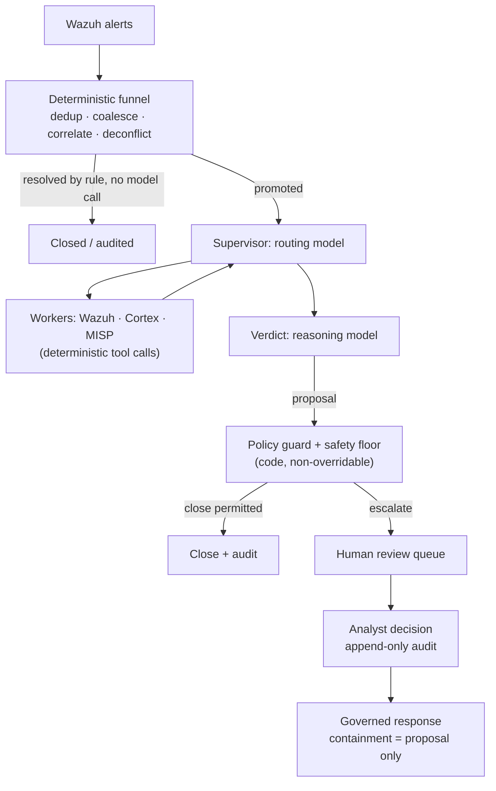

# Triaje con AI para alertas de Wazuh: qué funciona en producción (y qué no)

Todo operador de Wazuh ha tenido la misma idea: el manager produce miles de alertas al día, la mayoría son ruido, y un LLM es muy bueno leyendo una alerta y diciendo "esto es un intento de fuerza bruta" o "esto es un cron job". Así que conectas un webhook de Wazuh a una herramienta de workflows, pegas el JSON de la alerta en un prompt y publicas la respuesta del modelo en algún lado.

Ese prototipo funciona. También falla en producción, de maneras predecibles. Esta guía cubre por qué, y la arquitectura que aguanta cuando el triaje con AI de alertas de Wazuh tiene que correr sin supervisión contra un volumen real de alertas. Es la arquitectura que implementa SocTalk.

## Por qué "mandar cada alerta a un LLM" se rompe

El patrón ingenuo (webhook de Wazuh → prompt al LLM → veredicto) tiene tres problemas estructurales, y ninguno se arregla con mejores prompts.

**El costo escala con el ruido, no con la señal.** Un solo escaneo puede producir miles de alertas. Si cada alerta cruda cuesta una llamada al modelo, tu gasto es proporcional a qué tan ruidoso es tu entorno, y el gasto te empuja hacia modelos más débiles justo en los casos donde el criterio importa más.

**El modelo no tiene contexto ni piso.** Un LLM que lee una alerta aislada no tiene memoria de lo que un analista decidió ayer ni una imagen del estado propio de la organización, así que no puede distinguir un cambio autorizado de un ataque que produce una alerta byte a byte idéntica. Nada garantiza que no cierre con toda confianza sobre un indicador de compromiso real, y un veredicto "benigno" alucinado sobre una intrusión real es una detección suprimida; ninguna tasa de esas es tolerable.

**No hay rastro de auditoría ni compuerta.** Un workflow que publica el veredicto del modelo directo a un canal no tiene registro de en qué evidencia se apoyó el veredicto, ni identidad del revisor, ni mecanismo para impedir que un mal veredicto se convierta en un caso cerrado.

El prototipo de webhook sigue siendo una buena forma de convencerte de que los LLM pueden razonar sobre alertas. La pieza que falta es la arquitectura alrededor del modelo.

## La arquitectura que funciona: un embudo determinista antes de cualquier llamada al modelo

El primer arreglo es contraintuitivo: la mayor parte de un pipeline de triaje con AI no debería ser AI. En SocTalk, el plano de ingesta corre del lado del servidor y es totalmente determinista; ningún modelo lo toca:

- **La deduplicación** descarta eventos repetidos que traen un ID ya visto.
- **La coalescencia** agrupa alertas repetidas de la misma regla sobre el mismo activo dentro de una ventana de cinco minutos en un solo caso. Una ráfaga de una detección se vuelve un caso en lugar de miles.
- **La correlación de entidades** adjunta como evidencia una alerta nueva que comparte una entidad fuerte (host, hash de archivo) con una investigación activa, en lugar de arrancar una corrida nueva sin contexto.
- **La deconflicción de engagements** empareja ventanas declaradas de pentest y red team por origen, host, técnica y tiempo. Las pruebas autorizadas se marcan y auditan, nunca se cierran automáticamente, y la actividad de testers fuera de alcance se fuerza a un humano.
- **El cierre determinista** maneja falsos positivos de baja severidad y alta confianza por regla, sin llamada al modelo.

Muchas alertas nunca llegan a un modelo. Lo que sobrevive se promueve a una investigación, e incluso entonces el modelo se consulta en solo dos roles: un **supervisor** que enruta la investigación (traer contexto del host desde Wazuh, verificar la reputación de observables vía analizadores de Cortex, consultar inteligencia de amenazas en MISP; todas son llamadas deterministas a herramientas cuyos resultados el modelo solo *lee*), y un nodo de **veredicto** donde un modelo de razonamiento pondera todo lo recolectado y propone `escalate`, `close` o `needs_more_info` con confianza, justificación y fuerza de la evidencia.

## Guardrails como datos, veredictos con compuerta en código

El segundo arreglo trata el veredicto del modelo como una propuesta que solo una compuerta determinista puede convertir en un commit. La regla de SocTalk es *"el LLM propone; una compuerta determinista dispone"*.

Las [políticas de triaje](/es-419/triage-policies) son datos, reglas declarativas ejecutadas por un solo intérprete, que actúan en cuatro compuertas: un resolutor, una compuerta pre-decisión (un veredicto no es legal hasta que los pasos de evidencia requeridos hayan corrido), un guard post-veredicto y un **piso de seguridad**. El piso está a nivel de código y no se puede anular, aplicado en tres puntos independientes (worker, servidor, ingesta). Ningún cierre automático puede dispararse sobre un IOC conocido, un registro de autorización contradicho, un indicador sin verificar, un incidente relacionado activo, un kill switch, ni por encima del tope de volumen (por defecto, 500 cierres automáticos por 24 horas). Los kill switches (`SOCTALK_AUTO_CLOSE_KILL` a nivel de instalación, o por tenant) convierten cada cierre automático en una promoción al instante. Ese es el control al que recurres en medio de un incidente.

La propiedad que hace seguras las políticas escritas por el tenant: solo pueden hacer el triaje **más estricto**, nunca más laxo. Un override de guardrail solo puede subir una decisión por la escalera `close < needs_more_info < escalate`; la supresión no es expresable en el lenguaje de condiciones, que está aislado en sandbox: árboles de un solo operador sobre un contrato de estado documentado, sin acceso a atributos, sin llamadas a funciones, y las políticas inválidas se rechazan enteras en la validación. Una política mal configurada u hostil no puede convertirse en un canal para suprimir detecciones.

## El humano en el circuito es una propiedad dura

Todo veredicto `escalate` pasa por revisión humana. No hay bypass: un modo "auto-approve" solo con AI no está implementado en SocTalk (quitar la compuerta es un ítem del roadmap, planeado como un toggle auditado y restringido a administradores, no como un default silencioso). En V1 la superficie de revisión es la cola del dashboard, que muestra la justificación completa de la AI y la evidencia observable con su enriquecimiento. Las decisiones del analista de aprobar, rechazar o pedir más información escriben filas de auditoría de solo anexado con identidad, timestamp y justificación, nunca editables después de enviarse. Un cierre propuesto que toca un activo sensible (un host clasificado PCI, por ejemplo) se retiene para firma humana incluso cuando el modelo está confiado.

La misma postura gobierna la respuesta: una acción de contención como aislar un endpoint o deshabilitar una cuenta se levanta *siempre* como una propuesta que un analista aprueba primero. El modelo nunca toma una acción de contención por su cuenta, y el despacho ocurre del lado del servidor, nunca desde el loop del modelo. SocTalk funciona como copiloto, no como reemplazo del analista. El valor está en la compresión: el mismo equipo de analistas puede manejar 5–10× el volumen de alertas porque los casos rutinarios se cierran automáticamente y solo los poco claros llegan a revisión humana.

## Ingeniería de costos

Como el embudo resuelve muchas alertas sin llamada al modelo, el costo sigue a la ambigüedad y no al volumen. Las palancas restantes:

- **División rápido/razonamiento.** El enrutamiento y los workers usan un modelo rápido; solo el veredicto usa un modelo de razonamiento. Los defaults son `claude-sonnet-4-20250514` para ambos, sobreescribibles por tenant (`SOCTALK_FAST_MODEL` / `SOCTALK_REASONING_MODEL`).
- **Presupuestos de tokens por corrida.** Cada corrida lleva un presupuesto de tokens (default del modelo: 200,000), rastreado por corrida, por tenant y a nivel de instalación. Una investigación desbocada se detiene en lugar de facturar indefinidamente.
- **Gasto en el mundo real.** Muy variable, pero como orden de magnitud: aproximadamente **$9/día por tenant** con ~30 alertas/día en un montaje económico compatible con OpenAI, y baja 5–10× con un modelo rápido más barato. Trátalo como una estimación inicial, no como una cotización.
- **Opción de cero costo por token.** Corre totalmente local con [Ollama](/es-419/integrate/ollama): sin LLM en la nube, sin costo por token, los datos se quedan en tu infraestructura. Elige un modelo capaz de usar herramientas (qwen2.5, llama3.1, mistral-nemo), y ten presente que la inferencia en CPU es lenta, de minutos por investigación; usa un host con GPU para una latencia usable.

## Trae tu propio LLM

El runtime de SocTalk soporta dos proveedores: `anthropic` (Claude) y `openai`, que cubre a OpenAI mismo o cualquier endpoint compatible con OpenAI como Azure OpenAI, vLLM, Ollama y LiteLLM. Proveedor, modelo, URL base y clave de API son todos sobreescribibles **por tenant**, y un cliente puede traer su propia clave para aislamiento de facturación, montada en el runs-worker del tenant como un Secret de Kubernetes en el namespace propio de ese tenant. (Aplica una excepción documentada de V1: la clave también se guarda en la base de datos de SocTalk en texto plano, `IntegrationConfig.llm_api_key_plain`; ve [Secretos](/es-419/reference/secrets) para la postura y las recomendaciones de rotación.) El modelo solo ve el estado de la investigación actual (cuerpo de la alerta, observables, salidas de los workers); para una postura más estricta, apunta el tenant a un endpoint on-prem. Detalles en [Proveedores de LLM](/es-419/integrate/llm-providers).

## Cómo se ve esto en SocTalk

SocTalk es una plataforma SOC AI-first bajo Apache 2.0 para MSP y MSSP: un stack de Wazuh dedicado por cliente en tu propio Kubernetes, detrás de un solo control plane, con el pipeline de triaje de arriba corriendo por tenant. Para profundizar:

- [Cómo funciona](/es-419/how-it-works) cuenta la historia completa del pipeline: el embudo determinista, los dos roles del modelo, el piso de seguridad en tres sitios.
- [Pipeline de AI](/es-419/ai-pipeline) cubre la máquina de estados de LangGraph: supervisor, workers, veredicto, ciclo de vida de la corrida.
- [Políticas de triaje](/es-419/triage-policies) muestra cómo escribir guardrails deterministas en el editor no-code, en modo shadow y luego activar.
- [Revisión humana](/es-419/human-review) documenta la cola de revisión y el contrato de decisión del analista.

O sáltate la lectura: la [VM de demo](/es-419/quickstart-vm) te deja una instalación multi-tenant corriendo, con un tenant de demo dado de alta, en unos cinco minutos.
