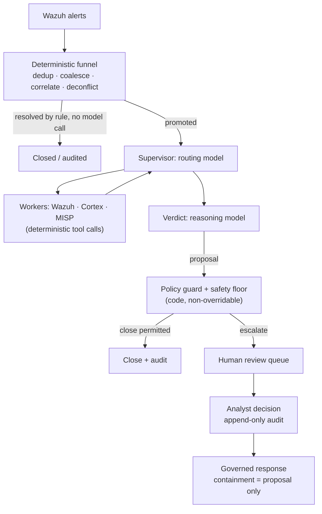

# Triaje con AI para alertas de Wazuh: qué funciona en producción (y qué no)

Todo operador de Wazuh ha tenido la misma idea: el manager produce miles de alertas al día, la mayoría son ruido, y un LLM es muy bueno leyendo una alerta y diciendo "esto es un intento de fuerza bruta" o "esto es un cron job". Entonces conectas un webhook de Wazuh a una herramienta de workflows, colocas el JSON de la alerta en un prompt y publicas la respuesta del modelo en algún lugar.

Ese prototipo funciona. También falla en producción, de maneras predecibles. Esta guía explica por qué, y la arquitectura que se sostiene cuando el triaje con AI de alertas de Wazuh tiene que ejecutarse sin supervisión contra un volumen real de alertas — la arquitectura que SocTalk implementa.

## Por qué "enviar cada alerta a un LLM" se rompe

El patrón ingenuo — webhook de Wazuh → prompt al LLM → veredicto — tiene tres problemas estructurales, y ninguno se arregla con mejores prompts.

**El costo escala con el ruido, no con la señal.** Un solo escaneo puede producir miles de alertas. Si cada alerta cruda cuesta una llamada al modelo, tu gasto es proporcional a qué tan ruidoso es tu entorno, y el gasto te empuja hacia modelos más débiles justamente en los casos donde el criterio importa más.

**El modelo no tiene contexto ni piso de seguridad.** Un LLM que lee una alerta de forma aislada no tiene memoria de lo que un analista decidió ayer, no tiene una imagen del estado propio de la organización — por lo que no puede distinguir un cambio autorizado de un ataque que produce una alerta byte a byte idéntica — y no hay garantía de que no cierre con confianza sobre un indicador de compromiso real. Un veredicto "benigno" alucinado sobre una intrusión real no es un problema de calidad tolerable a ninguna tasa; es una detección suprimida.

**No hay pista de auditoría ni compuerta.** Un workflow que publica el veredicto del modelo directamente en un canal no tiene registro de en qué evidencia se apoyó el veredicto, no tiene identidad de revisor, y no tiene mecanismo para impedir que un mal veredicto se convierta en un caso cerrado.

Para ser justos: el prototipo con webhook es una buena forma de convencerte de que los LLM pueden razonar sobre alertas. Lo que falta es la *arquitectura alrededor* del modelo.

## La arquitectura que funciona: un embudo determinista antes de cualquier llamada al modelo

El primer arreglo es contraintuitivo: la mayor parte de un pipeline de triaje con AI no debería ser AI. En SocTalk, el plano de ingesta es del lado del servidor y completamente determinista — ningún modelo lo toca:

- **Deduplicación** descarta eventos reenviados que traen un ID ya visto.
- **Coalescencia** agrupa alertas repetidas de la misma regla sobre el mismo activo dentro de una ventana de cinco minutos en un solo caso — una ráfaga de una misma detección se convierte en un caso, no en miles.
- **Correlación de entidades** adjunta como evidencia una alerta nueva que comparte una entidad fuerte (host, hash de archivo) con una investigación activa, en lugar de iniciar una ejecución nueva sin contexto.
- **Deconflicción de engagements** empareja ventanas declaradas de pentest y red team por origen, host, técnica y tiempo — las pruebas autorizadas se marcan y se auditan, nunca se cierran automáticamente, y la actividad del tester fuera de alcance se fuerza a un humano.
- **Cierre determinista** maneja por regla los falsos positivos de baja severidad y alta confianza, sin llamada al modelo.

Muchas alertas nunca llegan a un modelo. Lo que sobrevive se promueve a una investigación, e incluso entonces el modelo se consulta en solo dos roles: un **supervisor** que enruta la investigación (obtener contexto del host desde Wazuh, verificar la reputación de observables mediante analizadores de Cortex, consultar inteligencia de amenazas en MISP — todas llamadas deterministas a herramientas de las que el modelo solo *lee* los resultados), y un nodo de **veredicto** donde un modelo de razonamiento pondera todo lo recopilado y propone `escalate`, `close` o `needs_more_info` con confianza, justificación y fuerza de la evidencia.

## Guardrails como datos, veredictos controlados por código

El segundo arreglo: el veredicto del modelo es una propuesta, no un commit. La regla de SocTalk es *"el LLM propone; una compuerta determinista dispone"*.

Las [políticas de triaje](/es-419/triage-policies) son datos — reglas declarativas ejecutadas por un único intérprete — que actúan en cuatro compuertas: un resolutor, una compuerta previa a la decisión (un veredicto no es legal hasta que se han ejecutado los pasos de evidencia requeridos), un guard posterior al veredicto y un **piso de seguridad**. El piso está a nivel de código y no es anulable, y se aplica en tres puntos independientes (worker, servidor, ingesta). Ningún cierre automático puede dispararse sobre un IOC conocido, un registro de autorización contradicho, un indicador no verificado, un incidente relacionado activo, un kill switch, ni más allá del tope de volumen (por defecto 500 cierres automáticos por cada 24 horas). Los kill switches (`SOCTALK_AUTO_CLOSE_KILL` a nivel de instalación, o por tenant) convierten instantáneamente cada cierre automático en una promoción — el control que buscas en medio de un incidente.

La propiedad que hace seguras las políticas creadas por el tenant: solo pueden hacer el triaje **más estricto**, nunca más laxo. Un override de guardrail solo puede subir una decisión por la escalera `close < needs_more_info < escalate`; la supresión no es expresable en el lenguaje de condiciones, que está aislado en sandbox — árboles de un solo operador sobre un contrato de estado documentado, sin acceso a atributos, sin llamadas a funciones, y las políticas inválidas se rechazan completas en la validación. Una política mal configurada u hostil no puede convertirse en un canal para suprimir detecciones.

## Human-in-the-loop es una propiedad dura, no un ajuste

Todo veredicto `escalate` pasa por revisión humana. No hay bypass: un modo de "aprobación automática" solo con AI no está implementado en SocTalk (eliminar la compuerta es un ítem del roadmap, planificado como un toggle auditado y restringido a administradores — no un valor por defecto silencioso). En V1 la superficie de revisión es la cola del dashboard, que muestra la justificación completa de la AI y la evidencia observable con su enriquecimiento. Las decisiones del analista — aprobar, rechazar, más información — escriben filas de auditoría de solo anexado con identidad, marca de tiempo y justificación, nunca editables después de enviarse. Un cierre propuesto que toca un activo sensible (un host clasificado PCI, por ejemplo) se retiene para aprobación humana incluso cuando el modelo está confiado.

La misma postura gobierna la respuesta: una acción de contención como aislar un endpoint o deshabilitar una cuenta se plantea *siempre* como una propuesta que un analista aprueba primero. El modelo nunca ejecuta una acción de contención por su cuenta, y el despacho ocurre del lado del servidor, nunca desde el loop del modelo. SocTalk es un copiloto, no un reemplazo del analista — el valor es la compresión: el mismo equipo de analistas puede manejar de 5 a 10 veces el volumen de alertas porque los casos rutinarios se cierran automáticamente y solo los casos poco claros llegan a revisión humana.

## Ingeniería de costos

Como el embudo resuelve muchas alertas sin llamada al modelo, el costo sigue a la ambigüedad y no al volumen. Las palancas restantes:

- **División rápido/razonamiento.** El enrutamiento y los workers usan un modelo rápido; solo el veredicto usa un modelo de razonamiento. Los valores por defecto son `claude-sonnet-4-20250514` para ambos, anulables por tenant (`SOCTALK_FAST_MODEL` / `SOCTALK_REASONING_MODEL`).
- **Presupuestos de tokens por ejecución.** Cada ejecución lleva un presupuesto de tokens (200,000 por defecto del modelo), con seguimiento por ejecución, por tenant y a nivel de instalación. Una investigación fuera de control se detiene en lugar de facturar indefinidamente.
- **¿Cuánto cuesta?** Muy variable, pero como orden de magnitud: aproximadamente **$9/día por tenant** con ~30 alertas/día en una configuración económica compatible con OpenAI, bajando de 5 a 10 veces con un modelo rápido más barato. Trátalo como una estimación inicial, no como una cotización.
- **Opción de cero costo por token.** Ejecuta todo localmente con [Ollama](/es-419/integrate/ollama): sin LLM en la nube, sin costo por token, y los datos permanecen en tu infraestructura. Elige un modelo con capacidad de herramientas (qwen2.5, llama3.1, mistral-nemo) — y ten en cuenta que la inferencia en CPU es lenta, del orden de minutos por investigación; usa un host con GPU para una latencia utilizable.

## Trae tu propio LLM

El runtime de SocTalk soporta dos proveedores: `anthropic` (Claude) y `openai` — es decir, OpenAI o cualquier endpoint compatible con OpenAI: Azure OpenAI, vLLM, Ollama, LiteLLM. El proveedor, el modelo, la base URL y la API key son todos anulables **por tenant**, y un cliente puede traer su propia key para aislamiento de facturación — montada en el runs-worker del tenant como un Secret de Kubernetes en el namespace propio de ese tenant. (Aplica una excepción documentada de V1: la key también se guarda en la base de datos de SocTalk en texto plano, `IntegrationConfig.llm_api_key_plain` — consulta [Secretos](/es-419/reference/secrets) para la postura y las recomendaciones de rotación.) El modelo solo ve el estado de la investigación actual (cuerpo de la alerta, observables, salidas de los workers); para una postura más estricta, apunta el tenant a un endpoint on-prem. Detalles en [Proveedores de LLM](/es-419/integrate/llm-providers).

## Cómo se ve esto en SocTalk

SocTalk es una plataforma SOC AI-first bajo licencia Apache 2.0 para MSP y MSSP: un stack de Wazuh dedicado por cliente en tu propio Kubernetes, detrás de un único plano de control, con el pipeline de triaje descrito arriba ejecutándose por tenant. Para profundizar:

- [Cómo funciona](/es-419/how-it-works) — la historia completa del pipeline: el embudo determinista, los dos roles del modelo, el piso de seguridad en tres sitios.
- [Pipeline de AI](/es-419/ai-pipeline) — la máquina de estados de LangGraph: supervisor, workers, veredicto, ciclo de vida de la ejecución.
- [Políticas de triaje](/es-419/triage-policies) — creación de guardrails deterministas en el editor sin código, con modo shadow antes de activar.
- [Revisión humana](/es-419/human-review) — la cola de revisión y el contrato de decisión del analista.

O sáltate la lectura: la [VM de demo](/es-419/quickstart-vm) te da una instalación multi-tenant en funcionamiento, con un tenant de demo incorporado, en unos cinco minutos.
