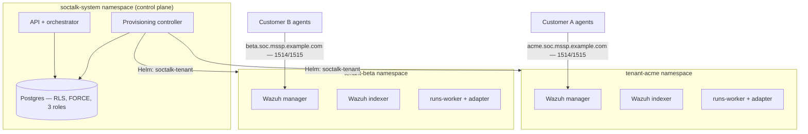

# Wazuh multi-tenant para MSSPs: patrones de arquitectura que realmente aíslan tenants

Wazuh no tiene multi-tenancy de primera clase. No existe un objeto "tenant" en el manager, no hay una frontera por cliente en el conjunto de reglas, ni un alcance por cliente en el enrolamiento de `authd`. Todo MSSP que estandariza sobre Wazuh termina construyendo la tenencia alrededor de él — y el patrón que elijas determina tus garantías de aislamiento, tu velocidad de onboarding y tu piso de costo por cliente.

Esta guía cubre lo que un MSSP realmente necesita de un despliegue de Wazuh multi-tenant, los tres patrones que los equipos prueban en la práctica, y lo que el aislamiento de grado productivo exige más allá del propio SIEM. Es la arquitectura que SocTalk implementa como código abierto (Apache 2.0); las páginas de referencia enlazadas a lo largo del texto documentan el comportamiento V1 ya publicado, y llevan "notas de despliegue V1" explícitas donde una sección describe la arquitectura objetivo.

## Lo que un MSSP necesita y Wazuh no provee

Tres requisitos aparecen en toda conversación de despliegue con un MSSP:

1. **Aislamiento que puedas defender en una revisión de seguridad del cliente.** "El cliente A no puede leer las alertas del cliente B" tiene que cumplirse en la capa de datos, la capa de red y la capa de enrolamiento de agentes — no solo en el dashboard.
2. **Velocidad de onboarding.** Si aprovisionar el SOC de un cliente nuevo es una semana de trabajo manual, el patrón no escala más allá de un puñado de clientes.
3. **Control de costos por tenant.** Necesitas saber cuánto cuesta un cliente en RAM, CPU y disco, limitarlo, y evitar que un tenant ruidoso deje sin recursos a los demás.

## Los tres patrones que los MSSPs prueban

### Patrón 1: manager compartido, separación a nivel de índice

Un solo manager de Wazuh, los agentes de todos los clientes enrolados contra él, y la separación hecha aguas abajo — multi-tenancy de OpenSearch Dashboards para los objetos del dashboard, patrones de índice y roles de seguridad para acotar la lectura. Este es el patrón que describen la mayoría de los hilos sobre multi-tenancy en Wazuh, porque es el único que puedes construir sin salir del propio tooling de Wazuh.

El problema es que la separación es un filtro del lado de lectura, no una frontera. El manager en sí es compartido: un solo conjunto de reglas, un solo secreto de `authd`, una sola API, una sola ventana de actualización para todos. Un rol mal configurado expone a todos los clientes a la vez, y los paquetes de reglas o las políticas de retención por cliente son imposibles sin afectar al resto.

### Patrón 2: manager por tenant en VMs

Una VM (o conjunto de VMs) por cliente, ejecutando un manager y un indexer dedicados. El aislamiento es real — procesos, discos y credenciales separados. Aquí es donde los MSSPs aterrizan después de que el patrón de manager compartido les pasa factura. El costo es operativo: el onboarding implica aprovisionar máquinas, las actualizaciones implican tocar cada VM, y el piso de recursos por tenant es una VM completa sin scheduling compartido que recupere la capacidad ociosa. Funciona con 5 clientes y duele con 30.

### Patrón 3: manager por tenant en Kubernetes, detrás de un plano de control

Cada cliente recibe un manager, un indexer y un dashboard de Wazuh dedicados en su propio namespace de Kubernetes, con una ResourceQuota y un LimitRange que limitan su huella. Un plano de control es dueño del ciclo de vida: el onboarding renderiza un release de Helm por tenant, el desmantelamiento lo elimina, y el estado del tenant vive en una base de datos en lugar de una hoja de cálculo. El aislamiento viene de la frontera del namespace más NetworkPolicy; la densidad, del scheduler empaquetando tenants en nodos compartidos.

### Los trade-offs, con honestidad

| | Manager compartido + separación por índice | Manager por tenant en VMs | Manager por tenant en Kubernetes |
|---|---|---|---|
| Frontera de aislamiento | Filtros de lectura sobre datos compartidos | Frontera de máquina | Namespace + NetworkPolicy + cuota |
| Radio de impacto de un compromiso | Todos los clientes | Un cliente | Un cliente |
| Reglas / retención / actualizaciones por tenant | No | Sí | Sí |
| Onboarding de un cliente | Rápido (cambio de configuración) | Lento (aprovisionar máquinas) | Rápido, si está automatizado (release de Helm) |
| Densidad / costo por tenant | El mejor | El peor | Bueno (empaquetado por el scheduler, limitado por cuotas) |
| Habilidad operativa requerida | Wazuh + seguridad de OpenSearch | Automatización de flotas/VMs | Kubernetes |
| Operación de flota con 30+ tenants | N/A (un solo stack) | Dolorosa | Manejable con un plano de control |

De los tres, el patrón 3 es el que está construido para entregar tanto aislamiento real como velocidad de onboarding — pero solo si el plano de control existe. Los namespaces por sí solos son una convención de nombres, no una frontera de seguridad. El resto de esta guía trata de lo que hace que la frontera sea real.

## El aislamiento en producción es más que el SIEM

Un stack de Wazuh por tenant aísla los datos del SIEM. Una plataforma MSSP también tiene estado entre tenants — casos, colas de revisión, registros de auditoría, configuraciones de integración — y esa capa necesita su propia aplicación de políticas.

### Capa de datos: seguridad a nivel de fila de Postgres, forzada y probada

El filtrado a nivel de aplicación con `WHERE tenant_id = ?` está a una cláusula olvidada de una fuga entre tenants. La base de datos debe hacer cumplir la tenencia por sí misma. El patrón:

- Cada tabla con alcance de tenant lleva políticas RLS ancladas a un ajuste `app.current_tenant_id` por transacción. Un contexto sin establecer produce **cero filas** — cero defensivo, no fuga.
- `FORCE ROW LEVEL SECURITY` en cada tabla con alcance de tenant, de modo que incluso el dueño de la tabla (el rol de migración) queda sujeto a la política. Por defecto Postgres exime a los dueños; una migración que lee datos de tenants podría de otro modo cruzar tenants silenciosamente.
- Una división en tres roles: un dueño de migraciones, un rol de runtime sujeto a RLS, y un rol `BYPASSRLS` segregado y reservado para rutas entre tenants auditadas. Ninguna aplicación se conecta como superusuario.
- Pruebas de aislamiento en CI — sondas de endpoints, SQL crudo bajo el rol de la aplicación, workers sin contexto, sondas con el rol dueño, flujos de eventos entre tenants. SocTalk ejecuta siete de estas pruebas, todas obligatorias; ninguna opcional.
- Claves de idempotencia con alcance `UNIQUE (tenant_id, idempotency_key)`, de modo que los pipelines de alertas de dos clientes puedan emitir el mismo ID de alerta externo sin colisionar.

Plantillas de políticas completas, DDL de roles y la suite de pruebas: [RLS de Postgres](/es-419/reference/postgres-rls).

### Capa de red: NetworkPolicy por namespace

La frontera del namespace no significa nada sin un CNI que la haga cumplir — el Flannel por defecto de K3s no aplica NetworkPolicy en absoluto. La postura objetivo es una línea base de denegación por defecto por namespace de tenant con permisos explícitos: tráfico intra-namespace, DNS, acceso del plano de control a los puertos del plano de datos del tenant, e ingreso de agentes en 1514/1515. El tráfico tenant-a-tenant y el egreso general del tenant quedan bloqueados.

SocTalk usa Cilium como el CNI soportado (aplicación de NetworkPolicy, egreso basado en FQDN para endpoints de LLM direccionados por hostname, observabilidad de flujos con Hubble para depurar preguntas de aislamiento). Ten presente la salvedad de V1: la lista de egreso por tenant totalmente anclada a FQDN es el destino del diseño, y el chart actual renderiza políticas más simples — egreso permisivo para el plano de control y egreso TCP/443 amplio para el worker por tenant. Las plantillas renderizadas están en el repositorio; lee el [diseño de NetworkPolicy](/es-419/reference/network-policy) para conocer tanto las políticas publicadas como la arquitectura objetivo.

### Enrolamiento de agentes: endpoints y secretos por tenant

El modo de falla más sutil: el agente del cliente A registrándose con el manager del cliente B. El protocolo de agente de Wazuh en 1514/TCP es un flujo cifrado propietario, no TLS estándar — no hay SNI sobre el cual enrutar, así que los proxies L4 que inspeccionan hostnames fallan silenciosamente. El enrutamiento tiene que ser por dirección de destino: cada tenant recibe su propio nombre DNS (`acme.soc.mssp.example.com`) que resuelve a un endpoint L4 por tenant, con un fallback de puerto por tenant cuando las IPs escasean.

Los secretos de enrolamiento tienen alcance de tenant: el secreto compartido de `authd` de cada tenant vive en el namespace de ese tenant, de modo que un agente con el secreto del tenant A solo puede registrarse con el manager de A — el direccionamiento lo enruta allí y el manager verifica el secreto. En V1, el aprovisionamiento de LoadBalancer y DNS es cableado manual del MSSP, no automatizado. Detalles y el runbook de enrolamiento: [Ingreso de agentes Wazuh](/es-419/reference/wazuh-ingress).

## Capacidad: cuánto cuesta un tenant

Los números que los MSSPs piden primero, del trabajo de dimensionamiento de SocTalk:

- **Huella por tenant (stack completo):** ~8 GB de RAM solicitados (~16 GB de límite), ~2.2 vCPU solicitados, ~120 GB de disco. El uso sostenido sigue a los requests; los límites son techos de ráfaga.
- **El cuello de botella suele ser el indexer de Wazuh por tenant** — cada uno es un proceso Java con su propio heap. Planifica ~6–8 GB de RAM y ~1.5 vCPU por tenant en producción.
- **El disco lo determina la tasa de ingesta:** aproximadamente 5 GB/día de índice a 10 alertas/seg sostenidas; el PVC por defecto del indexer es de 50 GB con retención caliente de 30 días.
- **Escala probada:** hasta ~50 tenants en un clúster de 3 nodos (16 vCPU / 64 GB por nodo). Los perfiles de instalación única más grandes están documentados pero no validados en esta versión — no planifiques más allá de ese número en una sola instalación sin probarlo.

Perfiles de host de referencia y la fórmula de máximo de tenants por nodo: [Dimensionamiento](/es-419/reference/sizing) y las [preguntas frecuentes sobre escalado](/es-419/faq#does-it-scale-to-n-customers).

## Cómo SocTalk empaqueta este patrón

SocTalk es una implementación de código abierto (Apache 2.0, sin división community/enterprise) del patrón 3: un plano de control, un release de Helm `soctalk-tenant` por cliente, sobre tu propio Kubernetes 1.30+ — K3s, EKS, AKS o GKE.

El onboarding ejecuta una secuencia de aprovisionamiento de nueve fases — preflight, acuñación de secretos, namespace con cuotas, instalaciones de Helm, sondeo de disponibilidad — cada fase emitiendo un evento de ciclo de vida y reintentable de forma idempotente desde `degraded`. El estado del tenant es una máquina aplicada por el servidor (`pending → provisioning → active`, con los estados suspended, decommissioning, archived y purged; las transiciones inválidas devuelven 409). Tres perfiles de onboarding cubren demos (`poc`), producción (`persistent`) y BYO-Wazuh (`provided`, donde SocTalk se conecta al stack existente de un cliente en lugar de desplegar uno). El desmantelamiento derriba el plano de datos pero conserva la fila del tenant y el historial de auditoría.

El ciclo de vida completo — estados, fases, cuotas, rutas de recuperación — está en [Ciclo de vida del tenant](/es-419/tenant-lifecycle). Para ejecutarlo: la [guía de instalación](/es-419/install) cubre un clúster de producción en aproximadamente una hora, y la [VM de demostración](/es-419/quickstart-vm) arranca una instalación multi-tenant funcional con un tenant de demostración en unos cinco minutos.
