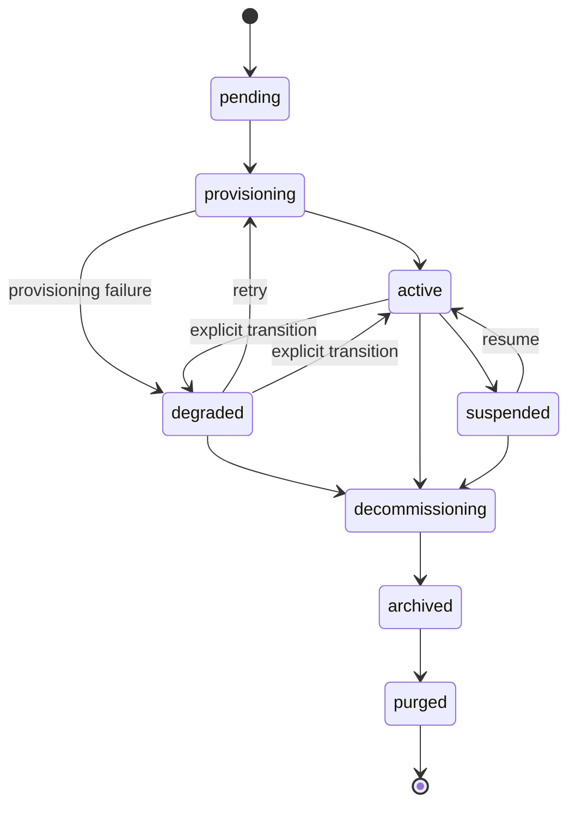

# Ciclo de vida del tenant

Qué le sucede al SOC de un cliente desde el "onboarding" hasta la "purga". Esta página es el complemento orientado al operador de [Contrato del Chart](/es-419/reference/chart-contract) (que documenta la representación de los valores en tránsito) y de [Operaciones diarias](/es-419/operations) (que documenta el lado del runbook).

## Máquina de estados del tenant



Las transiciones a `degraded` ocurren **únicamente por la ruta de fallo del controlador de aprovisionamiento** (una fase que lanzó `ProvisionError`). No existe ningún endpoint de API para marcar manualmente un tenant como `degraded`, ningún bucle de auto-degradación que vigile la antigüedad del heartbeat del adaptador, ni degradación basada en métricas. El indicador (gauge) `soctalk_tenant_adapter_heartbeat_age_seconds` se actualiza con los heartbeats pero no retroalimenta el estado del tenant. Las transiciones de regreso a `active` ocurren como efecto secundario de un re-aprovisionamiento `:retry` exitoso.

| Estado | Qué significa | Qué está en ejecución |
|---|---|---|
| `pending` | Onboarding aceptado, el controlador aún no ha iniciado el aprovisionamiento. | nada en `tenant-<slug>` |
| `provisioning` | El controlador está creando el namespace, los secrets, e instalando por helm el chart del tenant. | parcial — pods apareciendo |
| `active` | El tenant transicionó a `active` después de que el controlador de aprovisionamiento vio que los pods del plano de datos alcanzaron Ready. | Wazuh manager + indexer + dashboard + soctalk-adapter + runs-worker |
| `degraded` | El controlador de aprovisionamiento marcó el tenant como `degraded` tras un fallo de aprovisionamiento (o un operador transicionó manualmente). **La plataforma actualmente no realiza la auto-transición active→degraded basándose en la antigüedad del heartbeat del adaptador**; el indicador (gauge) `soctalk_tenant_adapter_heartbeat_age_seconds` es para tu alertado | indeterminado; revisa los pods |
| `suspended` | El administrador del MSSP marcó el tenant como suspendido en la base de datos. **En esta versión las cargas de trabajo NO se escalan por la propia acción de suspensión** — eso requiere el procedimiento manual de deshabilitación de emergencia (ver [Operaciones diarias → Deshabilitación de emergencia](/es-419/operations#emergency-disable-a-tenant-immediately)). El flag de estado impide que se programen nuevas investigaciones. | sin cambios — los pods siguen ejecutándose salvo que el operador los escale hacia abajo |
| `decommissioning` | Desmantelamiento en curso. Desinstalación del release de Helm, eliminación de PVCs. | reduciéndose |
| `archived` | Release de Helm eliminado; PVCs eliminados; la fila del tenant permanece para auditoría. | nada |
| `purged` | Fila del tenant eliminada permanentemente (hard-delete). | nada — solo quedan las entradas del registro de auditoría |

Las transiciones permitidas se aplican en `TenantController.VALID_TRANSITIONS`. Intentar suspender un tenant en estado `decommissioning` devuelve HTTP 409 con una lista de los siguientes estados válidos.

## Pasos de aprovisionamiento

El método `provision()` del controlador se ejecuta en nueve fases ordenadas. Cada fase emite una fila `TenantLifecycleEvent` visible en la página de detalle del tenant (tabla Eventos del ciclo de vida).

| # | Evento | Qué sucede |
|---|---|---|
| 1 | `preflight_ok` | Pasan las verificaciones previas (prerrequisitos del clúster, conflictos de nombres). |
| 2 | `secrets_minted` | Genera los secrets por tenant (`authd`, firma JWT, Postgres). |
| 3 | `namespace_ready` | Crea `tenant-<slug>` con labels, ResourceQuota, LimitRange. |
| 4 | `secrets_applied` | Introduce los secrets en K8s como objetos `Secret/*` en el nuevo namespace. |
| 5 | `helm_applied` (chart del tenant) | Instala el chart `soctalk-tenant` (adapter + runs-worker + ingress). El usuario tenant_admin se aprovisiona automáticamente como parte de este paso (inline `_mint_tenant_admin_user`). |
| 6 | `helm_applied` (chart de Wazuh) | Instala el chart independiente de Wazuh (manager/indexer/dashboard). El payload de la fila del evento identifica qué chart se aplicó. |
| 7 | `workloads_ready` | Sondea hasta que todos los pods del plano de datos estén Ready. |
| 8 | `integration_config_written` | Escribe en la base de datos las configuraciones de integración por tenant (LLM, URLs de TheHive, etc.). |
| 9 | `active` | Transición de estado a `active`. |

Un fallo en cualquier fase transiciona el tenant a `degraded` con el error capturado en la fila del evento. **Reintentar aprovisionamiento** (`POST /api/mssp/tenants/{id}:retry`) es una transición válida desde `degraded` de regreso a `provisioning` (y **no** está permitida desde `pending` — `pending → provisioning` solo ocurre automáticamente cuando el controlador inicia el primer intento). `provision()` es idempotente en cada fase.

## Perfiles

El perfil se elige en el momento del onboarding y es **fijo durante toda la vida del tenant**. Cambiar de perfil requiere `decommission` + recrear.

### `poc`

Para evaluaciones, demostraciones y pilotos de corta duración.

- StorageClass: `local-path` (valor por defecto de k3s; sin garantía real de persistencia)
- Heap JVM del Wazuh indexer: 512 MiB
- Peticiones de recursos en el extremo bajo de los rangos del chart
- Sin hooks de backup conectados

Este es el perfil que usa la [imagen de VM de demostración](/es-419/quickstart-vm) para su tenant `demo` incluido.

### `persistent`

Para SOCs de clientes en producción.

- StorageClass: lo que la instalación marque como predeterminado (Longhorn, Rook/Ceph, CSI del proveedor de nube)
- Heap JVM del Wazuh indexer: valor por defecto del chart (típicamente 2–4 GiB)
- Peticiones/límites de recursos dimensionados para carga sostenida
- Hooks de backup respetados si están configurados

Elige `persistent` para cualquier cosa orientada al cliente. El valor por defecto es `poc` si no se especifica, lo cual es el valor por defecto equivocado para un cliente real.

### `provided`

Para tenants que traen su propia pila de Wazuh desplegada externamente ("BYO-SIEM"). El chart del tenant instala únicamente el adaptador de SocTalk + runs-worker; no se ejecuta ningún Wazuh/TheHive/Cortex dentro del namespace del tenant.

- StorageClass: irrelevante — solo se aprovisiona el PVC de checkpoint del adaptador
- Wazuh: despliegue propio del tenant, alcanzado por la red a través de las URLs del indexer (:9200) y de la Manager API (:55000) suministradas en el momento del onboarding
- El material de conexión al SIEM externo (`wazuh_indexer_url`, `wazuh_api_url`, credenciales basic-auth) es **obligatorio** en el onboarding y se valida en el servidor (422 si está incompleto)
- Las credenciales de LLM por tenant también son **obligatorias** en el onboarding (no hay fallback compartido de la instalación para `provided`)
- Una lista de permitidos de egress FQDN de Cilium se deriva automáticamente de los hostnames de indexer/API suministrados

Elige `provided` cuando el cliente ya ejecuta Wazuh y quiere que SocTalk lo consulte en su lugar. Consulta el [tutorial del piloto MSSP → §3.1](/es-419/mssp-pilot#_3-1-run-the-create-customer-wizard) para el recorrido del asistente (el paso SIEM externo) y la [§3.4](/es-419/mssp-pilot#_3-4-coordinating-external-wazuh-creds-for-provided-tenants) para el trabajo de coordinación aguas arriba.

## Cuotas de recursos

Cada namespace `tenant-<slug>` recibe un `ResourceQuota` y un `LimitRange` en el momento de la creación, acotados a la huella esperada del perfil. Consulta [Dimensionamiento](/es-419/reference/sizing).

| Perfil | Peticiones de CPU | Límites de CPU | Peticiones de memoria | Límites de memoria | PVCs | Pods |
|---|---|---|---|---|---|---|
| `poc` | 2 | 4 | 4 Gi | 8 Gi | 4 | 20 |
| `persistent` | 2 | 5 | 6 Gi | 12 Gi | 6 | 30 |
| `provided` | 1 | 2 | 2 Gi | 4 Gi | 2 | 10 |

(Los números exactos viven en `_profile_tenant_overrides` en [`render.py`](https://github.com/soctalk/soctalk/blob/main/src/soctalk/core/provisioning/render.py).)

Si una carga de trabajo real excede el presupuesto del perfil (p. ej., el Wazuh indexer se ralentiza durante una ingesta intensa), aumenta el ResourceQuota mediante `helm upgrade` con valores sobrescritos. No edites el objeto ResourceQuota directamente — la siguiente actualización del chart lo sobrescribirá.

## Rutas de recuperación

### Tenant atascado en `pending` tras el onboarding

El controlador se cayó o fue reprogramado a mitad del aprovisionamiento antes de que se ejecutara la primera fase. El reintento no está permitido directamente desde `pending` — primero espera a que el intento de aprovisionamiento transicione a `degraded` (visible en los eventos del ciclo de vida), luego haz clic en **Reintentar aprovisionamiento** en la página de detalle del tenant (o `POST /api/mssp/tenants/{id}:retry`). El aprovisionamiento se reanuda desde la fase 1; cada fase es idempotente.

### Tenant en `provisioning` por más de 15 minutos

Normalmente un pod atascado (ImagePullBackOff, PVC en `Pending`, ResourceQuota demasiado pequeña). Consulta [Operaciones diarias — Tenant atascado en aprovisionamiento](/es-419/operations#tenant-stuck-in-provisioning).

### Tenant en `degraded`

En V1, a `degraded` solo se entra tras un **fallo de aprovisionamiento**, no por pérdida de heartbeat. Si un tenant está en `degraded`, el controlador de aprovisionamiento falló en uno de los 9 pasos anteriores — lee la fila del evento del ciclo de vida para ver cuál. El plano de datos (Wazuh) puede seguir ejecutándose dependiendo de qué paso falló. Consulta [Operaciones diarias — Tenant en estado degradado](/es-419/operations#tenant-in-degraded-state).

### Tenant en `suspended`

Hiciste esto deliberadamente. Reanuda desde la UI o con `POST /api/mssp/tenants/<id>:resume` — pero ten en cuenta que en esta versión **la reanudación solo actualiza el estado en la base de datos**, no restaura los conteos de réplicas. Si escalaste las cargas de trabajo a cero durante la suspensión (mediante el flujo de deshabilitación de emergencia), debes volver a escalarlas hacia arriba manualmente.

### Tenant en `decommissioning` por más de 30 minutos

Desinstalación de Helm atascada. Lo más frecuente es un finalizer en un PVC que nunca se ejecutó. `helm uninstall tenant-<slug> -n tenant-<slug> --no-hooks` y elimina los finalizers manualmente:

```bash
kubectl -n tenant-<slug> get pvc -o name | \
  xargs -I {} kubectl -n tenant-<slug> patch {} -p '{"metadata":{"finalizers":null}}' --type=merge
```

Luego vuelve a disparar el decommission. Documenta esto en el registro de auditoría para que la traza quede intacta.

## Decommission vs purge

`decommission` desmantela el plano de datos y transiciona el tenant a `archived` — la fila del tenant y el historial de auditoría permanecen. `purged` es el estado terminal de la máquina de estados (`archived → purged`), pero **no hay endpoint de API `:purge` en esta versión**. Hoy, transicionar a `purged` requiere una actualización a nivel de base de datos; un `POST /api/mssp/tenants/{id}:purge` restringido a administradores está en el roadmap. Hasta que se lance, deja los tenants desmantelados en `archived` y trata las filas archivadas como la superficie de retención a largo plazo.

## Punteros al código fuente

| Concepto | Archivo |
|---|---|
| Enum de estados del tenant + transiciones | [`src/soctalk/core/tenancy/models.py`](https://github.com/soctalk/soctalk/blob/main/src/soctalk/core/tenancy/models.py) |
| Controlador de aprovisionamiento | [`src/soctalk/core/provisioning/controller.py`](https://github.com/soctalk/soctalk/blob/main/src/soctalk/core/provisioning/controller.py) |
| API de onboarding + payload | [`src/soctalk/core/api/tenants.py`](https://github.com/soctalk/soctalk/blob/main/src/soctalk/core/api/tenants.py) |
| Tabla de eventos del ciclo de vida | [`src/soctalk/core/tenancy/models.py`](https://github.com/soctalk/soctalk/blob/main/src/soctalk/core/tenancy/models.py) |
