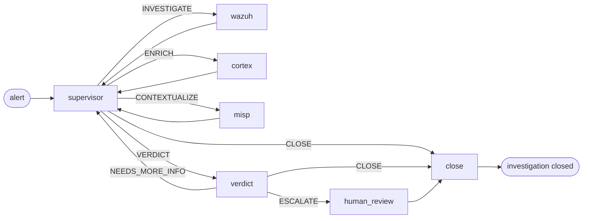

# Pipeline d'IA

Ce qui se passe entre « une alerte arrive » et « un verdict est écrit ». La couche de triage de SocTalk est une machine à états LangGraph, un superviseur qui achemine le travail vers des nœuds worker spécialisés, puis un nœud de verdict qui décide si le cas nécessite une revue humaine.

Cette page est le modèle mental. Le code se trouve dans [`src/soctalk/graph/`](https://github.com/soctalk/soctalk/tree/main/src/soctalk/graph), [`src/soctalk/supervisor/`](https://github.com/soctalk/soctalk/tree/main/src/soctalk/supervisor) et [`src/soctalk/workers/`](https://github.com/soctalk/soctalk/tree/main/src/soctalk/workers).

## Nœuds

| Nœud | Rôle | Modèle utilisé |
|---|---|---|
| **supervisor** | Décide de la prochaine action. Routage pur, n'effectue lui-même aucun travail métier. | modèle rapide |
| **wazuh_worker** | Récupère l'alerte en contexte, extrait les observables (IP, hachages, utilisateurs, processus), corrèle avec les alertes récentes du même tenant. | modèle rapide |
| **cortex_worker** | Envoie les observables aux analyseurs Cortex (VirusTotal, AbuseIPDB, etc.) pour la réputation/l'enrichissement. | modèle rapide |
| **misp_worker** | Recherche les observables dans les flux de renseignement sur les menaces MISP pour le contexte de campagne/acteur connu. | modèle rapide |
| **verdict** | Raisonne sur tout ce que les workers ont collecté. Produit `escalate | close | needs_more_info` + niveau de confiance + une courte justification. | **modèle de raisonnement** |
| **human_review** | Met le run en pause ; émet une demande d'examen vers la file du tableau de bord et/ou Slack. Attend une `HumanDecision` (`approve | reject | more_info`). |, (humains) |
| **close** | Génère le rapport de clôture et écrit la disposition (`close_fp | escalate | leave_open`). **En V1, le nœud close ne publie pas vers les intégrations sortantes.** Aucun nœud du graphe ne publie actuellement vers TheHive en V1 (le nœud `thehive_worker` référencé dans les brouillons antérieurs n'est pas câblé dans le constructeur de graphe V1). La publication via webhook Slack depuis close n'est pas non plus câblée. L'intégration sortante depuis le nœud close est sur la feuille de route. | modèle rapide |

## Routage du superviseur

Le seul travail du superviseur est de choisir le nœud suivant. Son espace de décision est une énumération fixe à 5 éléments :

| Décision | Signification |
|---|---|
| `INVESTIGATE` | Je n'en sais pas encore assez sur cette alerte. Exécuter le worker Wazuh. |
| `ENRICH` | J'ai des observables dont je n'ai pas vérifié la réputation. Exécuter Cortex. |
| `CONTEXTUALIZE` | Les observables semblent intéressants ; rechercher des campagnes/acteurs connus. Exécuter MISP. |
| `VERDICT` | J'en ai assez. Transmettre au nœud de verdict. |
| `CLOSE` | Il s'agit d'un cas tranché (par exemple, un faux positif évident ou une alerte déjà résolue). Ignorer le nœud de verdict. |

Le superviseur n'invoque jamais lui-même d'outils externes. Il lit le `SecOpsState` accumulé (alertes, observables, sorties de workers antérieures, verdicts) et produit l'une des cinq décisions. La plupart des cas enchaînent superviseur → worker → superviseur → worker → superviseur → VERDICT, soit trois à six sauts au total.

## Nœud de verdict

Le modèle de raisonnement reçoit tout l'état accumulé, alerte d'origine, conclusions de chaque worker, tous les observables avec leur enrichissement, tentatives de verdict antérieures (si `NEEDS_MORE_INFO` a bouclé). Il produit :

| Champ | Type |
|---|---|
| `decision` | `escalate | close | needs_more_info` |
| `confidence` | énumération : `low | medium | high` |
| `rationale` | markdown court |
| `evidence_strength` | `weak | moderate | strong | conclusive` |
| `verdict` | `benign | suspicious | malicious | unknown` |
| `impact` | `low | medium | high | critical` |

`escalate` passe toujours par `human_review`. `close` ignore la revue humaine et va directement à `close`. `needs_more_info` retourne au superviseur avec une invite suggérant ce qui manque encore.

## Portail de revue humaine

`human_review` met le run en pause. Le cas apparaît dans la [file d'examen](/fr-fr/mssp-ui#reviews-human-in-the-loop) du tableau de bord et (si Slack est configuré) dans le [HIL bidirectionnel Slack](/fr-fr/human-review). L'humain choisit :

| Décision | Effet sur le cas |
|---|---|
| `approve` | Examen en attente marqué comme terminé + retour audité. **Pas** de reprise automatique ; suivi par l'analyste. |
| `reject` | Le cas se clôt en `auto_closed_fp`. Terminal, le graphe n'est pas ré-invoqué. |
| `more_info` | Examen marqué `info_requested` avec la liste de questions. **Pas** de reprise automatique ; suivi par l'analyste. |

L'identité de l'humain, l'horodatage et la justification sont ajoutés au journal `case_events` du cas, en ajout seul.

## Cycle de vie d'un run

Un « run » est une exécution du graphe sur un cas. Énumération de statut :

| Statut | Signification |
|---|---|
| `active` | Le graphe est en cours d'exécution. |
| `waiting_on_gate` | En pause à `human_review`. |
| `paused` | Mis en pause manuellement par un administrateur MSSP. |
| `halted_budget` | A atteint le budget de tokens par run. Les runs V1 normaux prennent `tokens_budget = 200,000` depuis la ligne `case_runs` (valeur par défaut du modèle). La variable d'environnement `SOCTALK_CASE_RUN_TOKEN_BUDGET` (par défaut 15,000) n'est utilisée qu'en repli lorsque la ligne n'a aucune valeur définie. |
| `completed` | Le graphe a atteint `close` et a écrit une disposition. |
| `failed` | Le graphe a rencontré une erreur ou un outil externe est injoignable. |

Les budgets de tokens sont suivis par run, par tenant et à l'échelle de l'installation. Voir [Observabilité](/fr-fr/observability) pour les métriques, [Fournisseurs LLM](/fr-fr/integrate/llm-providers) pour les leviers de coût.

## Le processus runs-worker

Chaque tenant possède son propre pod `runs-worker` (dans l'espace de noms `tenant-<slug>`) qui consomme la file :

1. Appelle `POST /api/internal/worker/runs/claim` pour un run assigné à son tenant.
2. Construit le LangGraph à partir du chart de nœuds.
3. `ainvoke()` sur le graphe, en publiant `POST /api/internal/worker/runs/{run_id}/heartbeat` toutes les 20 s.
4. À la fin, publie l'état final et la disposition vers `POST /api/internal/worker/runs/{run_id}/complete`.

Le runs-worker est le seul pod de calcul par tenant, le garder dans l'espace de noms du tenant signifie qu'un tenant dépassant son budget ne peut pas priver le reste de l'installation de calcul. La logique superviseur + worker + verdict elle-même est sans état ; le gros du travail réside dans les appels LLM (hors cluster, facturés au fournisseur configuré du tenant).

## Pointeurs de code source

| Concept | Fichier |
|---|---|
| Constructeur de graphe + routage | [`src/soctalk/graph/builder.py`](https://github.com/soctalk/soctalk/blob/main/src/soctalk/graph/builder.py) |
| Logique du superviseur | [`src/soctalk/supervisor/node.py`](https://github.com/soctalk/soctalk/blob/main/src/soctalk/supervisor/node.py) |
| Nœud de verdict | [`src/soctalk/supervisor/verdict.py`](https://github.com/soctalk/soctalk/blob/main/src/soctalk/supervisor/verdict.py) |
| Nœuds worker | [`src/soctalk/workers/`](https://github.com/soctalk/soctalk/tree/main/src/soctalk/workers) |
| Clôture / disposition | [`src/soctalk/graph/close.py`](https://github.com/soctalk/soctalk/blob/main/src/soctalk/graph/close.py) |
| Boucle du runs worker | [`src/soctalk/runs_worker/main.py`](https://github.com/soctalk/soctalk/blob/main/src/soctalk/runs_worker/main.py) |
| Schéma d'état | [`src/soctalk/models/state.py`](https://github.com/soctalk/soctalk/blob/main/src/soctalk/models/state.py) |
