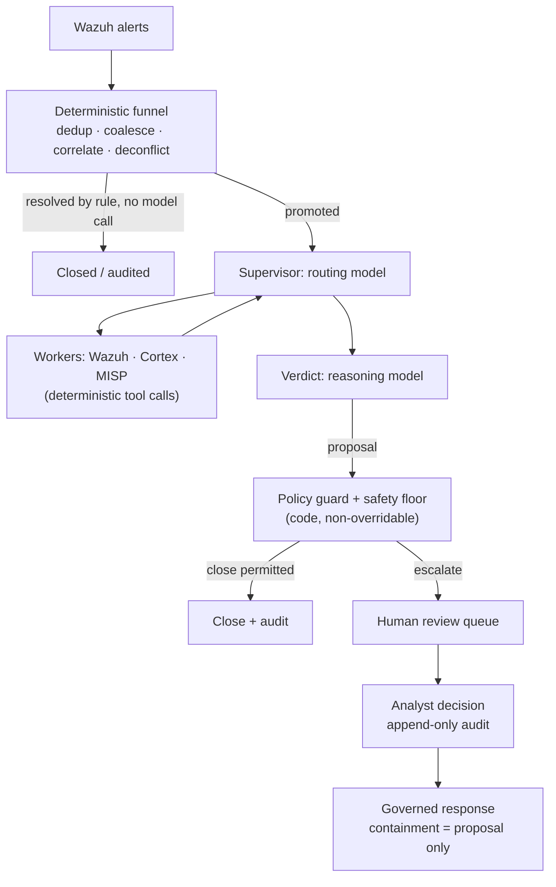

# Triage IA des alertes Wazuh : ce qui tient en production (et ce qui ne tient pas)

Chaque opérateur Wazuh a eu la même idée : le manager produit des milliers d'alertes par jour, la plupart ne sont que du bruit, et un LLM sait très bien lire une alerte et dire « c'est une tentative de force brute » ou « c'est une tâche cron ». Vous branchez donc un webhook de Wazuh vers un outil de workflow, vous déposez le JSON de l'alerte dans un prompt et vous publiez la réponse du modèle quelque part.

Ce prototype fonctionne. Il échoue aussi en production, de manière prévisible. Ce guide explique pourquoi, et décrit l'architecture qui tient quand le triage IA des alertes Wazuh doit tourner sans surveillance face à un volume d'alertes réel — l'architecture que SocTalk implémente.

## Pourquoi « envoyer chaque alerte à un LLM » casse

Le schéma naïf — webhook Wazuh → prompt LLM → verdict — présente trois problèmes structurels, dont aucun ne se corrige avec un meilleur prompt.

**Le coût suit le bruit, pas le signal.** Un seul scan peut produire des milliers d'alertes. Si chaque alerte brute coûte un appel de modèle, votre dépense est proportionnelle au niveau de bruit de votre environnement, et la contrainte de coût vous pousse vers des modèles plus faibles précisément sur les cas où le jugement compte le plus.

**Le modèle n'a ni contexte ni plancher.** Un LLM qui lit une alerte isolée n'a aucun souvenir de ce qu'un analyste a décidé la veille, aucune image de l'état propre de l'organisation — il ne peut donc pas distinguer un changement autorisé d'une attaque produisant une alerte identique à l'octet près — et aucune garantie qu'il ne clôturera pas avec assurance par-dessus un véritable indicateur de compromission. Un verdict « bénin » halluciné sur une intrusion réelle n'est pas un problème de qualité tolérable à quelque taux que ce soit ; c'est une détection supprimée.

**Il n'y a ni piste d'audit ni barrière.** Un workflow qui publie le verdict du modèle directement dans un canal ne conserve aucune trace des preuves sur lesquelles le verdict reposait, aucune identité de relecteur, et aucun mécanisme pour empêcher un mauvais verdict de devenir un dossier clos.

Soyons honnêtes : le prototype à base de webhook est un bon moyen de vous convaincre que les LLM savent raisonner sur des alertes. C'est l'*architecture autour* du modèle qui manque.

## L'architecture qui fonctionne : un entonnoir déterministe avant tout appel de modèle

Le premier correctif est contre-intuitif : la majeure partie d'un pipeline de triage IA ne devrait pas être de l'IA. Dans SocTalk, le plan d'ingestion est côté serveur et entièrement déterministe — aucun modèle n'y touche :

- **La déduplication** écarte les événements rejoués portant un ID déjà vu.
- **Le regroupement (coalescing)** rassemble en un seul dossier les alertes répétées de la même règle sur le même actif dans une fenêtre de cinq minutes — une rafale d'une même détection devient un dossier, pas des milliers.
- **La corrélation d'entités** rattache comme preuve une nouvelle alerte partageant une entité forte (hôte, hash de fichier) avec une enquête active, au lieu de démarrer une nouvelle exécution sans contexte.
- **La déconfliction d'engagements** met en correspondance les fenêtres de pentest et de red team déclarées par source, hôte, technique et horaire — les tests autorisés sont signalés et audités, jamais clôturés automatiquement, et l'activité d'un testeur hors périmètre est systématiquement soumise à un humain.
- **La clôture déterministe** traite par règle les faux positifs de faible gravité et de haute confiance, sans appel de modèle.

Beaucoup d'alertes n'atteignent jamais un modèle. Ce qui survit est promu en enquête, et même alors le modèle n'est consulté que dans deux rôles : un **superviseur** qui route l'enquête (récupérer le contexte hôte depuis Wazuh, vérifier la réputation des observables via les analyseurs Cortex, consulter le renseignement sur les menaces MISP — autant d'appels d'outils déterministes dont le modèle ne fait que *lire* les résultats), et un nœud de **verdict** où un modèle de raisonnement pèse tout ce qui a été collecté et propose `escalate`, `close` ou `needs_more_info` avec un niveau de confiance, une justification et une force de preuve.

## Des garde-fous comme données, des verdicts contrôlés par du code

Le second correctif : le verdict du modèle est une proposition, pas une validation. La règle de SocTalk est : *« le LLM propose ; une barrière déterministe dispose »*.

Les [politiques de triage](/fr-fr/triage-policies) sont des données — des règles déclaratives exécutées par un interpréteur unique — agissant à quatre barrières : un résolveur, une barrière pré-décision (un verdict n'est pas recevable tant que les étapes de preuve requises n'ont pas été exécutées), une garde post-verdict et un **plancher de sécurité**. Le plancher est au niveau du code et non contournable, appliqué en trois points indépendants (worker, serveur, ingestion). Aucune clôture automatique ne peut se déclencher par-dessus un IOC connu, un enregistrement d'autorisation contredit, un indicateur non vérifié, un incident lié actif, un interrupteur d'arrêt, ni au-delà du plafond de volume (500 clôtures automatiques par 24 heures par défaut). Les interrupteurs d'arrêt (`SOCTALK_AUTO_CLOSE_KILL` à l'échelle de l'installation, ou par tenant) transforment instantanément chaque clôture automatique en promotion — le contrôle que vous actionnez en plein incident.

La propriété qui rend sûres les politiques rédigées par les tenants : elles ne peuvent que rendre le triage **plus strict**, jamais plus laxiste. Un contournement de garde-fou ne peut que faire monter une décision le long de l'échelle `close < needs_more_info < escalate` ; la suppression n'est pas exprimable dans le langage de conditions, qui est sandboxé — arbres à opérateur unique sur un contrat d'état documenté, pas d'accès aux attributs, pas d'appels de fonction, politiques invalides rejetées en bloc à la validation. Une politique mal configurée ou hostile ne peut pas devenir un canal de suppression de détections.

## L'humain dans la boucle est une propriété stricte, pas un réglage

Chaque verdict `escalate` passe par une revue humaine. Il n'existe aucun contournement : un mode « auto-approve » purement IA n'est pas implémenté dans SocTalk (la suppression de cette barrière figure sur la feuille de route, prévue comme un basculement audité et réservé aux administrateurs — pas comme un défaut silencieux). En V1, la surface de revue est la file du tableau de bord, qui affiche la justification complète de l'IA et les preuves observables avec leur enrichissement. Les décisions d'analyste — approuver, rejeter, demander plus d'informations — écrivent des lignes d'audit en ajout seul, avec identité, horodatage et justification, jamais modifiables après soumission. Une proposition de clôture touchant un actif sensible (un hôte classé PCI, par exemple) est retenue pour validation humaine même quand le modèle est confiant.

La même posture gouverne la réponse : une action de confinement, comme l'isolement d'un terminal ou la désactivation d'un compte, est *toujours* soumise comme une proposition qu'un analyste approuve d'abord. Le modèle ne prend jamais une action de confinement de lui-même, et le déclenchement s'effectue côté serveur, jamais depuis la boucle du modèle. SocTalk est un copilote, pas un remplaçant d'analyste — la valeur réside dans la compression : la même équipe d'analystes peut absorber 5 à 10 fois le volume d'alertes, parce que les cas routiniers se clôturent automatiquement et que seuls les cas ambigus atteignent la revue humaine.

## Ingénierie des coûts

Parce que l'entonnoir résout beaucoup d'alertes sans appel de modèle, le coût suit l'ambiguïté plutôt que le volume. Les leviers restants :

- **Séparation rapide/raisonnement.** Le routage et les workers utilisent un modèle rapide ; seul le verdict utilise un modèle de raisonnement. Les valeurs par défaut sont `claude-sonnet-4-20250514` pour les deux, remplaçables par tenant (`SOCTALK_FAST_MODEL` / `SOCTALK_REASONING_MODEL`).
- **Budgets de tokens par exécution.** Chaque exécution porte un budget de tokens (200 000 par défaut pour le modèle), suivi par exécution, par tenant et à l'échelle de l'installation. Une enquête qui s'emballe s'arrête au lieu de facturer indéfiniment.
- **Combien ça coûte ?** Très variable, mais en ordre de grandeur : environ **9 $/jour par tenant** à ~30 alertes/jour sur une configuration économique compatible OpenAI, divisé par 5 à 10 avec un modèle rapide moins cher. Traitez cela comme une estimation de départ, pas comme un devis.
- **Option zéro coût par token.** Exécutez tout en local avec [Ollama](/fr-fr/integrate/ollama) : pas de LLM cloud, pas de coût par token, les données restent sur votre infrastructure. Choisissez un modèle capable d'appeler des outils (qwen2.5, llama3.1, mistral-nemo) — et sachez que l'inférence sur CPU se compte en minutes par enquête ; utilisez un hôte GPU pour une latence exploitable.

## Apportez votre propre LLM

Le runtime de SocTalk prend en charge deux fournisseurs : `anthropic` (Claude) et `openai` — c'est-à-dire OpenAI ou tout point de terminaison compatible OpenAI : Azure OpenAI, vLLM, Ollama, LiteLLM. Le fournisseur, le modèle, l'URL de base et la clé API sont tous remplaçables **par tenant**, et un client peut apporter sa propre clé pour isoler la facturation — elle est montée dans le runs-worker du tenant sous forme de Secret Kubernetes, dans le namespace propre à ce tenant. (Une exception documentée s'applique en V1 : la clé est aussi conservée en clair dans la base de données SocTalk, `IntegrationConfig.llm_api_key_plain` — voir [Secrets](/fr-fr/reference/secrets) pour la posture et les conseils de rotation.) Le modèle ne voit jamais que l'état de l'enquête en cours (corps de l'alerte, observables, sorties des workers) ; pour une posture plus stricte, pointez le tenant vers un point de terminaison on-prem. Détails dans [Fournisseurs LLM](/fr-fr/integrate/llm-providers).

## À quoi cela ressemble dans SocTalk

SocTalk est une plateforme SOC Apache 2.0, AI-first, pour MSP et MSSP : une stack Wazuh dédiée par client sur votre propre Kubernetes, derrière un seul plan de contrôle, avec le pipeline de triage ci-dessus exécuté par tenant. Pour aller plus loin :

- [Comment ça marche](/fr-fr/how-it-works) — l'histoire complète du pipeline : l'entonnoir déterministe, les deux rôles de modèle, le plancher de sécurité en trois points.
- [Pipeline IA](/fr-fr/ai-pipeline) — la machine à états LangGraph : superviseur, workers, verdict, cycle de vie des exécutions.
- [Politiques de triage](/fr-fr/triage-policies) — la rédaction de garde-fous déterministes dans l'éditeur no-code, mode shadow puis activation.
- [Revue humaine](/fr-fr/human-review) — la file de revue et le contrat de décision de l'analyste.

Ou sautez la lecture : la [VM de démonstration](/fr-fr/quickstart-vm) vous fournit une installation multi-tenant opérationnelle, avec un tenant de démonstration intégré, en cinq minutes environ.
