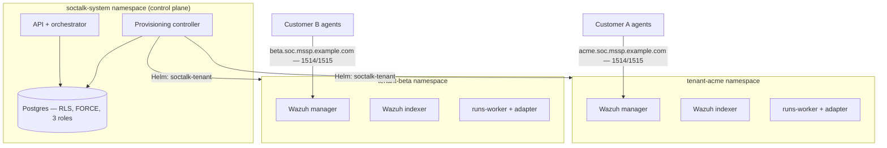

# Wazuh multi-tenant pour les MSSP : des patterns d'architecture qui isolent réellement les tenants

Wazuh n'offre pas de multi-tenance native. Il n'existe aucun objet « tenant » dans le manager, aucune frontière par client dans le ruleset, et aucun cloisonnement par client de l'enrôlement `authd`. Chaque MSSP qui standardise sur Wazuh finit par construire la tenance autour de l'outil — et le pattern que vous choisissez détermine vos garanties d'isolation, votre vitesse d'onboarding et votre coût plancher par client.

Ce guide couvre ce dont un MSSP a réellement besoin dans un déploiement Wazuh multi-tenant, les trois patterns que les équipes essaient en pratique, et ce que l'isolation de niveau production exige au-delà du SIEM lui-même. C'est l'architecture que SocTalk implémente en open source (Apache 2.0) ; les pages de référence liées tout au long du guide documentent le comportement V1 livré, et portent des « notes de déploiement V1 » explicites partout où une section décrit l'architecture cible.

## Ce dont un MSSP a besoin et que Wazuh ne fournit pas

Trois exigences reviennent dans chaque discussion de déploiement MSSP :

1. **Une isolation défendable lors d'une revue de sécurité client.** « Le client A ne peut pas lire les alertes du client B » doit tenir au niveau de la couche données, de la couche réseau et de la couche d'enrôlement des agents — pas seulement dans le tableau de bord.
2. **La vitesse d'onboarding.** Si le provisionnement d'un nouveau SOC client représente une semaine de travail manuel, le pattern ne passe pas à l'échelle au-delà d'une poignée de clients.
3. **La maîtrise des coûts par tenant.** Vous devez savoir ce qu'un client coûte en RAM, CPU et disque, le plafonner, et empêcher un tenant bruyant d'affamer les autres.

## Les trois patterns que les MSSP essaient

### Pattern 1 : manager partagé, séparation au niveau des index

Un seul manager Wazuh, les agents de tous les clients enrôlés contre lui, la séparation effectuée en aval — multi-tenance OpenSearch Dashboards pour les objets de tableau de bord, index patterns et rôles de sécurité pour le cloisonnement en lecture. C'est le pattern que la plupart des discussions sur la multi-tenance Wazuh décrivent, parce que c'est le seul que vous pouvez construire sans sortir de l'outillage propre à Wazuh.

Le problème est que la séparation est un filtre côté lecture, pas une frontière. Le manager lui-même est partagé : un seul ruleset, un seul secret `authd`, une seule API, une seule fenêtre de mise à niveau pour tout le monde. Un rôle mal configuré expose tous les clients à la fois, et des packs de règles ou des politiques de rétention par client sont impossibles sans affecter les autres.

### Pattern 2 : manager par tenant sur des VM

Une VM (ou un ensemble de VM) par client, exécutant un manager et un indexer dédiés. L'isolation est réelle — processus, disques et identifiants séparés. C'est là que les MSSP atterrissent après que le pattern du manager partagé les a mordus. Le coût est opérationnel : l'onboarding implique de provisionner des machines, les mises à niveau imposent de toucher chaque VM, et le plancher de ressources par tenant est une VM complète, sans ordonnancement partagé pour récupérer la capacité inutilisée. Cela fonctionne à 5 clients et fait mal à 30.

### Pattern 3 : manager par tenant sur Kubernetes, derrière un plan de contrôle

Chaque client reçoit un manager, un indexer et un tableau de bord Wazuh dédiés dans son propre namespace Kubernetes, avec un ResourceQuota et un LimitRange qui plafonnent son empreinte. Un plan de contrôle possède le cycle de vie : l'onboarding rend une release Helm par tenant, le démantèlement la supprime, et l'état des tenants vit dans une base de données plutôt que dans un tableur. L'isolation vient de la frontière du namespace plus NetworkPolicy ; la densité, de l'ordonnanceur qui empile les tenants sur des nœuds partagés.

### Les compromis, honnêtement

| | Manager partagé + séparation par index | Manager par tenant sur VM | Manager par tenant sur Kubernetes |
|---|---|---|---|
| Frontière d'isolation | Filtres côté lecture sur données partagées | Frontière machine | Namespace + NetworkPolicy + quota |
| Rayon d'impact d'une compromission | Tous les clients | Un client | Un client |
| Règles / rétention / mises à niveau par tenant | Non | Oui | Oui |
| Onboarding d'un client | Rapide (changement de config) | Lent (provisionner des machines) | Rapide, si automatisé (release Helm) |
| Densité / coût par tenant | Meilleur | Pire | Bon (empilement par l'ordonnanceur, plafonné par quota) |
| Compétences opérationnelles requises | Wazuh + sécurité OpenSearch | Automatisation de flotte/VM | Kubernetes |
| Opérations de flotte à 30+ tenants | N/A (une seule pile) | Douloureux | Gérable avec un plan de contrôle |

Des trois, le pattern 3 est celui conçu pour offrir à la fois une isolation réelle et la vitesse d'onboarding — mais seulement si le plan de contrôle existe. Les namespaces seuls sont une convention de nommage, pas une frontière de sécurité. Le reste de ce guide porte sur ce qui rend cette frontière réelle.

## L'isolation en production dépasse le SIEM

Une pile Wazuh par tenant isole les données du SIEM. Une plateforme MSSP possède aussi un état trans-tenant — dossiers, files de revue, journaux d'audit, configurations d'intégration — et cette couche exige sa propre mise en application.

### Couche données : row-level security Postgres, forcée et testée

Un filtrage applicatif `WHERE tenant_id = ?` n'est qu'à une clause oubliée d'une fuite trans-tenant. La base de données doit faire respecter la tenance elle-même. Le pattern :

- Chaque table cloisonnée par tenant porte des politiques RLS indexées sur un réglage `app.current_tenant_id` défini par transaction. Un contexte non défini renvoie **zéro ligne** — un zéro défensif, pas une fuite.
- `FORCE ROW LEVEL SECURITY` sur chaque table cloisonnée par tenant, de sorte que même le propriétaire de la table (le rôle de migration) est soumis aux politiques. Par défaut, Postgres exempte les propriétaires ; une migration qui lit des données de tenants pourrait sinon traverser les tenants silencieusement.
- Une séparation en trois rôles : un propriétaire des migrations, un rôle d'exécution soumis au RLS, et un rôle `BYPASSRLS` cloisonné, réservé aux chemins trans-tenant audités. Aucune application ne se connecte en superutilisateur.
- Des tests d'isolation en CI — sondes d'endpoints, SQL brut sous le rôle applicatif, workers sans contexte, sondes sous le rôle propriétaire, flux d'événements trans-tenant. SocTalk exécute sept tests de ce type, tous requis pour passer ; aucun n'est optionnel.
- Des clés d'idempotence cloisonnées `UNIQUE (tenant_id, idempotency_key)`, afin que les pipelines d'alertes de deux clients puissent émettre le même ID d'alerte externe sans collision.

Modèles de politiques complets, DDL des rôles et suite de tests : [Postgres RLS](/fr-fr/reference/postgres-rls).

### Couche réseau : NetworkPolicy par namespace

La frontière du namespace ne signifie rien sans un CNI qui l'applique — le Flannel par défaut de K3s n'applique pas du tout NetworkPolicy. La posture cible est une base default-deny par namespace de tenant avec des autorisations explicites : trafic intra-namespace, DNS, accès du plan de contrôle aux ports du plan de données du tenant, et ingress des agents sur 1514/1515. Le trafic de tenant à tenant et l'egress général des tenants sont bloqués.

SocTalk utilise Cilium comme CNI pris en charge (application de NetworkPolicy, egress basé sur les FQDN pour les endpoints LLM adressés par nom d'hôte, observabilité des flux via Hubble pour déboguer les questions d'isolation). Gardez à l'esprit la réserve V1 : la liste d'autorisation d'egress par tenant entièrement épinglée par FQDN est la destination de conception, et le chart actuel rend des politiques plus simples — un egress permissif pour le plan de contrôle et un egress TCP/443 large pour le worker par tenant. Les templates rendus sont dans le dépôt ; lisez [NetworkPolicy design](/fr-fr/reference/network-policy) pour les politiques livrées comme pour l'architecture cible.

### Enrôlement des agents : endpoints et secrets par tenant

Le mode de défaillance le plus subtil : l'agent du client A qui s'enregistre auprès du manager du client B. Le protocole agent de Wazuh sur 1514/TCP est un flux chiffré propriétaire, pas du TLS standard — il n'y a pas de SNI sur lequel router, donc les proxys L4 qui inspectent le nom d'hôte cassent silencieusement. Le routage doit se faire par adresse de destination : chaque tenant reçoit son propre nom DNS (`acme.soc.mssp.example.com`) résolvant vers un endpoint L4 par tenant, avec un repli par port dédié au tenant lorsque les IP sont rares.

Les secrets d'enrôlement sont cloisonnés par tenant : le secret partagé `authd` de chaque tenant vit dans le namespace de ce tenant, si bien qu'un agent détenant le secret du tenant A ne peut s'enregistrer qu'auprès du manager de A — l'adressage l'y route et le manager vérifie le secret. En V1, le provisionnement du LoadBalancer et du DNS relève d'un câblage manuel du MSSP, non automatisé. Détails et runbook d'enrôlement : [Wazuh agent ingress](/fr-fr/reference/wazuh-ingress).

## Capacité : ce qu'un tenant coûte

Les chiffres que les MSSP demandent en premier, issus du travail de dimensionnement de SocTalk :

- **Empreinte par tenant (pile complète) :** ~8 Go de RAM en request (~16 Go en limit), ~2,2 vCPU en request, ~120 Go de disque. L'usage soutenu suit les requests ; les limits sont des plafonds de burst.
- **Le goulot d'étranglement est généralement l'indexer Wazuh par tenant** — chacun est un processus Java avec son propre heap. Prévoyez ~6–8 Go de RAM et ~1,5 vCPU par tenant de production.
- **Le disque est déterminé par le débit d'ingestion :** environ 5 Go/jour d'index à 10 alertes/s en soutenu ; le PVC par défaut de l'indexer est de 50 Go avec une rétention chaude de 30 jours.
- **Échelle testée :** jusqu'à ~50 tenants sur un cluster de 3 nœuds (16 vCPU / 64 Go par nœud). Des profils mono-installation plus grands sont documentés mais non validés dans cette version — ne planifiez pas au-delà de ce nombre sur une seule installation sans tester.

Profils d'hôtes de référence et formule du nombre maximal de tenants par nœud : [Sizing](/fr-fr/reference/sizing) et la [FAQ sur le passage à l'échelle](/fr-fr/faq#does-it-scale-to-n-customers).

## Comment SocTalk package ce pattern

SocTalk est une implémentation open source (Apache 2.0, sans distinction community/enterprise) du pattern 3 : un plan de contrôle, une release Helm `soctalk-tenant` par client, sur votre propre Kubernetes 1.30+ — K3s, EKS, AKS ou GKE.

L'onboarding exécute une séquence de provisionnement en neuf phases — preflight, création des secrets, namespace avec quotas, installations Helm, sondage de disponibilité — chaque phase émettant un événement de cycle de vie et pouvant être rejouée de façon idempotente depuis `degraded`. L'état d'un tenant est une machine à états appliquée côté serveur (`pending → provisioning → active`, avec les états suspended, decommissioning, archived et purged ; les transitions invalides renvoient 409). Trois profils d'onboarding couvrent les démos (`poc`), la production (`persistent`) et le BYO-Wazuh (`provided`, où SocTalk se connecte à la pile existante d'un client au lieu d'en déployer une). Le démantèlement détruit le plan de données mais conserve la ligne du tenant et l'historique d'audit.

Le cycle de vie complet — états, phases, quotas, chemins de récupération — est dans [Tenant lifecycle](/fr-fr/tenant-lifecycle). Pour l'exécuter : le [guide d'installation](/fr-fr/install) couvre un cluster de production en environ une heure, et la [VM de démonstration](/fr-fr/quickstart-vm) démarre une installation multi-tenant fonctionnelle avec un tenant de démonstration en environ cinq minutes.
