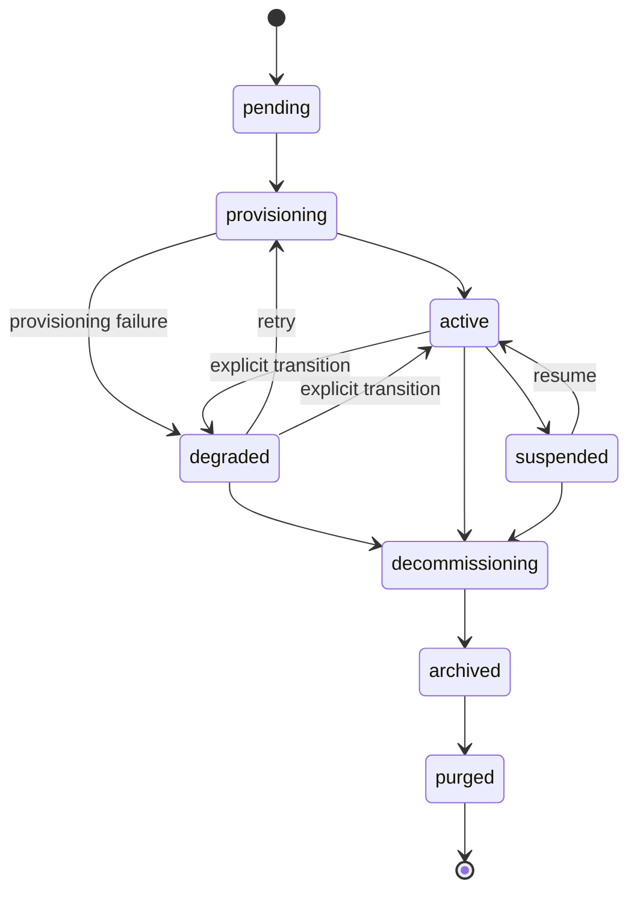

# Cycle de vie du Tenant

Ce qui arrive à un SOC client depuis l'« onboarding » jusqu'à la « purge ». Cette page est le pendant, côté opérateur, du [Contrat de chart](/fr-fr/reference/chart-contract) (qui documente le rendu des valeurs transmises sur le fil) et des [Opérations quotidiennes](/fr-fr/operations) (qui documentent le volet runbook).

## Machine à états du Tenant



Les transitions vers `degraded` ne se produisent **que via le chemin d'échec du contrôleur de provisioning** (une phase a levé `ProvisionError`). Il n'existe aucun endpoint d'API permettant de marquer manuellement un tenant comme `degraded`, aucune boucle d'auto-dégradation surveillant l'ancienneté du heartbeat de l'adaptateur, ni aucune dégradation fondée sur des métriques. La jauge `soctalk_tenant_adapter_heartbeat_age_seconds` se met à jour lors des heartbeats mais n'a aucune rétroaction sur l'état du tenant. Le retour à `active` se produit comme effet secondaire d'un re-provisioning `:retry` réussi.

| État | Ce que cela signifie | Ce qui tourne |
|---|---|---|
| `pending` | Onboarding accepté, le contrôleur n'a pas encore démarré le provisioning. | rien dans `tenant-<slug>` |
| `provisioning` | Le contrôleur crée le namespace, les secrets, et installe via helm le chart du tenant. | partiel, les pods apparaissent |
| `active` | Le tenant est passé à `active` après que le contrôleur de provisioning a constaté que les pods du plan de données ont atteint l'état Ready. | Wazuh manager + indexer + dashboard + soctalk-adapter + runs-worker |
| `degraded` | Le contrôleur de provisioning a marqué le tenant `degraded` après un échec de provisioning (ou un opérateur a effectué une transition manuelle). **La plateforme n'effectue pas actuellement de transition automatique active→degraded fondée sur l'ancienneté du heartbeat de l'adaptateur** ; la jauge `soctalk_tenant_adapter_heartbeat_age_seconds` est destinée à votre alerting | indéterminé ; vérifiez les pods |
| `suspended` | L'administrateur MSSP a marqué le tenant comme suspendu dans la base de données. **Les charges de travail ne sont PAS mises à l'échelle par l'action de suspension elle-même dans cette version**: cela nécessite la procédure manuelle de désactivation d'urgence (voir [Opérations quotidiennes → Désactivation d'urgence](/fr-fr/operations#emergency-disable-a-tenant-immediately)). Le drapeau d'état empêche la planification de nouvelles enquêtes. | inchangé, les pods continuent de tourner à moins que l'opérateur ne les mette à l'échelle vers le bas |
| `decommissioning` | Démantèlement en cours. La release Helm est en cours de désinstallation, les PVC sont en cours de suppression. | en réduction |
| `archived` | Release Helm supprimée ; PVC supprimés ; la ligne du tenant subsiste pour l'audit. | rien |
| `purged` | Ligne du tenant supprimée définitivement. | rien, seules les entrées du journal d'audit subsistent |

Les transitions autorisées sont appliquées dans `TenantController.VALID_TRANSITIONS`. Tenter de suspendre un tenant en `decommissioning` renvoie un HTTP 409 accompagné de la liste des états suivants valides.

## Étapes de provisioning

La méthode `provision()` du contrôleur s'exécute en neuf phases ordonnées. Chaque phase émet une ligne `TenantLifecycleEvent` visible sur la page de détail du tenant (table Lifecycle Events).

| # | Événement | Ce qui se passe |
|---|---|---|
| 1 | `preflight_ok` | Les contrôles préalables (prérequis du cluster, conflits de nommage) passent. |
| 2 | `secrets_minted` | Génération des secrets par tenant (`authd`, signature JWT, Postgres). |
| 3 | `namespace_ready` | Création de `tenant-<slug>` avec labels, ResourceQuota, LimitRange. |
| 4 | `secrets_applied` | Injection des secrets dans K8s sous forme d'objets `Secret/*` dans le nouveau namespace. |
| 5 | `helm_applied` (chart du tenant) | Installation du chart `soctalk-tenant` (adaptateur + runs-worker + ingress). L'utilisateur tenant_admin est auto-provisionné dans le cadre de cette étape (via `_mint_tenant_admin_user` en ligne). |
| 6 | `helm_applied` (chart Wazuh) | Installation du chart Wazuh autonome (manager/indexer/dashboard). La charge utile de la ligne d'événement identifie quel chart a été appliqué. |
| 7 | `workloads_ready` | Interrogation jusqu'à ce que tous les pods du plan de données soient Ready. |
| 8 | `integration_config_written` | Écriture des configurations d'intégration par tenant (LLM, URLs TheHive, etc.) dans la base de données. |
| 9 | `active` | Transition d'état vers `active`. |

Un échec à n'importe quelle phase fait passer le tenant en `degraded`, l'erreur étant consignée dans la ligne d'événement. **Retry Provisioning** (`POST /api/mssp/tenants/{id}:retry`) est une transition valide depuis `degraded` vers `provisioning` (et n'est **pas** autorisée depuis `pending`: `pending → provisioning` ne se produit automatiquement que lorsque le contrôleur démarre la première tentative). `provision()` est idempotent à chaque phase.

## Profils

Le profil est choisi au moment de l'onboarding et **fixé pour toute la durée de vie du tenant**. Changer de profil nécessite un `decommission` + une recréation.

### `poc`

Pour les évaluations, les démonstrations et les pilotes de courte durée.

- StorageClass : `local-path` (valeur par défaut de k3s ; aucune garantie réelle de persistance)
- Tas JVM de l'indexer Wazuh : 512 MiB
- Requêtes de ressources dans le bas des plages du chart
- Aucun hook de sauvegarde câblé

C'est le profil qu'utilise l'[image VM de démonstration](/fr-fr/quickstart-vm) pour son tenant `demo` intégré.

### `persistent`

Pour les SOC clients en production.

- StorageClass : ce que l'installation marque comme valeur par défaut (Longhorn, Rook/Ceph, CSI du fournisseur cloud)
- Tas JVM de l'indexer Wazuh : valeur par défaut côté chart (typiquement 2–4 GiB)
- Requêtes/limites de ressources dimensionnées pour une charge soutenue
- Hooks de sauvegarde honorés s'ils sont configurés

Choisissez `persistent` pour tout ce qui est destiné au client. La valeur par défaut est `poc` si rien n'est précisé, ce qui est une mauvaise valeur par défaut pour un vrai client.

### `provided`

Pour les tenants qui apportent leur propre stack Wazuh déployée en externe (« BYO-SIEM »). Le chart du tenant installe uniquement l'adaptateur SocTalk + runs-worker ; aucun Wazuh/TheHive/Cortex ne tourne au sein du namespace du tenant.

- StorageClass : sans objet, seul le PVC de checkpoint de l'adaptateur est provisionné
- Wazuh : déploiement propre au tenant, atteint sur le réseau via les URLs de l'indexer (:9200) et de l'API Manager (:55000) fournies au moment de l'onboarding
- Le matériel de connexion au SIEM externe (`wazuh_indexer_url`, `wazuh_api_url`, identifiants basic-auth) est **requis** à l'onboarding et validé côté serveur (422 si incomplet)
- Les identifiants LLM par tenant sont également **requis** à l'onboarding (aucun repli partagé au niveau de l'installation pour `provided`)
- Une liste d'autorisation d'egress FQDN Cilium est dérivée automatiquement des noms d'hôte de l'indexer/API fournis

Choisissez `provided` lorsque le client exploite déjà Wazuh et souhaite que SocTalk l'interroge sur place. Voir le [tutoriel du pilote MSSP → §3.1](/fr-fr/mssp-pilot#_3-1-run-the-create-customer-wizard) pour la présentation de l'assistant (l'étape SIEM externe) et le [§3.4](/fr-fr/mssp-pilot#_3-4-coordinating-external-wazuh-creds-for-provided-tenants) pour le travail de coordination en amont.

## Quotas de ressources

Chaque namespace `tenant-<slug>` reçoit un `ResourceQuota` et un `LimitRange` au moment de la création, dimensionnés selon l'empreinte attendue du profil. Voir [Dimensionnement](/fr-fr/reference/sizing).

| Profil | Requêtes CPU | Limites CPU | Requêtes mémoire | Limites mémoire | PVC | Pods |
|---|---|---|---|---|---|---|
| `poc` | 2 | 4 | 4 Gi | 8 Gi | 4 | 20 |
| `persistent` | 2 | 5 | 6 Gi | 12 Gi | 6 | 30 |
| `provided` | 1 | 2 | 2 Gi | 4 Gi | 2 | 10 |

(Les chiffres exacts figurent dans `_profile_tenant_overrides` dans [`render.py`](https://github.com/soctalk/soctalk/blob/main/src/soctalk/core/provisioning/render.py).)

Si une charge de travail réelle dépasse le budget du profil (par exemple, l'indexer Wazuh ralentit lors d'une ingestion intense), augmentez le ResourceQuota via `helm upgrade` avec des valeurs surchargées. Ne modifiez pas l'objet ResourceQuota directement, la prochaine mise à niveau du chart l'écrasera.

## Chemins de récupération

### Tenant bloqué en `pending` après l'onboarding

Le contrôleur a planté ou a été replanifié en plein provisioning avant l'exécution de la première phase. Le retry n'est pas autorisé directement depuis `pending`: attendez d'abord que la tentative de provisioning passe à `degraded` (visible dans les événements de cycle de vie), puis cliquez sur **Retry Provisioning** sur la page de détail du tenant (ou `POST /api/mssp/tenants/{id}:retry`). Le provisioning reprend à partir de la phase 1 ; chaque phase est idempotente.

### Tenant en `provisioning` depuis plus de 15 minutes

Il s'agit généralement d'un pod bloqué (ImagePullBackOff, PVC `Pending`, ResourceQuota trop petit). Voir [Opérations quotidiennes, Tenant bloqué en provisioning](/fr-fr/operations#tenant-stuck-in-provisioning).

### Tenant en `degraded`

En V1, `degraded` n'est atteint qu'après un **échec de provisioning**, et non une perte de heartbeat. Si un tenant est en `degraded`, c'est que le contrôleur de provisioning a échoué à l'une des 9 étapes ci-dessus, lisez la ligne d'événement de cycle de vie pour voir laquelle. Le plan de données (Wazuh) peut toujours être en cours d'exécution selon l'étape ayant échoué. Voir [Opérations quotidiennes, Tenant en état degraded](/fr-fr/operations#tenant-in-degraded-state).

### Tenant en `suspended`

Vous l'avez fait délibérément. Reprenez depuis l'interface ou via `POST /api/mssp/tenants/<id>:resume`: mais notez que dans cette version, **le resume ne met à jour que l'état en base de données**, il ne restaure pas le nombre de réplicas. Si vous avez mis les charges de travail à l'échelle zéro pendant la suspension (via le flux de désactivation d'urgence), vous devez les remettre à l'échelle à la main.

### Tenant en `decommissioning` depuis plus de 30 minutes

Désinstallation Helm bloquée. Le plus souvent un finalizer sur un PVC qui ne s'est jamais exécuté. `helm uninstall tenant-<slug> -n tenant-<slug> --no-hooks` puis supprimez les finalizers manuellement :

```bash
kubectl -n tenant-<slug> get pvc -o name | \
  xargs -I {} kubectl -n tenant-<slug> patch {} -p '{"metadata":{"finalizers":null}}' --type=merge
```

Puis relancez le decommission. Documentez-le dans le journal d'audit afin que la trace reste intacte.

## Decommission ou purge

`decommission` démantèle le plan de données et fait passer le tenant à `archived`: la ligne du tenant et l'historique d'audit subsistent. `purged` est l'état terminal de la machine à états (`archived → purged`), mais il n'existe **aucun endpoint d'API `:purge` dans cette version**. Aujourd'hui, la transition vers `purged` nécessite une mise à jour au niveau de la base de données ; un `POST /api/mssp/tenants/{id}:purge` restreint aux administrateurs est prévu dans la feuille de route. Jusqu'à sa livraison, laissez les tenants décommissionnés en `archived` et considérez les lignes archivées comme la surface de rétention à long terme.

## Pointeurs vers les sources

| Concept | Fichier |
|---|---|
| Enum d'état du tenant + transitions | [`src/soctalk/core/tenancy/models.py`](https://github.com/soctalk/soctalk/blob/main/src/soctalk/core/tenancy/models.py) |
| Contrôleur de provisioning | [`src/soctalk/core/provisioning/controller.py`](https://github.com/soctalk/soctalk/blob/main/src/soctalk/core/provisioning/controller.py) |
| API d'onboarding + charge utile | [`src/soctalk/core/api/tenants.py`](https://github.com/soctalk/soctalk/blob/main/src/soctalk/core/api/tenants.py) |
| Table des événements de cycle de vie | [`src/soctalk/core/tenancy/models.py`](https://github.com/soctalk/soctalk/blob/main/src/soctalk/core/tenancy/models.py) |
