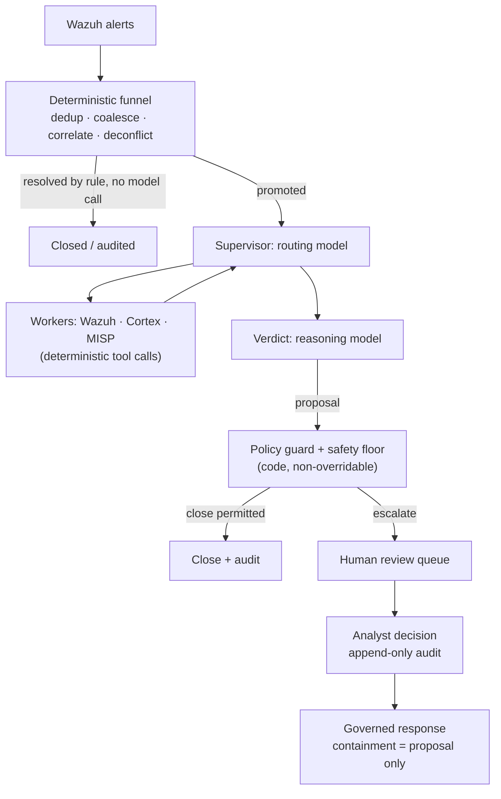

# AI triage for Wazuh alerts: what works in production (and what doesn't)

Every Wazuh operator has had the same idea: the manager is producing thousands of alerts a day, most of them are noise, and an LLM is very good at reading an alert and saying "this is a brute-force attempt" or "this is a cron job." So you wire a webhook from Wazuh to a workflow tool, drop the alert JSON into a prompt, and post the model's answer somewhere.

That prototype works. It also fails in production, in predictable ways. This guide covers why, and the architecture that holds up when AI triage of Wazuh alerts has to run unattended against a real alert volume. It is the architecture SocTalk implements.

## Why "pipe every alert to an LLM" breaks

The naive pattern (Wazuh webhook → LLM prompt → verdict) has three structural problems, none of which better prompting fixes.

**Cost scales with noise, not with signal.** A single scan can produce thousands of alerts. If every raw alert costs a model call, your spend is proportional to how loud your environment is, and expense pushes you toward weaker models on exactly the cases where judgment matters most.

**The model has no context and no floor.** An LLM reading one alert in isolation has no memory of what an analyst decided yesterday and no picture of the organization's own state, so it cannot tell a sanctioned change from an attack that produces a byte-identical alert. Nothing guarantees it won't confidently close over a real indicator of compromise, and a hallucinated "benign" verdict on a real intrusion is a suppressed detection; no rate of those is tolerable.

**There is no audit trail or gate.** A workflow that posts the model's verdict straight to a channel has no record of what evidence the verdict rested on, no reviewer identity, and no mechanism to stop a bad verdict from becoming a closed case.

The webhook prototype remains a fine way to convince yourself LLMs can reason about alerts. The missing piece is the architecture around the model.

## The architecture that works: a deterministic funnel before any model call

The first fix is counterintuitive: most of an AI triage pipeline should not be AI. In SocTalk, the ingest plane is server-side and fully deterministic; no model touches it:

- **Deduplication** drops replayed events carrying an ID already seen.
- **Coalescing** groups repeated alerts from the same rule on the same asset within a five-minute window into a single case. A burst of one detection becomes one case instead of thousands.
- **Entity correlation** attaches a new alert that shares a strong entity (host, file hash) with an active investigation as evidence, instead of starting a fresh context-free run.
- **Engagement deconfliction** matches declared pentest and red-team windows by source, host, technique, and time. Sanctioned testing is flagged and audited, never auto-closed, and out-of-scope tester activity is forced to a human.
- **Deterministic close** handles low-severity, high-confidence false positives by rule, with no model call.

Many alerts never reach a model at all. Whatever survives is promoted to an investigation, and even then the model is consulted in only two roles: a **supervisor** that routes the investigation (pull host context from Wazuh, check observable reputation via Cortex analyzers, look up MISP threat intel; all are deterministic tool calls whose results the model only *reads*), and a **verdict** node where a reasoning model weighs everything gathered and proposes `escalate`, `close`, or `needs_more_info` with confidence, rationale, and evidence strength.

## Guardrails as data, verdicts gated by code

The second fix treats the model's verdict as a proposal that only a deterministic gate can turn into a commit. SocTalk's rule is *"the LLM proposes; a deterministic gate disposes."*

[Triage policies](/triage-policies) are data, declarative rules run by one interpreter, acting at four gates: a resolver, a pre-decision gate (a verdict isn't legal until required evidence steps have run), a post-verdict guard, and a **safety floor**. The floor is code-level and non-overridable, enforced at three independent points (worker, server, ingest). No automatic close can fire over a known IOC, a contradicted authorization record, an unverified indicator, an active related incident, a kill switch, or past the volume cap (default 500 automatic closes per 24 hours). Kill switches (`SOCTALK_AUTO_CLOSE_KILL` install-wide, or per tenant) flip every automatic close to a promotion instantly. That is the control you reach for mid-incident.

The property that makes tenant-authored policies safe: they can only make triage **stricter**, never looser. A guardrail override may only raise a decision up the ladder `close < needs_more_info < escalate`; suppression is not expressible in the condition language, which is sandboxed: single-operator trees over a documented state contract, no attribute access, no function calls, invalid policies rejected whole at validation. A misconfigured or hostile policy cannot become a channel for suppressing detections.

## Human-in-the-loop is a hard property

Every `escalate` verdict goes through human review. There is no bypass: an AI-only "auto-approve" mode is not implemented in SocTalk (removing the gate is a roadmap item, planned as an admin-gated, audited toggle rather than a quiet default). In V1 the review surface is the dashboard queue, showing the AI's full rationale and the observable evidence with its enrichment. Analyst decisions to approve, reject, or request more info write append-only audit rows with identity, timestamp, and rationale, never editable after submit. A proposed close touching a sensitive asset (a PCI-classified host, say) is held for human sign-off even when the model is confident.

The same stance governs response: a containment action such as isolating an endpoint or disabling an account is *always* raised as a proposal an analyst approves first. The model never takes a containment action on its own, and dispatch happens server-side, never from the model's loop. SocTalk works as a copilot rather than an analyst replacement. The value is compression: the same analyst team can handle 5–10× the alert volume because routine cases auto-close and only the unclear ones reach human review.

## Cost engineering

Because the funnel resolves many alerts without a model call, cost tracks ambiguity rather than volume. The remaining levers:

- **Fast/reasoning split.** Routing and workers use a fast model; only the verdict uses a reasoning model. Defaults are `claude-sonnet-4-20250514` for both, overridable per tenant (`SOCTALK_FAST_MODEL` / `SOCTALK_REASONING_MODEL`).
- **Per-run token budgets.** Each run carries a token budget (model default 200,000), tracked per run, per tenant, and install-wide. A runaway investigation halts instead of billing indefinitely.
- **Real-world spend.** Highly variable, but as an order of magnitude: roughly **$9/day per tenant** at ~30 alerts/day on a budget OpenAI-compatible setup, dropping 5–10× with a cheaper fast model. Treat that as a starting estimate rather than a quote.
- **Zero per-token option.** Run fully local with [Ollama](/integrate/ollama): no cloud LLM, no per-token cost, data stays on your infrastructure. Pick a tool-capable model (qwen2.5, llama3.1, mistral-nemo), and know that CPU inference is minutes-per-investigation slow; use a GPU host for usable latency.

## Bring your own LLM

SocTalk's runtime supports two providers: `anthropic` (Claude) and `openai`, which covers OpenAI itself or any OpenAI-compatible endpoint such as Azure OpenAI, vLLM, Ollama, and LiteLLM. Provider, model, base URL, and API key are all overridable **per tenant**, and a customer can bring their own key for billing isolation, mounted into the tenant's runs-worker as a Kubernetes Secret in that tenant's own namespace. (One documented V1 exception applies: the key is also held in the SocTalk database in plaintext, `IntegrationConfig.llm_api_key_plain`; see [Secrets](/reference/secrets) for the posture and rotation advice.) The model only ever sees the current investigation state (alert body, observables, worker outputs); for a stricter posture, point the tenant at an on-prem endpoint. Details in [LLM providers](/integrate/llm-providers).

## What this looks like in SocTalk

SocTalk is an Apache 2.0, AI-first SOC platform for MSPs and MSSPs: a dedicated Wazuh stack per customer on your own Kubernetes, behind one control plane, with the triage pipeline above running per tenant. To go deeper:

- [How it works](/how-it-works) tells the full pipeline story: the deterministic funnel, the two model roles, the three-site safety floor.
- [AI pipeline](/ai-pipeline) covers the LangGraph state machine: supervisor, workers, verdict, run lifecycle.
- [Triage policies](/triage-policies) shows how to author deterministic guardrails in the no-code editor, shadow-then-activate.
- [Human review](/human-review) documents the review queue and the analyst decision contract.

Or skip the reading: the [demo VM](/quickstart-vm) gets you a running multi-tenant install, with a demo tenant onboarded, in about five minutes.
