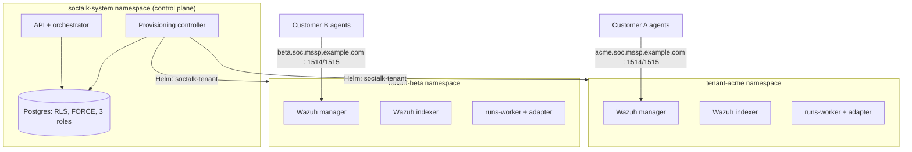

# Multi-tenant Wazuh for MSSPs: architecture patterns that actually isolate tenants

Wazuh has no first-class multi-tenancy. There is no "tenant" object in the manager, no per-customer boundary in the ruleset, and no per-customer scoping of `authd` enrollment. Every MSSP that standardizes on Wazuh ends up building tenancy around it, and the pattern you pick determines your isolation guarantees, your onboarding speed, and your per-customer cost floor.

This guide covers what an MSSP needs from a multi-tenant Wazuh deployment, the three patterns teams try in practice, and what production-grade isolation requires beyond the SIEM itself. It is the architecture SocTalk implements as open source (Apache 2.0); the reference pages linked throughout go a level deeper on each layer.

## What an MSSP needs that Wazuh doesn't provide

Three requirements come up in every MSSP deployment conversation:

1. **Isolation you can defend in a customer security review.** A dashboard filter alone won't satisfy anyone; "customer A cannot read customer B's alerts" has to hold at the data layer, the network layer, and the agent-enrollment layer.
2. **Onboarding speed.** If provisioning a new customer SOC is a week of manual work, the pattern doesn't scale past a handful of customers.
3. **Per-tenant cost control.** You need to know what one customer costs in RAM, CPU, and disk, cap it, and stop a noisy tenant from starving the others.

## The three patterns MSSPs try

### Pattern 1: shared manager, index-level separation

One Wazuh manager, all customers' agents enrolled against it, separation done downstream: OpenSearch Dashboards multi-tenancy for dashboard objects, index patterns and security roles for read scoping. This is the pattern most Wazuh multi-tenancy threads describe, because it is the only one you can build without leaving Wazuh's own tooling.

The problem is that the separation happens at read time and draws no boundary around the data. The manager itself is shared: one ruleset, one `authd` secret, one API, one upgrade window for everyone. A misconfigured role exposes every customer at once, and per-customer rule packs or retention policies are impossible without affecting the rest.

### Pattern 2: manager-per-tenant on VMs

One VM (or VM set) per customer, running a dedicated manager and indexer. Isolation is real: separate processes, disks, and credentials. This is where MSSPs land after the shared-manager pattern bites them. The cost is operational: onboarding means provisioning machines, upgrades mean touching every VM, and the per-tenant resource floor is a full VM with no shared scheduling to reclaim idle capacity. It works at 5 customers and hurts at 30.

### Pattern 3: manager-per-tenant on Kubernetes, behind a control plane

Each customer gets a dedicated Wazuh manager, indexer, and dashboard in its own Kubernetes namespace, with a ResourceQuota and LimitRange capping its footprint. A control plane owns the lifecycle: onboarding renders a Helm release per tenant, teardown removes it, and tenant state lives in a database rather than a spreadsheet. Isolation comes from the namespace boundary plus NetworkPolicy; density from the scheduler packing tenants onto shared nodes.

### How the patterns compare

| | Shared manager + index separation | Manager-per-tenant on VMs | Manager-per-tenant on Kubernetes |
|---|---|---|---|
| Isolation boundary | Read-side filters on shared data | Machine boundary | Namespace + NetworkPolicy + quota |
| Blast radius of one compromise | All customers | One customer | One customer |
| Per-tenant rules / retention / upgrades | No | Yes | Yes |
| Onboarding a customer | Fast (config change) | Slow (provision machines) | Fast, if automated (Helm release) |
| Density / cost per tenant | Best | Worst | Good (scheduler-packed, quota-capped) |
| Operational skill required | Wazuh + OpenSearch security | Fleet/VM automation | Kubernetes |
| Fleet operations at 30+ tenants | N/A (one stack) | Painful | Tractable with a control plane |

Of the three, pattern 3 is the one built to deliver both real isolation and onboarding speed, but only if the control plane exists. Namespaces alone amount to a naming convention; a security boundary has to be built on top of them. The rest of this guide is about what makes the boundary real.

## Production isolation is more than the SIEM

A per-tenant Wazuh stack isolates the SIEM data. An MSSP platform also has cross-tenant state, from cases and review queues to audit logs and integration configs, and that layer needs its own enforcement.

### Data layer: Postgres row-level security, forced and tested

With application-level `WHERE tenant_id = ?` filtering, one forgotten clause leaks data across tenants. The database should enforce tenancy itself. The pattern:

- Every tenant-scoped table carries RLS policies keyed on a per-transaction `app.current_tenant_id` setting. An unset context yields **zero rows**; the failure mode is an empty result, never another tenant's data.
- `FORCE ROW LEVEL SECURITY` on every tenant-scoped table, so even the table owner (the migration role) is subject to policy. Default Postgres exempts owners; a migration that reads tenant data could otherwise cross tenants silently.
- A three-role split: a migration owner, an RLS-subject runtime role, and a segregated `BYPASSRLS` role reserved for audited cross-tenant paths. No application connects as superuser.
- Isolation tests in CI: endpoint probes, raw SQL under the app role, workers without context, owner-role probes, cross-tenant event streams. SocTalk runs seven such tests, all required to pass; none optional.
- Idempotency keys scoped `UNIQUE (tenant_id, idempotency_key)`, so two customers' alert pipelines can emit the same external alert ID without colliding.

Full policy templates, role DDL, and the test suite: [Postgres RLS](/reference/postgres-rls).

### Network layer: per-namespace NetworkPolicy

The namespace boundary means nothing without an enforcing CNI; K3s's default Flannel does not enforce NetworkPolicy at all. The target posture is a default-deny baseline per tenant namespace with explicit allows: intra-namespace traffic, DNS, control-plane access to the tenant's data-plane ports, and agent ingress on 1514/1515. Tenant-to-tenant traffic and general tenant egress are blocked.

SocTalk uses Cilium as the supported CNI (NetworkPolicy enforcement, FQDN-based egress for hostname-addressed LLM endpoints, Hubble flow observability for debugging isolation questions). Be aware of the V1 hedge: the fully FQDN-pinned per-tenant egress allowlist is the design destination, and the current chart renders simpler policies, with permissive control-plane egress and broad TCP/443 egress for the per-tenant worker. The rendered templates are in the repo; read [NetworkPolicy design](/reference/network-policy) for both the shipped policies and the target architecture.

### Agent enrollment: per-tenant endpoints and secrets

The subtlest failure mode: customer A's agent registering with customer B's manager. Wazuh's agent protocol on 1514/TCP is a proprietary encrypted stream rather than standard TLS. There is no SNI to route on, so hostname-inspecting L4 proxies silently break. Routing has to be by destination address: each tenant gets its own DNS name (`acme.soc.mssp.example.com`) resolving to a per-tenant L4 endpoint, with a per-tenant-port fallback when IPs are scarce.

Enrollment secrets are tenant-scoped: each tenant's `authd` shared secret lives in that tenant's namespace, so an agent holding tenant A's secret can only register with A's manager: the addressing routes it there and the manager verifies the secret. In V1, LoadBalancer and DNS provisioning are manual MSSP wiring, not automated. Details and the enrollment runbook: [Wazuh agent ingress](/reference/wazuh-ingress).

## Capacity: what one tenant costs

The numbers MSSPs ask for first, from SocTalk's sizing work:

- **Per-tenant footprint (full stack):** ~8 GB RAM request (~16 GB limit), ~2.2 vCPU request, ~120 GB disk. Sustained usage tracks requests; limits are burst ceilings.
- **The bottleneck is usually the per-tenant Wazuh indexer.** Each one is a Java process with its own heap. Plan ~6–8 GB RAM and ~1.5 vCPU per production tenant.
- **Disk is driven by ingest rate:** roughly 5 GB/day of index at 10 alerts/sec sustained; the default indexer PVC is 50 GB with 30-day hot retention.
- **Tested scale:** up to ~50 tenants on a 3-node cluster (16 vCPU / 64 GB per node). Larger single-install profiles are documented but not validated in this release; don't plan past that number on one install without testing.

Reference host profiles and the max-tenants-per-node formula: [Sizing](/reference/sizing) and the [scaling FAQ](/faq#does-it-scale-to-n-customers).

## How SocTalk packages this pattern

SocTalk is an open-source (Apache 2.0, no community/enterprise split) implementation of pattern 3: one control plane, one `soctalk-tenant` Helm release per customer, on your own Kubernetes 1.30+, whether that is K3s, EKS, AKS, or GKE.

Onboarding runs a nine-phase provisioning sequence (preflight, secret minting, namespace with quotas, Helm installs, readiness polling), each phase emitting a lifecycle event and idempotently retryable from `degraded`. Tenant state is a server-enforced machine (`pending → provisioning → active`, with suspended, decommissioning, archived, and purged states; invalid transitions return 409). Three onboard profiles cover demos (`poc`), production (`persistent`), and BYO-Wazuh (`provided`, where SocTalk connects to a customer's existing stack instead of deploying one). Decommission tears down the data plane but keeps the tenant row and audit history.

The full lifecycle, from states and phases to quotas and recovery paths, is in [Tenant lifecycle](/tenant-lifecycle). To run it: the [install guide](/install) covers a production cluster in about an hour, and the [demo VM](/quickstart-vm) boots a working multi-tenant install with a demo tenant in about five minutes.
