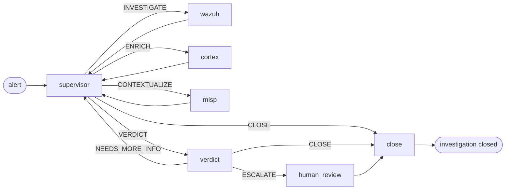

# Pipeline AI

Cosa succede tra "arriva un alert" e "viene scritto un verdetto". Il livello di triage di SocTalk è una macchina a stati LangGraph, un supervisor che instrada il lavoro verso nodi worker specializzati, seguito da un nodo di verdetto che decide se il caso richiede una revisione umana.

Questa pagina è il modello mentale. Il codice si trova in [`src/soctalk/graph/`](https://github.com/soctalk/soctalk/tree/main/src/soctalk/graph), [`src/soctalk/supervisor/`](https://github.com/soctalk/soctalk/tree/main/src/soctalk/supervisor) e [`src/soctalk/workers/`](https://github.com/soctalk/soctalk/tree/main/src/soctalk/workers).

## Nodi

| Nodo | Scopo | Modello usato |
|---|---|---|
| **supervisor** | Decide cosa fare in seguito. Puro instradamento, non svolge esso stesso alcun lavoro di dominio. | modello veloce |
| **wazuh_worker** | Recupera l'alert nel suo contesto, estrae gli observable (IP, hash, utenti, processi), correla con gli alert recenti nello stesso tenant. | modello veloce |
| **cortex_worker** | Invia gli observable agli analyzer di Cortex (VirusTotal, AbuseIPDB, ecc.) per reputazione/arricchimento. | modello veloce |
| **misp_worker** | Cerca gli observable nei feed di threat-intel di MISP per il contesto di campagne / attori noti. | modello veloce |
| **verdict** | Ragiona su tutto ciò che i worker hanno raccolto. Produce `escalate | close | needs_more_info` + confidenza + una breve motivazione. | **modello di reasoning** |
| **human_review** | Mette in pausa l'esecuzione; emette una richiesta di revisione verso la coda della dashboard e/o Slack. Attende una `HumanDecision` (`approve | reject | more_info`). |, (esseri umani) |
| **close** | Genera il report di chiusura e scrive la disposizione (`close_fp | escalate | leave_open`). **In V1 il nodo close non pubblica verso le integrazioni in uscita.** Nessun nodo del grafo pubblica attualmente su TheHive in V1 (il nodo `thehive_worker` citato in bozze precedenti non è collegato al graph builder V1). Anche la pubblicazione tramite webhook Slack da close non è collegata. L'integrazione in uscita dal nodo close è nella roadmap. | modello veloce |

## Instradamento del supervisor

L'unico compito del supervisor è scegliere il nodo successivo. Il suo spazio decisionale è un enum fisso di 5 elementi:

| Decisione | Significato |
|---|---|
| `INVESTIGATE` | Non so ancora abbastanza su questo alert. Esegui il worker Wazuh. |
| `ENRICH` | Ho observable di cui non ho verificato la reputazione. Esegui Cortex. |
| `CONTEXTUALIZE` | Gli observable sembrano interessanti; verifica campagne/attori noti. Esegui MISP. |
| `VERDICT` | Ho abbastanza. Passa al nodo di verdetto. |
| `CLOSE` | Questo è un caso lampante (ad es. un falso positivo evidente o un alert già risolto). Salta il nodo di verdetto. |

Il supervisor non invoca mai strumenti esterni direttamente. Legge lo `SecOpsState` accumulato (alert, observable, output precedenti dei worker, verdetti) e produce una delle cinque decisioni. La maggior parte dei casi cicla supervisor → worker → supervisor → worker → supervisor → VERDICT, da tre a sei hop in totale.

## Nodo di verdetto

Il modello di reasoning riceve l'intero stato accumulato, l'alert originale, i risultati di ogni worker, tutti gli observable con il loro arricchimento, i tentativi di verdetto precedenti (se ha ciclato su `NEEDS_MORE_INFO`). Produce:

| Campo | Tipo |
|---|---|
| `decision` | `escalate | close | needs_more_info` |
| `confidence` | enum: `low | medium | high` |
| `rationale` | markdown breve |
| `evidence_strength` | `weak | moderate | strong | conclusive` |
| `verdict` | `benign | suspicious | malicious | unknown` |
| `impact` | `low | medium | high | critical` |

`escalate` passa sempre attraverso `human_review`. `close` salta la revisione umana e va direttamente a `close`. `needs_more_info` torna al supervisor con un prompt che suggerisce cosa manca ancora.

## Gate di revisione umana

`human_review` mette in pausa l'esecuzione. Il caso compare nella [coda di Revisione](/it-it/mssp-ui#reviews-human-in-the-loop) sulla dashboard e (se Slack è configurato) nella [HIL bidirezionale di Slack](/it-it/human-review). L'operatore umano sceglie:

| Decisione | Effetto sul caso |
|---|---|
| `approve` | Revisione pendente contrassegnata come completata + feedback registrato nell'audit. **Non** ripresa automaticamente; segue l'intervento dell'analista. |
| `reject` | Il caso si chiude come `auto_closed_fp`. Terminale, il grafo non viene reinvocato. |
| `more_info` | Revisione contrassegnata `info_requested` con l'elenco delle domande. **Non** ripresa automaticamente; segue l'intervento dell'analista. |

L'identità dell'operatore umano, il timestamp e la motivazione vengono aggiunti al log append-only `case_events` del caso.

## Ciclo di vita dell'esecuzione

Un'"esecuzione" (run) è un'esecuzione del grafo su un singolo caso. Enum di stato:

| Stato | Significato |
|---|---|
| `active` | Il grafo è in esecuzione. |
| `waiting_on_gate` | In pausa su `human_review`. |
| `paused` | Messo in pausa manualmente da un admin MSSP. |
| `halted_budget` | Ha raggiunto il budget di token per esecuzione. Le normali esecuzioni V1 recuperano `tokens_budget = 200,000` dalla riga `case_runs` (default del modello). L'env `SOCTALK_CASE_RUN_TOKEN_BUDGET` (default 15,000) viene usato solo come fallback quando la riga non ha alcun valore impostato. |
| `completed` | Il grafo ha raggiunto `close` e ha scritto una disposizione. |
| `failed` | Il grafo ha generato un errore o uno strumento esterno è irraggiungibile. |

I budget di token sono tracciati per esecuzione, per tenant e a livello dell'intera installazione. Vedi [Observability](/it-it/observability) per le metriche, [Provider LLM](/it-it/integrate/llm-providers) per le leve sui costi.

## Il processo runs-worker

Ogni tenant ha il proprio pod `runs-worker` (nel namespace `tenant-<slug>`) che consuma la coda:

1. Chiama `POST /api/internal/worker/runs/claim` per un'esecuzione assegnata al proprio tenant.
2. Costruisce il LangGraph a partire dalla chart dei nodi.
3. `ainvoke()` sul grafo, pubblicando `POST /api/internal/worker/runs/{run_id}/heartbeat` ogni 20 s.
4. Al completamento, pubblica lo stato finale e la disposizione su `POST /api/internal/worker/runs/{run_id}/complete`.

Il runs-worker è l'unico pod di calcolo per tenant, tenerlo nel namespace del tenant significa che un tenant fuori budget non può privare il resto dell'installazione delle risorse di calcolo. La logica del supervisor + worker + verdetto è di per sé stateless; il grosso del lavoro sono le chiamate LLM (fuori dal cluster, addebitate al provider configurato del tenant).

## Riferimenti al codice sorgente

| Concetto | File |
|---|---|
| Graph builder + instradamento | [`src/soctalk/graph/builder.py`](https://github.com/soctalk/soctalk/blob/main/src/soctalk/graph/builder.py) |
| Logica del supervisor | [`src/soctalk/supervisor/node.py`](https://github.com/soctalk/soctalk/blob/main/src/soctalk/supervisor/node.py) |
| Nodo di verdetto | [`src/soctalk/supervisor/verdict.py`](https://github.com/soctalk/soctalk/blob/main/src/soctalk/supervisor/verdict.py) |
| Nodi worker | [`src/soctalk/workers/`](https://github.com/soctalk/soctalk/tree/main/src/soctalk/workers) |
| Chiusura / disposizione | [`src/soctalk/graph/close.py`](https://github.com/soctalk/soctalk/blob/main/src/soctalk/graph/close.py) |
| Loop del runs worker | [`src/soctalk/runs_worker/main.py`](https://github.com/soctalk/soctalk/blob/main/src/soctalk/runs_worker/main.py) |
| Schema dello stato | [`src/soctalk/models/state.py`](https://github.com/soctalk/soctalk/blob/main/src/soctalk/models/state.py) |
