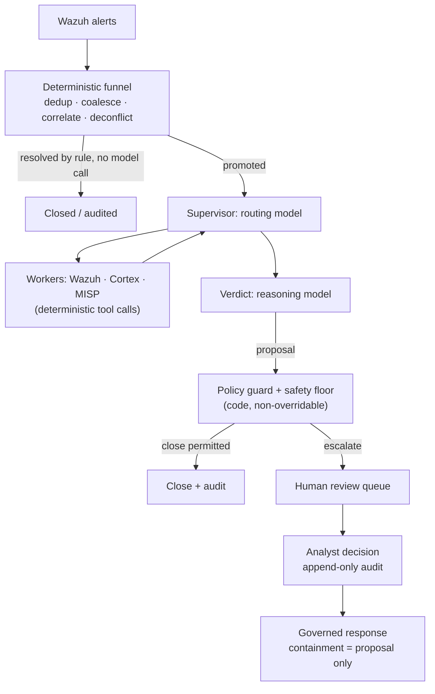

# Triage AI per gli alert Wazuh: cosa funziona in produzione (e cosa no)

Ogni operatore Wazuh ha avuto la stessa idea: il manager produce migliaia di alert al giorno, la maggior parte è rumore, e un LLM è molto bravo a leggere un alert e dire "questo è un tentativo di brute force" oppure "questo è un cron job". Quindi colleghi un webhook da Wazuh a uno strumento di workflow, inserisci il JSON dell'alert in un prompt e pubblichi la risposta del modello da qualche parte.

Quel prototipo funziona. E fallisce anche, in produzione, in modi prevedibili. Questa guida spiega perché, e descrive l'architettura che regge quando il triage AI degli alert Wazuh deve girare senza supervisione su un volume reale di alert — l'architettura che SocTalk implementa.

## Perché "manda ogni alert a un LLM" si rompe

Il pattern ingenuo — webhook Wazuh → prompt LLM → verdetto — ha tre problemi strutturali, e nessuno si risolve con prompt migliori.

**Il costo scala con il rumore, non con il segnale.** Una singola scansione può produrre migliaia di alert. Se ogni alert grezzo costa una chiamata al modello, la spesa è proporzionale a quanto è rumoroso il tuo ambiente, e il costo ti spinge verso modelli più deboli proprio nei casi in cui il giudizio conta di più.

**Il modello non ha contesto né soglia minima.** Un LLM che legge un alert in isolamento non ha memoria di ciò che un analista ha deciso ieri, nessuna visione dello stato dell'organizzazione — quindi non può distinguere una modifica autorizzata da un attacco che produce un alert byte-identico — e nessuna garanzia che non chiuda con sicurezza sopra un vero indicatore di compromissione. Un verdetto "benigno" allucinato su una vera intrusione non è un problema di qualità tollerabile a qualsiasi tasso; è una detection soppressa.

**Non c'è audit trail né gate.** Un workflow che pubblica il verdetto del modello direttamente in un canale non ha traccia delle evidenze su cui il verdetto si basava, nessuna identità del revisore e nessun meccanismo per impedire che un verdetto sbagliato diventi un caso chiuso.

Per essere onesti: il prototipo a webhook è un ottimo modo per convincersi che gli LLM sanno ragionare sugli alert. È l'*architettura intorno* al modello che manca.

## L'architettura che funziona: un funnel deterministico prima di ogni chiamata al modello

La prima correzione è controintuitiva: la maggior parte di una pipeline di triage AI non dovrebbe essere AI. In SocTalk, il piano di ingest è lato server e completamente deterministico — nessun modello lo tocca:

- La **deduplicazione** scarta gli eventi riprodotti che portano un ID già visto.
- Il **coalescing** raggruppa alert ripetuti dalla stessa regola sullo stesso asset entro una finestra di cinque minuti in un unico caso — una raffica di una singola detection diventa un caso, non migliaia.
- La **correlazione di entità** allega come evidenza un nuovo alert che condivide un'entità forte (host, hash di file) con un'indagine attiva, invece di avviare una nuova esecuzione priva di contesto.
- La **deconfliction degli engagement** confronta le finestre dichiarate di pentest e red team per sorgente, host, tecnica e tempo — i test autorizzati vengono contrassegnati e sottoposti ad audit, mai chiusi automaticamente, e l'attività dei tester fuori perimetro viene forzata verso un umano.
- La **chiusura deterministica** gestisce per regola i falsi positivi a bassa severità e alta confidenza, senza alcuna chiamata al modello.

Molti alert non raggiungono mai un modello. Ciò che sopravvive viene promosso a indagine, e anche allora il modello viene consultato in due soli ruoli: un **supervisor** che instrada l'indagine (recupera il contesto dell'host da Wazuh, verifica la reputazione degli observable tramite gli analyzer di Cortex, consulta la threat intel di MISP — tutte chiamate a strumenti deterministici di cui il modello si limita a *leggere* i risultati), e un nodo di **verdetto** in cui un modello di ragionamento pesa tutto ciò che è stato raccolto e propone `escalate`, `close` o `needs_more_info` con confidenza, motivazione e forza delle evidenze.

## Guardrail come dati, verdetti vincolati dal codice

La seconda correzione: il verdetto del modello è una proposta, non un commit. La regola di SocTalk è *"l'LLM propone; un gate deterministico dispone."*

Le [policy di triage](/it-it/triage-policies) sono dati — regole dichiarative eseguite da un unico interprete — che agiscono su quattro gate: un resolver, un gate pre-decisione (un verdetto non è valido finché non sono stati eseguiti i passaggi di evidenza richiesti), una guardia post-verdetto e una **soglia di sicurezza** (safety floor). La soglia è a livello di codice e non aggirabile, applicata in tre punti indipendenti (worker, server, ingest). Nessuna chiusura automatica può scattare sopra un IOC noto, un record di autorizzazione contraddetto, un indicatore non verificato, un incidente correlato attivo, un kill switch, o oltre il limite di volume (default 500 chiusure automatiche ogni 24 ore). I kill switch (`SOCTALK_AUTO_CLOSE_KILL` a livello di installazione, o per tenant) trasformano istantaneamente ogni chiusura automatica in una promozione — il controllo che cerchi nel mezzo di un incidente.

La proprietà che rende sicure le policy scritte dai tenant: possono solo rendere il triage **più severo**, mai più permissivo. Un override di guardrail può solo alzare una decisione lungo la scala `close < needs_more_info < escalate`; la soppressione non è esprimibile nel linguaggio delle condizioni, che è sandboxed — alberi a operatore singolo su un contratto di stato documentato, nessun accesso ad attributi, nessuna chiamata di funzione, policy non valide rifiutate in blocco alla validazione. Una policy mal configurata o ostile non può diventare un canale per sopprimere le detection.

## Human-in-the-loop è una proprietà rigida, non un'impostazione

Ogni verdetto `escalate` passa per la revisione umana. Non esiste bypass: una modalità "auto-approve" solo AI non è implementata in SocTalk (la rimozione del gate è una voce di roadmap, pianificata come toggle riservato agli admin e sottoposto ad audit — non un default silenzioso). Nella V1 la superficie di revisione è la coda della dashboard, che mostra la motivazione completa dell'AI e le evidenze degli observable con il relativo arricchimento. Le decisioni dell'analista — approva, rifiuta, richiedi altre informazioni — scrivono righe di audit append-only con identità, timestamp e motivazione, mai modificabili dopo l'invio. Una proposta di chiusura che tocca un asset sensibile (un host classificato PCI, ad esempio) viene trattenuta per l'approvazione umana anche quando il modello è confidente.

La stessa posizione governa la risposta: un'azione di contenimento come l'isolamento di un endpoint o la disabilitazione di un account viene *sempre* sollevata come proposta che un analista approva prima. Il modello non esegue mai un'azione di contenimento da solo, e il dispatch avviene lato server, mai dal loop del modello. SocTalk è un copilota, non un sostituto dell'analista — il valore è la compressione: lo stesso team di analisti può gestire un volume di alert 5–10 volte superiore perché i casi di routine si chiudono automaticamente e solo quelli ambigui arrivano alla revisione umana.

## Ingegneria dei costi

Poiché il funnel risolve molti alert senza una chiamata al modello, il costo segue l'ambiguità anziché il volume. Le leve restanti:

- **Suddivisione fast/reasoning.** Il routing e i worker usano un modello veloce; solo il verdetto usa un modello di ragionamento. Il default è `claude-sonnet-4-20250514` per entrambi, sovrascrivibile per tenant (`SOCTALK_FAST_MODEL` / `SOCTALK_REASONING_MODEL`).
- **Budget di token per esecuzione.** Ogni esecuzione ha un budget di token (default del modello 200,000), tracciato per esecuzione, per tenant e a livello di installazione. Un'indagine fuori controllo si arresta invece di fatturare all'infinito.
- **Quanto costa?** Molto variabile, ma come ordine di grandezza: circa **9 $/giorno per tenant** a ~30 alert/giorno su un setup economico compatibile OpenAI, con un calo di 5–10 volte usando un modello fast più economico. Trattalo come una stima di partenza, non come un preventivo.
- **Opzione a zero costo per token.** Esegui tutto in locale con [Ollama](/it-it/integrate/ollama): nessun LLM cloud, nessun costo per token, i dati restano sulla tua infrastruttura. Scegli un modello con supporto ai tool (qwen2.5, llama3.1, mistral-nemo) — e sappi che l'inferenza su CPU è lenta, nell'ordine di minuti per indagine; usa un host con GPU per una latenza utilizzabile.

## Porta il tuo LLM

Il runtime di SocTalk supporta due provider: `anthropic` (Claude) e `openai` — ovvero OpenAI o qualsiasi endpoint compatibile OpenAI: Azure OpenAI, vLLM, Ollama, LiteLLM. Provider, modello, base URL e chiave API sono tutti sovrascrivibili **per tenant**, e un cliente può portare la propria chiave per l'isolamento della fatturazione — montata nel runs-worker del tenant come Secret Kubernetes nel namespace di quel tenant. (Si applica un'eccezione documentata nella V1: la chiave è conservata anche nel database SocTalk in chiaro, `IntegrationConfig.llm_api_key_plain` — vedi [Secrets](/it-it/reference/secrets) per la postura e i consigli di rotazione.) Il modello vede solo ed esclusivamente lo stato dell'indagine corrente (corpo dell'alert, observable, output dei worker); per una postura più rigorosa, punta il tenant verso un endpoint on-prem. Dettagli in [Provider LLM](/it-it/integrate/llm-providers).

## Come si presenta in SocTalk

SocTalk è una piattaforma SOC AI-first con licenza Apache 2.0 per MSP e MSSP: uno stack Wazuh dedicato per ogni cliente sul tuo Kubernetes, dietro un unico control plane, con la pipeline di triage descritta sopra in esecuzione per tenant. Per approfondire:

- [Come funziona](/it-it/how-it-works) — la storia completa della pipeline: il funnel deterministico, i due ruoli del modello, la soglia di sicurezza a tre punti.
- [Pipeline AI](/it-it/ai-pipeline) — la macchina a stati LangGraph: supervisor, worker, verdetto, ciclo di vita dell'esecuzione.
- [Policy di triage](/it-it/triage-policies) — la creazione di guardrail deterministici nell'editor no-code, shadow-then-activate.
- [Revisione umana](/it-it/human-review) — la coda di revisione e il contratto di decisione dell'analista.

Oppure salta la lettura: la [VM demo](/it-it/quickstart-vm) ti dà un'installazione multi-tenant funzionante, con un tenant demo già onboardato, in circa cinque minuti.
