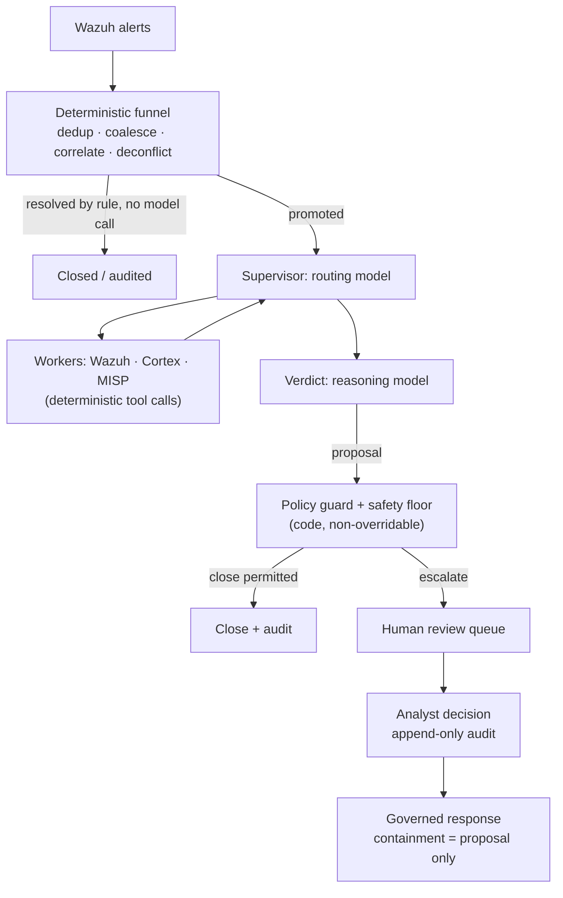

# Triage AI degli alert Wazuh: cosa funziona in produzione (e cosa no)

Ogni operatore Wazuh ha avuto la stessa idea: il manager produce migliaia di alert al giorno, la maggior parte è rumore, e un LLM è molto bravo a leggere un alert e dire "questo è un tentativo di brute force" oppure "questo è un cron job". Quindi colleghi un webhook da Wazuh a uno strumento di workflow, inserisci il JSON dell'alert in un prompt e pubblichi la risposta del modello da qualche parte.

Quel prototipo funziona. In produzione però fallisce, in modi prevedibili. Questa guida spiega perché, e descrive l'architettura che regge quando il triage AI degli alert Wazuh deve girare senza supervisione su un volume di alert reale. È l'architettura che SocTalk implementa.

## Perché "manda ogni alert a un LLM" si rompe

Il pattern ingenuo (webhook Wazuh → prompt LLM → verdetto) ha tre problemi strutturali, e nessuno di questi si risolve con prompt migliori.

**Il costo scala con il rumore, non con il segnale.** Una singola scansione può produrre migliaia di alert. Se ogni alert grezzo costa una chiamata al modello, la spesa è proporzionale a quanto è rumoroso il tuo ambiente, e il costo ti spinge verso modelli più deboli proprio nei casi in cui il giudizio conta di più.

**Il modello non ha contesto e non ha un limite inferiore.** Un LLM che legge un alert in isolamento non ricorda cosa ha deciso un analista ieri e non ha una visione dello stato dell'organizzazione, quindi non può distinguere una modifica autorizzata da un attacco che produce un alert identico byte per byte. Nulla garantisce che non chiuda con sicurezza sopra un vero indicatore di compromissione, e un verdetto "benigno" allucinato su un'intrusione reale è una detection soppressa; nessun tasso di errori di quel tipo è tollerabile.

**Non c'è audit trail né cancello di controllo.** Un workflow che pubblica il verdetto del modello direttamente in un canale non conserva traccia delle evidenze su cui il verdetto si è basato, non registra l'identità del revisore e non ha alcun meccanismo per impedire che un verdetto sbagliato diventi un caso chiuso.

Il prototipo a webhook resta un ottimo modo per convincerti che gli LLM sanno ragionare sugli alert. Il pezzo mancante è l'architettura intorno al modello.

## L'architettura che funziona: un funnel deterministico prima di qualsiasi chiamata al modello

La prima correzione è controintuitiva: la maggior parte di una pipeline di triage AI non dovrebbe essere AI. In SocTalk il piano di ingest è lato server e completamente deterministico; nessun modello lo tocca:

- La **deduplicazione** scarta gli eventi ritrasmessi che portano un ID già visto.
- Il **coalescing** raggruppa in un unico caso gli alert ripetuti della stessa regola sullo stesso asset entro una finestra di cinque minuti. Una raffica di una singola detection diventa un caso invece di migliaia.
- La **correlazione per entità** allega come evidenza un nuovo alert che condivide un'entità forte (host, hash di file) con un'indagine attiva, invece di avviare una nuova esecuzione priva di contesto.
- La **deconfliction degli engagement** confronta le finestre dichiarate di pentest e red team per sorgente, host, tecnica e tempo. I test autorizzati vengono contrassegnati e sottoposti ad audit, mai chiusi automaticamente, e l'attività dei tester fuori scope viene forzata a un umano.
- La **chiusura deterministica** gestisce per regola i falsi positivi a bassa severità e alta confidenza, senza alcuna chiamata al modello.

Molti alert non raggiungono mai un modello. Ciò che sopravvive viene promosso a indagine, e anche allora il modello viene consultato in due soli ruoli: un **supervisore** che instrada l'indagine (recupera il contesto dell'host da Wazuh, verifica la reputazione degli observable tramite gli analyzer di Cortex, consulta la threat intel di MISP; sono tutte chiamate a strumenti deterministici i cui risultati il modello si limita a *leggere*), e un nodo di **verdetto** in cui un modello di reasoning pesa tutto quanto raccolto e propone `escalate`, `close` o `needs_more_info` con confidenza, motivazione e forza delle evidenze.

## Guardrail come dati, verdetti vincolati dal codice

La seconda correzione tratta il verdetto del modello come una proposta che solo un cancello deterministico può trasformare in una decisione definitiva. La regola di SocTalk è *"l'LLM propone; un cancello deterministico dispone"*.

Le [policy di triage](/it-it/triage-policies) sono dati, regole dichiarative eseguite da un unico interprete, che agiscono su quattro cancelli: un resolver, un cancello pre-decisione (un verdetto non è valido finché non sono stati eseguiti i passi di evidenza richiesti), un guard post-verdetto e un **safety floor**. Il floor è a livello di codice e non aggirabile, applicato in tre punti indipendenti (worker, server, ingest). Nessuna chiusura automatica può scattare sopra un IOC noto, un record di autorizzazione contraddetto, un indicatore non verificato, un incidente correlato attivo, un kill switch, o oltre il limite di volume (default 500 chiusure automatiche ogni 24 ore). I kill switch (`SOCTALK_AUTO_CLOSE_KILL` per l'intera installazione, oppure per singolo tenant) trasformano istantaneamente ogni chiusura automatica in una promozione. È il controllo a cui ricorri nel mezzo di un incidente.

La proprietà che rende sicure le policy scritte dai tenant: possono solo rendere il triage **più severo**, mai più permissivo. Un override di guardrail può solo alzare una decisione lungo la scala `close < needs_more_info < escalate`; la soppressione non è esprimibile nel linguaggio delle condizioni, che è sandboxato: alberi a operatore singolo su un contratto di stato documentato, nessun accesso ad attributi, nessuna chiamata a funzioni, policy non valide rifiutate in blocco alla validazione. Una policy mal configurata o ostile non può diventare un canale per sopprimere le detection.

## Lo human-in-the-loop è una proprietà rigida

Ogni verdetto `escalate` passa dalla revisione umana. Non esiste bypass: una modalità "auto-approve" solo AI non è implementata in SocTalk (la rimozione del cancello è una voce di roadmap, prevista come toggle riservato agli admin e sottoposto ad audit, non come default silenzioso). In V1 la superficie di revisione è la coda della dashboard, che mostra la motivazione completa dell'AI e le evidenze degli observable con il relativo arricchimento. Le decisioni dell'analista di approvare, rifiutare o chiedere più informazioni scrivono righe di audit append-only con identità, timestamp e motivazione, mai modificabili dopo l'invio. Una proposta di chiusura che tocca un asset sensibile (per esempio un host classificato PCI) viene trattenuta per l'approvazione di un umano anche quando il modello è sicuro.

La stessa impostazione governa la risposta: un'azione di contenimento come isolare un endpoint o disabilitare un account viene *sempre* sollevata come proposta che un analista approva prima. Il modello non esegue mai un'azione di contenimento da solo, e il dispatch avviene lato server, mai dal loop del modello. SocTalk lavora come copilota, non come sostituto dell'analista. Il valore è la compressione: lo stesso team di analisti può gestire un volume di alert 5–10 volte superiore, perché i casi di routine si chiudono automaticamente e solo quelli poco chiari arrivano alla revisione umana.

## Ingegneria dei costi

Poiché il funnel risolve molti alert senza chiamate al modello, il costo segue l'ambiguità e non il volume. Le leve rimanenti:

- **Divisione fast/reasoning.** Routing e worker usano un modello veloce; solo il verdetto usa un modello di reasoning. I default sono `claude-sonnet-4-20250514` per entrambi, sovrascrivibili per tenant (`SOCTALK_FAST_MODEL` / `SOCTALK_REASONING_MODEL`).
- **Budget di token per esecuzione.** Ogni esecuzione ha un budget di token (default del modello 200.000), tracciato per esecuzione, per tenant e per l'intera installazione. Un'indagine fuori controllo si ferma invece di fatturare all'infinito.
- **Spesa nel mondo reale.** Molto variabile, ma come ordine di grandezza: circa **9 $/giorno per tenant** a ~30 alert/giorno su una configurazione economica compatibile con OpenAI, con un calo di 5–10 volte usando un modello fast più economico. Trattala come una stima di partenza, non come un preventivo.
- **Opzione a costo per token zero.** Esegui tutto in locale con [Ollama](/it-it/integrate/ollama): nessun LLM cloud, nessun costo per token, i dati restano sulla tua infrastruttura. Scegli un modello capace di usare gli strumenti (qwen2.5, llama3.1, mistral-nemo), e tieni presente che l'inferenza su CPU è lenta, nell'ordine di minuti per indagine; usa un host con GPU per una latenza utilizzabile.

## Porta il tuo LLM

Il runtime di SocTalk supporta due provider: `anthropic` (Claude) e `openai`, che copre OpenAI stessa o qualsiasi endpoint compatibile con OpenAI come Azure OpenAI, vLLM, Ollama e LiteLLM. Provider, modello, base URL e chiave API sono tutti sovrascrivibili **per tenant**, e un cliente può portare la propria chiave per l'isolamento della fatturazione, montata nel runs-worker del tenant come Secret Kubernetes nel namespace di quel tenant. (Si applica un'eccezione documentata in V1: la chiave è conservata anche nel database SocTalk in chiaro, `IntegrationConfig.llm_api_key_plain`; vedi [Secrets](/it-it/reference/secrets) per la postura e i consigli di rotazione.) Il modello vede sempre e solo lo stato dell'indagine corrente (corpo dell'alert, observable, output dei worker); per una postura più rigorosa, punta il tenant a un endpoint on-prem. Dettagli in [Provider LLM](/it-it/integrate/llm-providers).

## Come si presenta in SocTalk

SocTalk è una piattaforma SOC AI-first con licenza Apache 2.0 per MSP e MSSP: uno stack Wazuh dedicato per ogni cliente sul tuo Kubernetes, dietro un unico control plane, con la pipeline di triage descritta sopra in esecuzione per tenant. Per approfondire:

- [Come funziona](/it-it/how-it-works) racconta l'intera pipeline: il funnel deterministico, i due ruoli del modello, il safety floor a tre punti.
- [Pipeline AI](/it-it/ai-pipeline) copre la macchina a stati LangGraph: supervisore, worker, verdetto, ciclo di vita delle esecuzioni.
- [Policy di triage](/it-it/triage-policies) mostra come scrivere guardrail deterministici nell'editor no-code, prima in shadow mode e poi in attivazione.
- [Revisione umana](/it-it/human-review) documenta la coda di revisione e il contratto di decisione dell'analista.

Oppure salta la lettura: la [VM demo](/it-it/quickstart-vm) ti dà un'installazione multi-tenant funzionante, con un tenant demo già a bordo, in circa cinque minuti.
