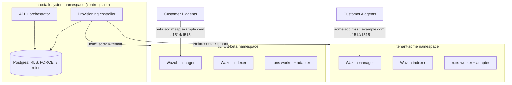

# Wazuh multi-tenant per MSSP: pattern architetturali che isolano davvero i tenant

Wazuh non ha una multi-tenancy di prima classe. Non esiste un oggetto "tenant" nel manager, nessun confine per cliente nel ruleset e nessuno scoping per cliente dell'enrollment `authd`. Ogni MSSP che standardizza su Wazuh finisce per costruire la tenancy attorno al prodotto, e il pattern che scegli determina le garanzie di isolamento, la velocità di onboarding e il costo minimo per cliente.

Questa guida copre ciò che un MSSP richiede da un deployment Wazuh multi-tenant, i tre pattern che i team provano nella pratica e ciò che serve per un isolamento di livello produzione oltre al SIEM stesso. È l'architettura che SocTalk implementa come open source (Apache 2.0); le pagine di riferimento linkate nel testo approfondiscono ogni livello.

## Cosa serve a un MSSP che Wazuh non fornisce

Tre requisiti emergono in ogni conversazione di deployment MSSP:

1. **Un isolamento difendibile in una security review del cliente.** Un filtro di dashboard da solo non convince nessuno; "il cliente A non può leggere gli alert del cliente B" deve valere al livello dei dati, al livello di rete e al livello di enrollment degli agent.
2. **Velocità di onboarding.** Se il provisioning del SOC di un nuovo cliente richiede una settimana di lavoro manuale, il pattern non scala oltre una manciata di clienti.
3. **Controllo dei costi per tenant.** Devi sapere quanto costa un cliente in RAM, CPU e disco, imporre un tetto e impedire che un tenant rumoroso affami gli altri.

## I tre pattern che gli MSSP provano

### Pattern 1: manager condiviso, separazione a livello di indice

Un solo manager Wazuh, gli agent di tutti i clienti registrati su di esso, separazione fatta a valle: multi-tenancy di OpenSearch Dashboards per gli oggetti di dashboard, index pattern e ruoli di sicurezza per lo scoping in lettura. È il pattern descritto dalla maggior parte dei thread sulla multi-tenancy di Wazuh, perché è l'unico realizzabile senza uscire dagli strumenti di Wazuh.

Il problema è che la separazione avviene in lettura e non traccia alcun confine attorno ai dati. Il manager stesso è condiviso: un solo ruleset, un solo segreto `authd`, una sola API, una sola finestra di upgrade per tutti. Un ruolo mal configurato espone tutti i clienti in una volta sola, e rule pack o policy di retention per cliente sono impossibili senza impattare gli altri.

### Pattern 2: manager per tenant su VM

Una VM (o un set di VM) per cliente, con manager e indexer dedicati. L'isolamento è reale: processi, dischi e credenziali separati. È il punto in cui gli MSSP approdano dopo che il pattern a manager condiviso li ha scottati. Il costo è operativo: l'onboarding significa provisionare macchine, gli upgrade significano toccare ogni VM, e la soglia minima di risorse per tenant è una VM intera, senza scheduling condiviso per recuperare capacità inutilizzata. Funziona con 5 clienti e diventa doloroso con 30.

### Pattern 3: manager per tenant su Kubernetes, dietro un control plane

Ogni cliente riceve un manager Wazuh, un indexer e una dashboard dedicati nel proprio namespace Kubernetes, con una ResourceQuota e una LimitRange che ne limitano il footprint. Un control plane governa il ciclo di vita: l'onboarding genera una release Helm per tenant, il teardown la rimuove, e lo stato dei tenant vive in un database invece che in un foglio di calcolo. L'isolamento deriva dal confine di namespace più le NetworkPolicy; la densità dallo scheduler che impacchetta i tenant su nodi condivisi.

### Confronto tra i pattern

| | Manager condiviso + separazione per indice | Manager per tenant su VM | Manager per tenant su Kubernetes |
|---|---|---|---|
| Confine di isolamento | Filtri in lettura su dati condivisi | Confine di macchina | Namespace + NetworkPolicy + quota |
| Raggio d'impatto di una compromissione | Tutti i clienti | Un cliente | Un cliente |
| Regole / retention / upgrade per tenant | No | Sì | Sì |
| Onboarding di un cliente | Veloce (modifica di config) | Lento (provisioning di macchine) | Veloce, se automatizzato (release Helm) |
| Densità / costo per tenant | Migliore | Peggiore | Buono (impacchettato dallo scheduler, limitato da quota) |
| Competenze operative richieste | Wazuh + sicurezza OpenSearch | Automazione fleet/VM | Kubernetes |
| Operazioni di fleet con 30+ tenant | N/D (uno stack solo) | Doloroso | Gestibile con un control plane |

Dei tre, il pattern 3 è quello costruito per offrire sia isolamento reale sia velocità di onboarding, ma solo se il control plane esiste. I namespace da soli equivalgono a una convenzione di naming; il confine di sicurezza va costruito sopra di essi. Il resto di questa guida spiega cosa rende reale quel confine.

## L'isolamento in produzione va oltre il SIEM

Uno stack Wazuh per tenant isola i dati del SIEM. Una piattaforma MSSP ha anche stato cross-tenant, dai casi e le code di revisione fino agli audit log e alle configurazioni delle integrazioni, e quel livello richiede un enforcement dedicato.

### Livello dati: row-level security di Postgres, forzata e testata

Con il filtraggio applicativo `WHERE tenant_id = ?`, una sola clausola dimenticata fa trapelare dati tra tenant. Deve essere il database a imporre la tenancy. Il pattern:

- Ogni tabella con scope di tenant porta policy RLS basate su un'impostazione per transazione `app.current_tenant_id`. Un contesto non impostato produce **zero righe**; la modalità di fallimento è un risultato vuoto, mai i dati di un altro tenant.
- `FORCE ROW LEVEL SECURITY` su ogni tabella con scope di tenant, così anche il proprietario della tabella (il ruolo di migrazione) è soggetto alle policy. Postgres di default esenta i proprietari; una migrazione che legge dati di tenant potrebbe altrimenti attraversare i tenant in silenzio.
- Una separazione in tre ruoli: un proprietario per le migrazioni, un ruolo runtime soggetto a RLS e un ruolo `BYPASSRLS` segregato, riservato ai percorsi cross-tenant sottoposti ad audit. Nessuna applicazione si connette come superuser.
- Test di isolamento in CI: probe sugli endpoint, SQL grezzo con il ruolo applicativo, worker senza contesto, probe con il ruolo proprietario, stream di eventi cross-tenant. SocTalk esegue sette test di questo tipo, tutti obbligatori; nessuno opzionale.
- Chiavi di idempotenza con scope `UNIQUE (tenant_id, idempotency_key)`, così le pipeline di alert di due clienti possono emettere lo stesso ID di alert esterno senza collidere.

Template completi delle policy, DDL dei ruoli e suite di test: [RLS su Postgres](/it-it/reference/postgres-rls).

### Livello rete: NetworkPolicy per namespace

Il confine di namespace non vale nulla senza una CNI che lo applichi; il Flannel di default di K3s non applica affatto le NetworkPolicy. La postura obiettivo è una baseline default-deny per namespace tenant con permessi espliciti: traffico intra-namespace, DNS, accesso del control plane alle porte del data plane del tenant e ingress degli agent su 1514/1515. Il traffico tenant-verso-tenant e l'egress generico dei tenant sono bloccati.

SocTalk usa Cilium come CNI supportata (enforcement delle NetworkPolicy, egress basato su FQDN per endpoint LLM indirizzati per hostname, osservabilità dei flussi con Hubble per il debug delle questioni di isolamento). Tieni presente la riserva della V1: l'allowlist di egress per tenant interamente vincolata a FQDN è la destinazione del design, mentre il chart attuale genera policy più semplici, con egress permissivo per il control plane ed egress TCP/443 ampio per il worker per tenant. I template generati sono nel repo; leggi [Design delle NetworkPolicy](/it-it/reference/network-policy) sia per le policy attualmente distribuite sia per l'architettura obiettivo.

### Enrollment degli agent: endpoint e segreti per tenant

La modalità di fallimento più subdola: l'agent del cliente A che si registra sul manager del cliente B. Il protocollo agent di Wazuh su 1514/TCP è uno stream cifrato proprietario, non TLS standard. Non c'è SNI su cui instradare, quindi i proxy L4 che ispezionano l'hostname si rompono in silenzio. L'instradamento deve avvenire per indirizzo di destinazione: ogni tenant riceve il proprio nome DNS (`acme.soc.mssp.example.com`) che risolve verso un endpoint L4 per tenant, con un fallback a porta per tenant quando gli IP scarseggiano.

I segreti di enrollment hanno scope di tenant: il segreto condiviso `authd` di ogni tenant vive nel namespace di quel tenant, quindi un agent in possesso del segreto del tenant A può registrarsi solo sul manager di A: l'indirizzamento lo instrada lì e il manager verifica il segreto. In V1, il provisioning di LoadBalancer e DNS è cablaggio manuale a carico dell'MSSP, non automatizzato. Dettagli e runbook di enrollment: [Ingress degli agent Wazuh](/it-it/reference/wazuh-ingress).

## Capacità: quanto costa un tenant

I numeri che gli MSSP chiedono per primi, dal lavoro di dimensionamento di SocTalk:

- **Footprint per tenant (stack completo):** ~8 GB di RAM in request (~16 GB di limit), ~2,2 vCPU in request, ~120 GB di disco. L'utilizzo sostenuto segue le request; i limit sono tetti di burst.
- **Il collo di bottiglia è di solito l'indexer Wazuh per tenant.** Ognuno è un processo Java con il proprio heap. Pianifica ~6-8 GB di RAM e ~1,5 vCPU per tenant in produzione.
- **Il disco è guidato dal tasso di ingest:** circa 5 GB/giorno di indice a 10 alert/sec sostenuti; la PVC di default dell'indexer è di 50 GB con retention hot di 30 giorni.
- **Scala testata:** fino a ~50 tenant su un cluster a 3 nodi (16 vCPU / 64 GB per nodo). Profili single-install più grandi sono documentati ma non validati in questa release; non pianificare oltre quel numero su una singola installazione senza test.

Profili host di riferimento e formula del massimo di tenant per nodo: [Dimensionamento](/it-it/reference/sizing) e la [FAQ sullo scaling](/it-it/faq#does-it-scale-to-n-customers).

## Come SocTalk confeziona questo pattern

SocTalk è un'implementazione open source (Apache 2.0, senza divisione community/enterprise) del pattern 3: un control plane, una release Helm `soctalk-tenant` per cliente, sul tuo Kubernetes 1.30+, che sia K3s, EKS, AKS o GKE.

L'onboarding esegue una sequenza di provisioning in nove fasi (preflight, generazione dei segreti, namespace con quote, installazioni Helm, polling di readiness), con ogni fase che emette un evento di ciclo di vita ed è riprovabile in modo idempotente dallo stato `degraded`. Lo stato del tenant è una macchina imposta lato server (`pending → provisioning → active`, con gli stati suspended, decommissioning, archived e purged; le transizioni non valide restituiscono 409). Tre profili di onboarding coprono le demo (`poc`), la produzione (`persistent`) e il BYO-Wazuh (`provided`, in cui SocTalk si connette allo stack esistente di un cliente invece di deployarne uno). Il decommissioning smantella il data plane ma conserva la riga del tenant e la storia di audit.

Il ciclo di vita completo, dagli stati e le fasi fino alle quote e ai percorsi di ripristino, è in [Ciclo di vita del tenant](/it-it/tenant-lifecycle). Per metterlo in pratica: la [guida di installazione](/it-it/install) copre un cluster di produzione in circa un'ora, e la [VM demo](/it-it/quickstart-vm) avvia un'installazione multi-tenant funzionante con un tenant demo in circa cinque minuti.
