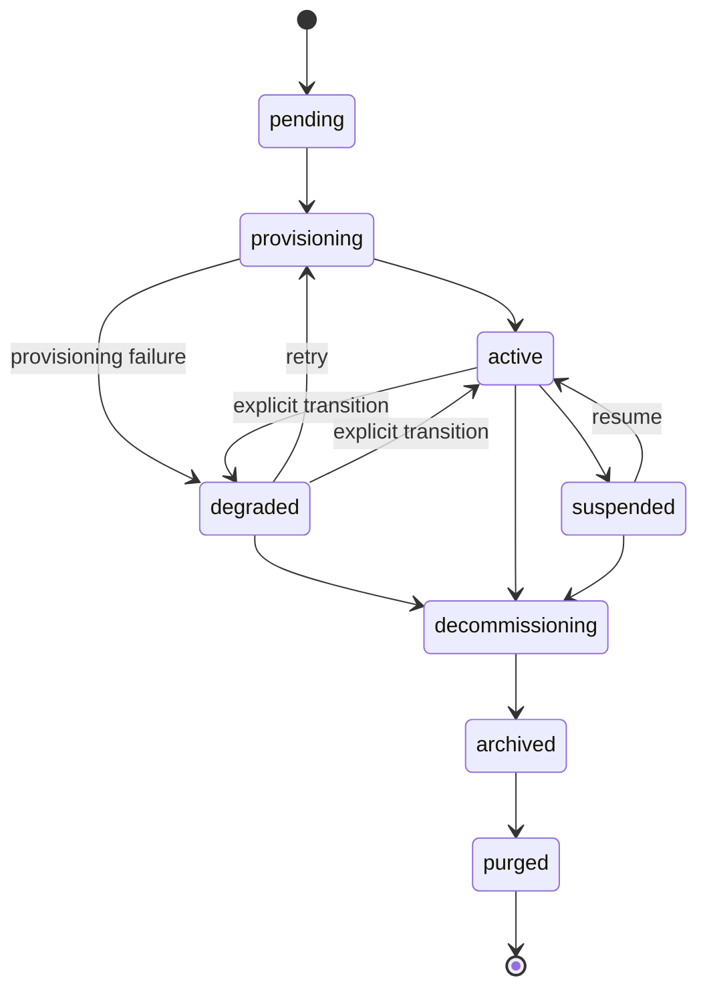

# Ciclo di vita del Tenant

Cosa accade a un SOC cliente dall'"onboarding" alla "cancellazione definitiva". Questa pagina è il complemento, rivolto agli operatori, di [Chart Contract](/it-it/reference/chart-contract) (che documenta il rendering dei valori sul canale) e di [Operazioni quotidiane](/it-it/operations) (che documenta il lato runbook).

## Macchina a stati del Tenant



Le transizioni verso `degraded` avvengono **solo tramite il percorso di errore del controller di provisioning** (una fase ha sollevato `ProvisionError`). Non esiste alcun endpoint API per contrassegnare manualmente un tenant come `degraded`, nessun ciclo di auto-degradazione che monitori l'età dell'heartbeat dell'adattatore e nessun degrado basato su metriche. La gauge `soctalk_tenant_adapter_heartbeat_age_seconds` si aggiorna sugli heartbeat ma non retroagisce sullo stato del tenant. Le transizioni di ritorno verso `active` avvengono come effetto collaterale di un re-provisioning `:retry` andato a buon fine.

| Stato | Cosa significa | Cosa è in esecuzione |
|---|---|---|
| `pending` | Onboarding accettato, il controller non ha ancora avviato il provisioning. | nulla in `tenant-<slug>` |
| `provisioning` | Il controller sta creando il namespace, i secret ed esegue l'helm-install del chart del tenant. | parziale, i pod stanno comparendo |
| `active` | Il tenant è passato ad `active` dopo che il controller di provisioning ha visto i pod del data plane raggiungere lo stato Ready. | Wazuh manager + indexer + dashboard + soctalk-adapter + runs-worker |
| `degraded` | Il controller di provisioning ha contrassegnato il tenant come `degraded` dopo un errore di provisioning (oppure un operatore ha effettuato la transizione manualmente). **Attualmente la piattaforma non effettua transizioni automatiche active→degraded in base all'età dell'heartbeat dell'adattatore**; la gauge `soctalk_tenant_adapter_heartbeat_age_seconds` è destinata al tuo alerting | indeterminato; controlla i pod |
| `suspended` | L'amministratore MSSP ha contrassegnato il tenant come sospeso nel database. **In questa release i workload NON vengono ridimensionati dall'azione di sospensione in sé**: ciò richiede la procedura manuale di disabilitazione d'emergenza (vedi [Operazioni quotidiane → Disabilitazione d'emergenza](/it-it/operations#emergency-disable-a-tenant-immediately)). Il flag di stato impedisce la pianificazione di nuove indagini. | invariato, i pod continuano a essere in esecuzione a meno che l'operatore non li ridimensioni |
| `decommissioning` | Smantellamento in corso. La release Helm si sta disinstallando, i PVC vengono eliminati. | in riduzione |
| `archived` | Release Helm rimossa; PVC eliminati; la riga del tenant rimane per l'audit. | nulla |
| `purged` | Riga del tenant eliminata definitivamente. | nulla, rimangono solo le voci del log di audit |

Le transizioni consentite sono applicate in `TenantController.VALID_TRANSITIONS`. Il tentativo di sospendere un tenant in stato `decommissioning` restituisce HTTP 409 con un elenco dei prossimi stati validi.

## Fasi di provisioning

Il metodo `provision()` del controller viene eseguito in nove fasi ordinate. Ogni fase emette una riga `TenantLifecycleEvent` visibile nella pagina di dettaglio del tenant (tabella Lifecycle Events).

| # | Evento | Cosa accade |
|---|---|---|
| 1 | `preflight_ok` | I controlli pre-flight (prerequisiti del cluster, conflitti di naming) sono superati. |
| 2 | `secrets_minted` | Generazione dei secret per-tenant (`authd`, firma JWT, Postgres). |
| 3 | `namespace_ready` | Creazione di `tenant-<slug>` con label, ResourceQuota, LimitRange. |
| 4 | `secrets_applied` | Push dei secret in K8s come oggetti `Secret/*` nel nuovo namespace. |
| 5 | `helm_applied` (chart del tenant) | Installazione del chart `soctalk-tenant` (adapter + runs-worker + ingress). L'utente tenant_admin viene auto-provisionato come parte di questa fase (inline `_mint_tenant_admin_user`). |
| 6 | `helm_applied` (chart Wazuh) | Installazione del chart standalone di Wazuh (manager/indexer/dashboard). Il payload della riga dell'evento identifica quale chart è stato applicato. |
| 7 | `workloads_ready` | Polling finché tutti i pod del data plane non sono Ready. |
| 8 | `integration_config_written` | Scrittura nel database delle configurazioni di integrazione per-tenant (LLM, URL di TheHive, ecc.). |
| 9 | `active` | Transizione di stato ad `active`. |

Un errore in una qualsiasi fase porta il tenant a `degraded`, con l'errore registrato nella riga dell'evento. **Retry Provisioning** (`POST /api/mssp/tenants/{id}:retry`) è una transizione valida da `degraded` di nuovo a `provisioning` (e **non** è consentita da `pending`: `pending → provisioning` avviene solo automaticamente quando il controller avvia il primo tentativo). `provision()` è idempotente su ogni fase.

## Profili

Il profilo viene scelto al momento dell'onboarding ed è **fisso per l'intera vita del tenant**. Cambiare profilo richiede `decommission` + ricreazione.

### `poc`

Per valutazioni, demo e pilot di breve durata.

- StorageClass: `local-path` (default di k3s; nessuna reale garanzia di persistenza)
- JVM heap dell'indexer Wazuh: 512 MiB
- Richieste di risorse nella fascia bassa degli intervalli del chart
- Nessun hook di backup configurato

Questo è il profilo utilizzato dall'[immagine VM demo](/it-it/quickstart-vm) per il suo tenant `demo` incluso.

### `persistent`

Per SOC di clienti in produzione.

- StorageClass: quella che l'installazione contrassegna come default (Longhorn, Rook/Ceph, CSI del cloud provider)
- JVM heap dell'indexer Wazuh: default lato chart (tipicamente 2–4 GiB)
- Richieste/limiti di risorse dimensionati per carico sostenuto
- Hook di backup rispettati se configurati

Scegli `persistent` per qualsiasi cosa rivolta al cliente. Il default è `poc` se non specificato, che è il default sbagliato per un cliente reale.

### `provided`

Per i tenant che portano il proprio stack Wazuh distribuito esternamente ("BYO-SIEM"). Il chart del tenant installa solo l'adattatore SocTalk + runs-worker; nessun Wazuh/TheHive/Cortex viene eseguito all'interno del namespace del tenant.

- StorageClass: irrilevante, viene provisionato solo il PVC di checkpoint dell'adattatore
- Wazuh: deployment proprio del tenant, raggiunto in rete tramite gli URL dell'indexer (:9200) e della Manager API (:55000) forniti al momento dell'onboarding
- Il materiale di connessione al SIEM esterno (`wazuh_indexer_url`, `wazuh_api_url`, credenziali basic-auth) è **obbligatorio** all'onboarding e viene validato lato server (422 se incompleto)
- Anche le credenziali LLM per-tenant sono **obbligatorie** all'onboarding (nessun fallback condiviso a livello di installazione per `provided`)
- Una allow-list di egress FQDN di Cilium viene derivata automaticamente dagli hostname di indexer/API forniti

Scegli `provided` quando il cliente esegue già Wazuh e vuole che SocTalk lo interroghi in loco. Vedi il [tutorial pilot MSSP → §3.1](/it-it/mssp-pilot#_3-1-run-the-create-customer-wizard) per la guida al wizard (il passaggio External SIEM) e [§3.4](/it-it/mssp-pilot#_3-4-coordinating-external-wazuh-creds-for-provided-tenants) per il lavoro di coordinamento a monte.

## Quote di risorse

Ogni namespace `tenant-<slug>` riceve una `ResourceQuota` e un `LimitRange` al momento della creazione, dimensionati sul footprint atteso del profilo. Vedi [Dimensionamento](/it-it/reference/sizing).

| Profilo | Richieste CPU | Limiti CPU | Richieste memoria | Limiti memoria | PVC | Pod |
|---|---|---|---|---|---|---|
| `poc` | 2 | 4 | 4 Gi | 8 Gi | 4 | 20 |
| `persistent` | 2 | 5 | 6 Gi | 12 Gi | 6 | 30 |
| `provided` | 1 | 2 | 2 Gi | 4 Gi | 2 | 10 |

(I numeri esatti risiedono in `_profile_tenant_overrides` in [`render.py`](https://github.com/soctalk/soctalk/blob/main/src/soctalk/core/provisioning/render.py).)

Se un workload reale supera il budget del profilo (ad esempio, l'indexer Wazuh rallenta durante un ingest pesante), aumenta la ResourceQuota tramite `helm upgrade` con valori sovrascritti. Non modificare direttamente l'oggetto ResourceQuota, il prossimo upgrade del chart lo sovrascriverà.

## Percorsi di ripristino

### Tenant bloccato in `pending` dopo l'onboarding

Il controller è andato in crash o è stato riprogrammato a metà provisioning prima dell'esecuzione della prima fase. Il retry non è consentito direttamente da `pending`: attendi prima che il tentativo di provisioning transiti a `degraded` (visibile negli eventi del ciclo di vita), quindi fai clic su **Retry Provisioning** nella pagina di dettaglio del tenant (oppure `POST /api/mssp/tenants/{id}:retry`). Il provisioning riprende dalla fase 1; ogni fase è idempotente.

### Tenant in `provisioning` per oltre 15 minuti

Di solito si tratta di un pod bloccato (ImagePullBackOff, PVC `Pending`, ResourceQuota troppo piccola). Vedi [Operazioni quotidiane, Tenant bloccato in provisioning](/it-it/operations#tenant-stuck-in-provisioning).

### Tenant in `degraded`

In V1, lo stato `degraded` viene raggiunto solo dopo un **errore di provisioning**, non per perdita di heartbeat. Se un tenant è in `degraded`, il controller di provisioning ha fallito in uno dei 9 passaggi sopra elencati, leggi la riga dell'evento del ciclo di vita per vedere quale. Il data plane (Wazuh) potrebbe essere ancora in esecuzione a seconda del passaggio fallito. Vedi [Operazioni quotidiane, Tenant in stato degraded](/it-it/operations#tenant-in-degraded-state).

### Tenant in `suspended`

L'hai fatto deliberatamente. Riprendi dalla UI o con `POST /api/mssp/tenants/<id>:resume`: ma nota che in questa release **il resume aggiorna solo lo stato nel DB**, non ripristina il numero di repliche. Se hai ridimensionato i workload a zero durante la sospensione (tramite il flusso di disabilitazione d'emergenza), devi riportarli su manualmente.

### Tenant in `decommissioning` per oltre 30 minuti

Disinstallazione Helm bloccata. Molto spesso un finalizer su un PVC che non è mai stato eseguito. Esegui `helm uninstall tenant-<slug> -n tenant-<slug> --no-hooks` e rimuovi i finalizer manualmente:

```bash
kubectl -n tenant-<slug> get pvc -o name | \
  xargs -I {} kubectl -n tenant-<slug> patch {} -p '{"metadata":{"finalizers":null}}' --type=merge
```

Quindi riavvia il decommission. Documenta questa operazione nel log di audit affinché la tracciabilità rimanga integra.

## Decommission vs purge

`decommission` smantella il data plane e porta il tenant ad `archived`: la riga del tenant e lo storico di audit rimangono. `purged` è lo stato terminale nella macchina a stati (`archived → purged`), ma in questa release **non esiste alcun endpoint API `:purge`**. Oggi la transizione a `purged` richiede un aggiornamento a livello di database; un endpoint `POST /api/mssp/tenants/{id}:purge` protetto da restrizioni admin è in roadmap. Finché non sarà rilasciato, lascia i tenant dismessi in `archived` e considera le righe archiviate come la superficie di conservazione a lungo termine.

## Riferimenti al codice sorgente

| Concetto | File |
|---|---|
| Enum di stato del Tenant + transizioni | [`src/soctalk/core/tenancy/models.py`](https://github.com/soctalk/soctalk/blob/main/src/soctalk/core/tenancy/models.py) |
| Controller di provisioning | [`src/soctalk/core/provisioning/controller.py`](https://github.com/soctalk/soctalk/blob/main/src/soctalk/core/provisioning/controller.py) |
| API di onboarding + payload | [`src/soctalk/core/api/tenants.py`](https://github.com/soctalk/soctalk/blob/main/src/soctalk/core/api/tenants.py) |
| Tabella degli eventi del ciclo di vita | [`src/soctalk/core/tenancy/models.py`](https://github.com/soctalk/soctalk/blob/main/src/soctalk/core/tenancy/models.py) |
