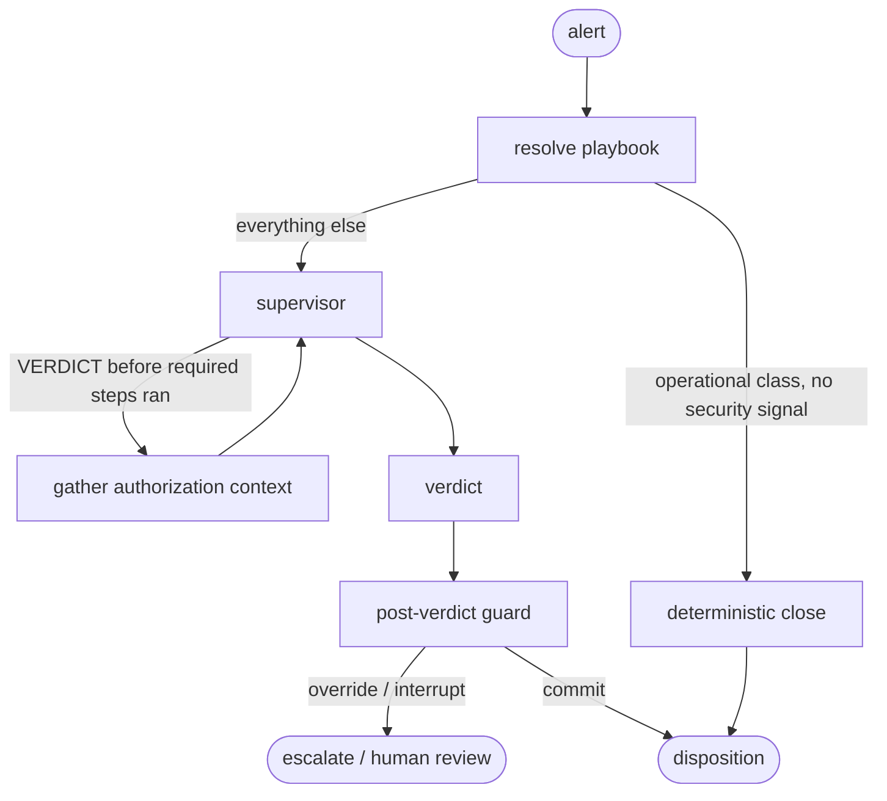
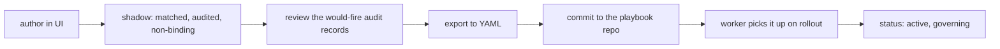

# Playbooks

The [AI pipeline](/ai-pipeline) reasons its way to a verdict. That flexibility is the point for investigation, and it is the wrong tool for the parts of triage that have to be guaranteed: mandatory steps, safety overrides, and decisions you can make without a model. Playbooks are the layer that handles those. They are deterministic guardrails wrapped around the agentic loop, expressed as data.

The rule they follow is always the same. The LLM proposes, a deterministic gate disposes.

```
LLM node  ->  deterministic guard  ->  { commit | override | interrupt | reroute }
```

The model stays free to reason. A pure function decides whether its output takes effect. Guards fire only on edges you can prove (an authorization record that contradicts the activity, an IOC on the alert, an active incident on the same host). The ambiguous middle passes straight through to the model, which is where it belongs.

The code lives in [`src/soctalk/playbook/`](https://github.com/soctalk/soctalk/tree/main/src/soctalk/playbook).

## Policy is not playbook

Two ideas that are easy to conflate.

Policy is declarative. It states what is allowed or forbidden, and the authorization engine reasons over it. "Privileged actions on PCI systems need an approved change window" is policy.

A playbook is procedural. It states what to do, in what order, and which gates apply. "Gather the authorization context before deciding, and require human sign-off on any close touching a PCI asset" is a playbook.

Keep the judgment reasoned and the response procedural. A playbook never decides a disposition from surface features. That would reintroduce the keyword-matcher failure the whole authorization layer exists to avoid. The playbook wraps around the engine, it does not replace it.

## Where a playbook acts

A playbook governs one run at four points.



1. **Resolver.** An entry node matches the alert against the registry and writes the active playbook into the run state. If the alert belongs to a known operational class with no security indicators, the run can close deterministically here without ever calling the model.
2. **Pre-decision gate.** A playbook can require deterministic steps (for example, gathering authorization context) before a verdict is legal. If the supervisor proposes a verdict too early, the gate reroutes it to the required step first. A playbook can also restrict which supervisor actions are legal in each phase, and that restriction is applied to the model's structured output before the call, so an illegal action cannot even be sampled.
3. **Post-verdict guard.** After the model drafts a verdict, a pure function decides whether it commits. It can override the draft (raise a close to an escalate), interrupt it (keep the draft but route to human sign-off), or let it stand. Every override is recorded.
4. **Safety floor.** A non-overridable set of checks sits on every automatic-close path. Nothing in a playbook can weaken it.

## The safety floor

The floor is enforced in code, not in playbook data, and it applies on every plane where a case can close automatically: the worker's disposition, the server that commits it, and the ingest fast-paths (memoized close and rules-based auto-close). A close is vetoed and the case is promoted or escalated instead when any of these hold:

| Veto | When it fires |
|---|---|
| IOC present | The alert carries a malicious enrichment verdict or a MISP match. |
| Contradicted authorization | Records exist but do not cover the activity (expired, out of window, wrong scope, forbidden by policy). |
| Unverified IOC | A router-tier close with observables that no enrichment ever checked. |
| Active incident | Another active investigation shares an attach-eligible entity with this one. |
| Kill switch | Auto-close is turned off, per tenant or install-wide. |
| Volume cap | The tenant's rolling count of automatic closes is spent. |

The effective set of gates on any run is the floor plus whatever the active playbook adds. A playbook can only make things stricter. This is what makes tenant-authored playbooks safe to allow: a misconfigured or hostile one cannot become a channel for suppressing detections.

The kill switch and volume cap are worth knowing by name. `SOCTALK_AUTO_CLOSE_KILL` on the API process, or the `auto_close_kill` policy flag on a tenant, flips every automatic close to a promotion with no rollout needed, which is the control you reach for mid-incident. `auto_close_volume_cap` (default 500 per 24 hours) means a runaway close loop degrades to "humans look at these" rather than mass suppression.

## Built-in playbooks

Two ship with the product. Both are vetted code and read-only.

**`dual-use-privileged-exec`** handles host-auth activity like `sudo` and `su`, where the same event is routine administration under a covering change record and an incident without one. It requires the `gather_authorization_context` step before any verdict, removes `CLOSE` from the supervisor's legal actions (so the cheap router tier cannot short-circuit a case whose whole point is that benign and hostile look identical), and requires human sign-off on any close touching a PCI-classified asset.

**`agent-health-operational`** handles Wazuh agent self-monitoring noise, such as rule 202 "Agent event queue is flooded." This is an infrastructure condition, not a security event, so the playbook closes it deterministically with no model call at all, which also makes the outcome consistent instead of varying run to run. Any security indicator on the alert (a MITRE technique, an IOC, high severity, a malicious signal) vetoes the deterministic close and sends the alert to full triage.

You can see both, with every gate and guardrail expanded, on the **Playbooks** page in the MSSP dashboard.

## The schema

A playbook is data. One generic interpreter runs any number of them.

```yaml
id: regulated-privileged-exec
version: 2
tenant: acme                       # a tenant slug or id; authored playbooks are always scoped
status: shadow                     # active | shadow
priority: 70                       # lower wins on a multi-match; authored/file >= 60
applies_to:
  rule_groups: [sudo]
  rule_ids: []
  authorization_tracks: [account]
required_steps: [gather_authorization_context]
decision_modules: [authorization_engine]
legal_actions:
  triage:  [ENRICH, CONTEXTUALIZE, INVESTIGATE, VERDICT]
  decide:  [ENRICH, CONTEXTUALIZE, INVESTIGATE, VERDICT]
close_signoff_data_classes: [pci]
guardrails:
  - when:
      "and":
        - "==": [{ "var": "authz.class" }, "contradicted"]
        - "==": [{ "var": "verdict" }, "close"]
    effect: override
    to: escalate
    reason: acted outside the terms of an authorization
```

Read that condition as: if the authorization class came out `contradicted` and the model drafted a `close`, raise it to `escalate`. Each node is a single operator over its arguments, and `var` reads a field from the state contract.

| Field | Meaning |
|---|---|
| `applies_to` | Which alerts the playbook governs. Matched on rule groups, rule ids, or the authorization track of the alert's activity. |
| `required_steps` | Deterministic nodes that must run before a verdict is legal. |
| `legal_actions` | The supervisor actions allowed per phase (`triage` until the required steps have run, then `decide`). Drawn from the fixed action set. |
| `close_signoff_data_classes` | A committing close on an asset in one of these classes is interrupted for human sign-off. |
| `guardrails` | Declarative override or interrupt rules. See below. |
| `priority` | Registry order. Built-ins occupy 10 and 50; anything authored or file-loaded must be 60 or higher, so it can never outrank a built-in's protections. |

Some capabilities are built-in-only and cannot be authored or loaded from a file: deterministic dispositions (the thing `agent-health-operational` uses to close without a model), because minting a new auto-close class is a code-review decision, not configuration.

## Guardrail conditions

Conditions are the only logic an author writes, and they run in a small sandboxed language over a documented state contract. There is no attribute access, no function calls, no way to name anything outside the contract. A condition is a tree of single-operator nodes.

Operators: `var`, the comparisons (`==`, `!=`, `<`, `<=`, `>`, `>=`), the logical `and` / `or` / `!`, and `in`.

The fields a condition may read:

| Field | What it is |
|---|---|
| `authz.class` | `covered`, `contradicted`, or `absent`, derived from the engine. |
| `authz.in_scope`, `authz.sanctioned_or_routine`, `authz.actor_genuine`, `authz.policy_allowed` | The four expectedness components. |
| `verdict` | The model's draft decision. |
| `verdict_confidence` | Its confidence, `0.0` to `1.0`. |
| `asset.data_classification`, `asset.environment`, `asset.criticality` | Trust-resolved attributes of the activity's asset. |
| `enrichment.ioc` | Whether a malicious signal is present. |
| `correlation.active_incident` | Whether an active incident overlaps. |

An `effect` is either `override` or `interrupt`. Suppression is not expressible: `close` is not a valid target, and an override may only raise a decision up the ladder `close < needs_more_info < escalate`, never down it. A condition that references an undeclared field or an unknown operator is rejected when the playbook is validated, before it can ever run.

## Authoring a playbook

Admins can author playbooks from the **Playbooks** page while a tenant is pinned. Authored playbooks are stored in the database, validated on save, and kept as an append-only revision history.

There is one deliberate constraint: **authored playbooks are shadow only.** They never govern the worker directly. A shadow playbook is matched and evaluated exactly as an active one would be, and its would-fire decisions are written to the audit trail, but it changes no disposition. This gives you real evidence of what a playbook would do against live traffic before it decides anything.

The reason for the constraint is operational, not arbitrary. The worker is a separate process with a registry it loads once at startup. A playbook that governs has to be a thing you can review, diff, and roll back through git, not a database row a UI mutated. So the authoring flow ends in an export, not an activation.



Validation on save is fail-closed and applies the same rules as file playbooks plus a few stricter ones: the id must be a slug, referenced steps and decision modules and legal-action phases must be ones the runtime actually knows, and the definition is size-capped. An unknown reference is rejected at author time rather than silently ignored at runtime.

## Rolling one out

Activation is the file path, and it is intentionally the same whether a playbook started as an authored draft or was written by hand.

1. Export the authored playbook to YAML (the **Export** action on the Playbooks page), or write the file directly.
2. Commit it to the directory your install mounts for playbooks, and set `status: active` in the file when you are ready for it to govern.
3. Point the environment at the directory and roll the workers.

Two environment variables carry the wiring:

- `SOCTALK_PLAYBOOK_DIR` on the runs-worker is the directory the registry loads from at startup.
- `SOCTALK_TENANT_PLAYBOOKS_DIR` on the controller is the operator-mounted directory the provisioning path reads, validates, and renders into each tenant's chart values as a mounted ConfigMap.

On the chart-provisioned path, playbooks are tenant chart values (`runsWorker.playbooks`), and a content change stamps a checksum on the pod template so an edit rolls the worker automatically. The rollout is the activation gate: because the registry loads once per process, a playbook only starts governing when a fresh worker reads it.

Every load, skip, and rejection is logged. A file that fails validation for any reason (bad schema, an unknown field, a malformed condition, a priority that would outrank a built-in) is rejected whole and never governs anything, so a bad rollout degrades to "that playbook is not active," never to wrong enforcement.

## Where it shows up

- **Playbooks page** in the MSSP dashboard: the built-ins that govern triage, and the authored drafts for a pinned tenant, each expandable to its full definition.
- **Audit trail**: every guard override, every floor veto, and every shadow would-fire is an audit event, so you can reconstruct exactly why a case went where it did.
- **Golden evals**: the deterministic playbook cases in the triage golden set pin this behavior, so a regression in the guardrail logic fails the suite rather than reaching production.
