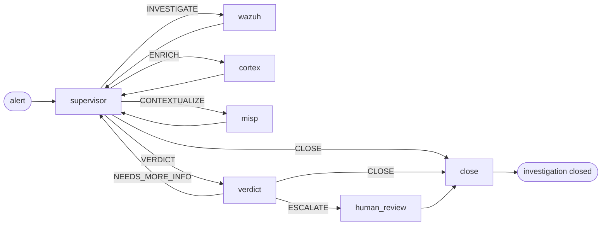

# Pipeline de AI

O que acontece entre "um alerta chega" e "um veredito é gravado". A camada de triagem da SocTalk é uma máquina de estados LangGraph, um supervisor que roteia o trabalho para nós de trabalho especializados, seguido por um nó de veredito que decide se o caso precisa de revisão humana.

Esta página é o modelo mental. O código vive em [`src/soctalk/graph/`](https://github.com/soctalk/soctalk/tree/main/src/soctalk/graph), [`src/soctalk/supervisor/`](https://github.com/soctalk/soctalk/tree/main/src/soctalk/supervisor) e [`src/soctalk/workers/`](https://github.com/soctalk/soctalk/tree/main/src/soctalk/workers).

## Nós

| Nó | Finalidade | Modelo usado |
|---|---|---|
| **supervisor** | Decide o que fazer em seguida. Roteamento puro, não realiza nenhum trabalho de domínio por conta própria. | modelo rápido |
| **wazuh_worker** | Puxa o alerta em contexto, extrai observáveis (IPs, hashes, usuários, processos), correlaciona com alertas recentes no mesmo tenant. | modelo rápido |
| **cortex_worker** | Envia observáveis aos analisadores do Cortex (VirusTotal, AbuseIPDB, etc.) para reputação/enriquecimento. | modelo rápido |
| **misp_worker** | Consulta observáveis contra feeds de inteligência de ameaças do MISP em busca de contexto conhecido de campanha / ator. | modelo rápido |
| **verdict** | Raciocina sobre tudo o que os workers coletaram. Produz `escalate | close | needs_more_info` + confiança + uma justificativa curta. | **modelo de raciocínio** |
| **human_review** | Pausa a execução; emite uma solicitação de revisão para a fila do dashboard e/ou Slack. Aguarda uma `HumanDecision` (`approve | reject | more_info`). |, (humanos) |
| **close** | Gera o relatório de encerramento e grava a disposição (`close_fp | escalate | leave_open`). **Na V1 o nó close não publica em integrações de saída.** Nenhum nó do grafo atualmente publica no TheHive na V1 (o nó `thehive_worker` referenciado em rascunhos anteriores não está conectado ao construtor de grafo da V1). A publicação via webhook do Slack a partir do close também não está conectada. A integração de saída a partir do nó close está no roadmap. | modelo rápido |

## Roteamento do supervisor

O único trabalho do supervisor é escolher o próximo nó. Seu espaço de decisão é um enum fixo de 5 elementos:

| Decisão | Significa |
|---|---|
| `INVESTIGATE` | Ainda não sei o suficiente sobre este alerta. Execute o worker do Wazuh. |
| `ENRICH` | Tenho observáveis cuja reputação não verifiquei. Execute o Cortex. |
| `CONTEXTUALIZE` | Os observáveis parecem interessantes; verifique se há campanhas/atores conhecidos. Execute o MISP. |
| `VERDICT` | Tenho o suficiente. Passe para o nó de veredito. |
| `CLOSE` | Este é um caso evidente (ex.: falso positivo óbvio ou alerta já resolvido). Pule o nó de veredito. |

O supervisor nunca invoca ferramentas externas por conta própria. Ele lê o `SecOpsState` acumulado (alertas, observáveis, saídas anteriores dos workers, veredictos) e produz uma das cinco decisões. A maioria dos casos percorre supervisor → worker → supervisor → worker → supervisor → VERDICT, de três a seis saltos no total.

## Nó de veredito

O modelo de raciocínio recebe todo o estado acumulado, alerta original, descobertas de cada worker, todos os observáveis com seu enriquecimento, tentativas anteriores de veredito (se houve loop de `NEEDS_MORE_INFO`). Ele produz:

| Campo | Tipo |
|---|---|
| `decision` | `escalate | close | needs_more_info` |
| `confidence` | enum: `low | medium | high` |
| `rationale` | markdown curto |
| `evidence_strength` | `weak | moderate | strong | conclusive` |
| `verdict` | `benign | suspicious | malicious | unknown` |
| `impact` | `low | medium | high | critical` |

`escalate` sempre passa por `human_review`. `close` pula a revisão humana e vai direto para `close`. `needs_more_info` retorna ao supervisor com um prompt sugerindo o que ainda está faltando.

## Portão de revisão humana

`human_review` pausa a execução. O caso aparece na [fila de Revisão](/pt-br/mssp-ui#reviews-human-in-the-loop) no dashboard e (se o Slack estiver configurado) no [HIL bidirecional do Slack](/pt-br/human-review). O humano escolhe:

| Decisão | Efeito no caso |
|---|---|
| `approve` | Revisão pendente marcada como concluída + feedback auditado. **Não** é retomada automaticamente; acompanhamento pelo analista. |
| `reject` | O caso é encerrado como `auto_closed_fp`. Terminal, o grafo não é reinvocado. |
| `more_info` | Revisão marcada como `info_requested` com a lista de perguntas. **Não** é retomada automaticamente; acompanhamento pelo analista. |

A identidade, o timestamp e a justificativa do humano são anexados ao log `case_events` do caso, que é somente-acréscimo.

## Ciclo de vida da execução

Uma "execução" (run) é uma execução do grafo contra um caso. Enum de status:

| Status | Significa |
|---|---|
| `active` | O grafo está em execução. |
| `waiting_on_gate` | Pausado em `human_review`. |
| `paused` | Pausado manualmente por um admin MSSP. |
| `halted_budget` | Atingiu o orçamento de tokens por execução. Execuções normais da V1 assumem `tokens_budget = 200,000` da linha `case_runs` (padrão do modelo). O env `SOCTALK_CASE_RUN_TOKEN_BUDGET` (padrão 15,000) é usado apenas como fallback quando a linha não tem valor definido. |
| `completed` | O grafo chegou ao `close` e gravou uma disposição. |
| `failed` | O grafo apresentou erro ou uma ferramenta externa ficou inacessível. |

Os orçamentos de tokens são rastreados por execução, por tenant e para toda a instalação. Consulte [Observabilidade](/pt-br/observability) para as métricas, e [Provedores de LLM](/pt-br/integrate/llm-providers) para os controles de custo.

## O processo runs-worker

Cada tenant tem seu próprio pod `runs-worker` (no namespace `tenant-<slug>`) que consome a fila:

1. Chama `POST /api/internal/worker/runs/claim` para uma execução atribuída ao seu tenant.
2. Constrói o LangGraph a partir do chart de nós.
3. `ainvoke()` contra o grafo, publicando `POST /api/internal/worker/runs/{run_id}/heartbeat` a cada 20 s.
4. Ao concluir, publica o estado final e a disposição em `POST /api/internal/worker/runs/{run_id}/complete`.

O runs-worker é o único pod de computação por tenant, mantê-lo no namespace do tenant significa que um tenant acima do orçamento não pode privar o restante da instalação de computação. A própria lógica de supervisor + worker + veredito é sem estado; o trabalho pesado são as chamadas de LLM (fora do cluster, faturadas ao provedor configurado do tenant).

## Ponteiros de código-fonte

| Conceito | Arquivo |
|---|---|
| Construtor de grafo + roteamento | [`src/soctalk/graph/builder.py`](https://github.com/soctalk/soctalk/blob/main/src/soctalk/graph/builder.py) |
| Lógica do supervisor | [`src/soctalk/supervisor/node.py`](https://github.com/soctalk/soctalk/blob/main/src/soctalk/supervisor/node.py) |
| Nó de veredito | [`src/soctalk/supervisor/verdict.py`](https://github.com/soctalk/soctalk/blob/main/src/soctalk/supervisor/verdict.py) |
| Nós de trabalho | [`src/soctalk/workers/`](https://github.com/soctalk/soctalk/tree/main/src/soctalk/workers) |
| Encerramento / disposição | [`src/soctalk/graph/close.py`](https://github.com/soctalk/soctalk/blob/main/src/soctalk/graph/close.py) |
| Loop do runs worker | [`src/soctalk/runs_worker/main.py`](https://github.com/soctalk/soctalk/blob/main/src/soctalk/runs_worker/main.py) |
| Schema de estado | [`src/soctalk/models/state.py`](https://github.com/soctalk/soctalk/blob/main/src/soctalk/models/state.py) |
