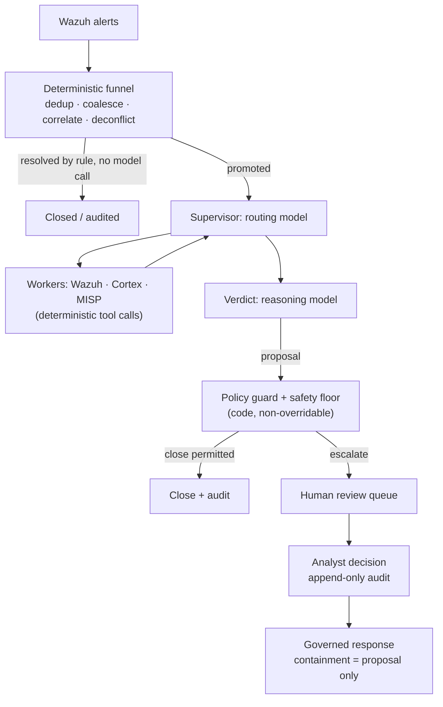

# Triagem com AI para alertas do Wazuh: o que funciona em produção (e o que não funciona)

Todo operador de Wazuh já teve a mesma ideia: o manager está produzindo milhares de alertas por dia, a maioria é ruído, e um LLM é muito bom em ler um alerta e dizer "isto é uma tentativa de força bruta" ou "isto é um cron job". Então você liga um webhook do Wazuh a uma ferramenta de workflow, joga o JSON do alerta em um prompt e publica a resposta do modelo em algum lugar.

Esse protótipo funciona. Ele também falha em produção, de formas previsíveis. Este guia explica por quê, e mostra a arquitetura que se sustenta quando a triagem com AI de alertas do Wazuh precisa rodar sem supervisão contra um volume real de alertas. É a arquitetura que o SocTalk implementa.

## Por que "mandar todo alerta para um LLM" quebra

O padrão ingênuo (webhook do Wazuh → prompt de LLM → verdict) tem três problemas estruturais, e nenhum deles se resolve com prompts melhores.

**O custo escala com o ruído, não com o sinal.** Um único scan pode produzir milhares de alertas. Se cada alerta bruto custa uma chamada de modelo, seu gasto é proporcional ao quão barulhento é o seu ambiente, e a despesa empurra você para modelos mais fracos exatamente nos casos em que o julgamento mais importa.

**O modelo não tem contexto nem piso.** Um LLM lendo um alerta isolado não tem memória do que um analista decidiu ontem nem uma imagem do estado da própria organização, então não consegue distinguir uma mudança sancionada de um ataque que produz um alerta byte a byte idêntico. Nada garante que ele não vá fechar com confiança por cima de um indicador real de comprometimento, e um verdict "benigno" alucinado sobre uma intrusão real é uma detecção suprimida; nenhuma taxa disso é tolerável.

**Não há trilha de auditoria nem gate.** Um workflow que publica o verdict do modelo direto em um canal não tem registro de quais evidências sustentaram o verdict, não tem identidade de revisor e não tem mecanismo para impedir que um verdict ruim vire um caso fechado.

O protótipo de webhook continua sendo uma boa forma de se convencer de que LLMs conseguem raciocinar sobre alertas. A peça que falta é a arquitetura em volta do modelo.

## A arquitetura que funciona: um funil determinístico antes de qualquer chamada de modelo

A primeira correção é contraintuitiva: a maior parte de um pipeline de triagem com AI não deveria ser AI. No SocTalk, o plano de ingestão é server-side e totalmente determinístico; nenhum modelo toca nele:

- **Deduplicação** descarta eventos reenviados que carregam um ID já visto.
- **Coalescência** agrupa alertas repetidos da mesma regra no mesmo ativo, dentro de uma janela de cinco minutos, em um único caso. Uma rajada de uma detecção vira um caso em vez de milhares.
- **Correlação de entidades** anexa como evidência um alerta novo que compartilha uma entidade forte (host, hash de arquivo) com uma investigação ativa, em vez de iniciar uma execução nova sem contexto.
- **Deconflição de engajamentos** casa janelas declaradas de pentest e red team por origem, host, técnica e horário. Testes sancionados são sinalizados e auditados, nunca fechados automaticamente, e atividade de tester fora do escopo é forçada para um humano.
- **Fechamento determinístico** trata falsos positivos de baixa severidade e alta confiança por regra, sem chamada de modelo.

Muitos alertas nunca chegam a um modelo. O que sobrevive é promovido a uma investigação, e mesmo então o modelo é consultado em apenas dois papéis: um **supervisor** que roteia a investigação (puxar contexto de host do Wazuh, checar a reputação de observáveis via analisadores do Cortex, consultar threat intel no MISP; todas são chamadas de ferramenta determinísticas cujos resultados o modelo apenas *lê*), e um nó de **verdict** em que um modelo de raciocínio pesa tudo o que foi coletado e propõe `escalate`, `close` ou `needs_more_info` com confiança, justificativa e força de evidência.

## Guardrails como dados, verdicts com gate em código

A segunda correção trata o verdict do modelo como uma proposta que só um gate determinístico pode transformar em decisão final. A regra do SocTalk é *"o LLM propõe; um gate determinístico dispõe."*

[Políticas de triagem](/pt-br/triage-policies) são dados, regras declarativas executadas por um único interpretador, atuando em quatro gates: um resolver, um gate pré-decisão (um verdict não é válido até que os passos de evidência obrigatórios tenham rodado), um guard pós-verdict e um **piso de segurança**. O piso é em nível de código e não pode ser sobrescrito, aplicado em três pontos independentes (worker, servidor, ingestão). Nenhum fechamento automático pode disparar por cima de um IOC conhecido, de um registro de autorização contraditado, de um indicador não verificado, de um incidente relacionado ativo, de um kill switch, nem além do teto de volume (padrão de 500 fechamentos automáticos por 24 horas). Kill switches (`SOCTALK_AUTO_CLOSE_KILL` para a instalação inteira, ou por tenant) convertem instantaneamente todo fechamento automático em uma promoção. Esse é o controle que você aciona no meio de um incidente.

A propriedade que torna seguras as políticas escritas por tenants: elas só podem tornar a triagem **mais estrita**, nunca mais frouxa. Um override de guardrail só pode elevar uma decisão na escada `close < needs_more_info < escalate`; supressão não é expressável na linguagem de condições, que roda em sandbox: árvores de operador único sobre um contrato de estado documentado, sem acesso a atributos, sem chamadas de função, e políticas inválidas são rejeitadas por inteiro na validação. Uma política mal configurada ou hostil não pode virar um canal para suprimir detecções.

## Human-in-the-loop é uma propriedade rígida

Todo verdict `escalate` passa por revisão humana. Não há bypass: um modo "auto-approve" só com AI não está implementado no SocTalk (remover o gate é um item de roadmap, planejado como um toggle auditado e restrito a admins, e não como um padrão silencioso). No V1 a superfície de revisão é a fila do dashboard, que mostra a justificativa completa da AI e a evidência observável com seu enriquecimento. Decisões do analista de aprovar, rejeitar ou pedir mais informações gravam linhas de auditoria append-only com identidade, timestamp e justificativa, nunca editáveis depois do envio. Um fechamento proposto que toca um ativo sensível (um host classificado como PCI, por exemplo) fica retido para aprovação humana mesmo quando o modelo está confiante.

A mesma postura governa a resposta: uma ação de contenção, como isolar um endpoint ou desabilitar uma conta, é *sempre* levantada como uma proposta que um analista aprova primeiro. O modelo nunca executa uma ação de contenção por conta própria, e o despacho acontece server-side, nunca a partir do loop do modelo. O SocTalk funciona como um copiloto, não como um substituto do analista. O valor está na compressão: o mesmo time de analistas consegue lidar com 5 a 10 vezes o volume de alertas, porque os casos rotineiros se fecham automaticamente e só os pouco claros chegam à revisão humana.

## Engenharia de custo

Como o funil resolve muitos alertas sem chamada de modelo, o custo acompanha a ambiguidade, não o volume. As alavancas restantes:

- **Divisão rápido/raciocínio.** Roteamento e workers usam um modelo rápido; só o verdict usa um modelo de raciocínio. Os padrões são `claude-sonnet-4-20250514` para ambos, sobrescrevíveis por tenant (`SOCTALK_FAST_MODEL` / `SOCTALK_REASONING_MODEL`).
- **Orçamentos de tokens por execução.** Cada execução carrega um orçamento de tokens (padrão do modelo de 200.000), rastreado por execução, por tenant e para a instalação inteira. Uma investigação descontrolada é interrompida em vez de faturar indefinidamente.
- **Gasto no mundo real.** Altamente variável, mas como ordem de grandeza: cerca de **US$ 9/dia por tenant** com ~30 alertas/dia em um setup econômico compatível com OpenAI, caindo 5 a 10 vezes com um modelo rápido mais barato. Trate isso como uma estimativa inicial, não como uma cotação.
- **Opção de custo zero por token.** Rode totalmente local com [Ollama](/pt-br/integrate/ollama): sem LLM em nuvem, sem custo por token, e os dados ficam na sua infraestrutura. Escolha um modelo capaz de usar ferramentas (qwen2.5, llama3.1, mistral-nemo) e saiba que inferência em CPU é lenta, na casa de minutos por investigação; use um host com GPU para latência utilizável.

## Traga seu próprio LLM

O runtime do SocTalk suporta dois providers: `anthropic` (Claude) e `openai`, que cobre a própria OpenAI ou qualquer endpoint compatível com OpenAI, como Azure OpenAI, vLLM, Ollama e LiteLLM. Provider, modelo, base URL e chave de API são todos sobrescrevíveis **por tenant**, e um cliente pode trazer a própria chave para isolamento de cobrança, montada no runs-worker do tenant como um Secret do Kubernetes no namespace do próprio tenant. (Vale uma exceção documentada do V1: a chave também fica guardada no banco de dados do SocTalk em texto puro, `IntegrationConfig.llm_api_key_plain`; veja [Segredos](/pt-br/reference/secrets) para a postura e as recomendações de rotação.) O modelo só vê o estado da investigação atual (corpo do alerta, observáveis, saídas dos workers); para uma postura mais estrita, aponte o tenant para um endpoint on-prem. Detalhes em [Providers de LLM](/pt-br/integrate/llm-providers).

## Como isso aparece no SocTalk

O SocTalk é uma plataforma SOC Apache 2.0, AI-first, para MSPs e MSSPs: uma stack Wazuh dedicada por cliente no seu próprio Kubernetes, atrás de um único control plane, com o pipeline de triagem acima rodando por tenant. Para se aprofundar:

- [Como funciona](/pt-br/how-it-works) conta a história completa do pipeline: o funil determinístico, os dois papéis do modelo, o piso de segurança em três pontos.
- [Pipeline de AI](/pt-br/ai-pipeline) cobre a máquina de estados do LangGraph: supervisor, workers, verdict, ciclo de vida da execução.
- [Políticas de triagem](/pt-br/triage-policies) mostra como criar guardrails determinísticos no editor no-code, com shadow antes de ativar.
- [Revisão humana](/pt-br/human-review) documenta a fila de revisão e o contrato de decisão do analista.

Ou pule a leitura: a [VM de demonstração](/pt-br/quickstart-vm) coloca no ar uma instalação multi-tenant, com um tenant de demonstração já integrado, em cerca de cinco minutos.
