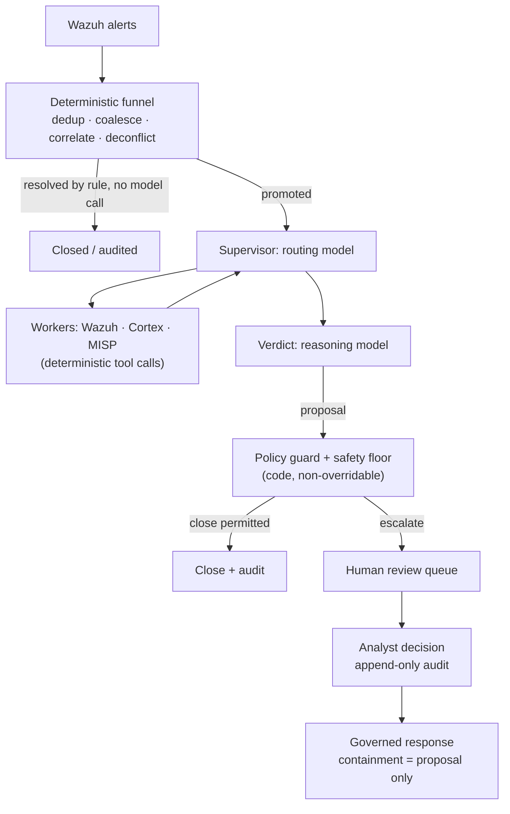

# Triagem com AI para alertas do Wazuh: o que funciona em produção (e o que não funciona)

Todo operador de Wazuh já teve a mesma ideia: o manager está produzindo milhares de alertas por dia, a maioria é ruído, e um LLM é muito bom em ler um alerta e dizer "isto é uma tentativa de força bruta" ou "isto é um cron job". Então você conecta um webhook do Wazuh a uma ferramenta de workflow, coloca o JSON do alerta em um prompt e publica a resposta do modelo em algum lugar.

Esse protótipo funciona. Ele também falha em produção, de formas previsíveis. Este guia explica por quê, e apresenta a arquitetura que se sustenta quando a triagem com AI de alertas do Wazuh precisa rodar sem supervisão contra um volume real de alertas — a arquitetura que o SocTalk implementa.

## Por que "enviar todo alerta para um LLM" quebra

O padrão ingênuo — webhook do Wazuh → prompt de LLM → veredito — tem três problemas estruturais, e nenhum deles se resolve com prompts melhores.

**O custo escala com o ruído, não com o sinal.** Um único scan pode produzir milhares de alertas. Se cada alerta bruto custa uma chamada de modelo, seu gasto é proporcional a quão barulhento é o seu ambiente, e a despesa empurra você para modelos mais fracos exatamente nos casos em que o julgamento mais importa.

**O modelo não tem contexto nem piso de segurança.** Um LLM lendo um alerta isolado não tem memória do que um analista decidiu ontem, não tem visão do estado da própria organização — portanto não consegue distinguir uma mudança sancionada de um ataque que produz um alerta byte a byte idêntico — e não há garantia de que ele não vai fechar com confiança por cima de um indicador real de comprometimento. Um veredito "benigno" alucinado sobre uma intrusão real não é um problema de qualidade que você possa tolerar em qualquer taxa; é uma detecção suprimida.

**Não há trilha de auditoria nem portão de controle.** Um workflow que publica o veredito do modelo direto em um canal não tem registro de em quais evidências o veredito se apoiou, não tem identidade de revisor e não tem mecanismo para impedir que um veredito ruim vire um caso encerrado.

Para ser justo: o protótipo de webhook é uma ótima forma de se convencer de que LLMs conseguem raciocinar sobre alertas. O que falta é a *arquitetura em torno* do modelo.

## A arquitetura que funciona: um funil determinístico antes de qualquer chamada de modelo

A primeira correção é contraintuitiva: a maior parte de um pipeline de triagem com AI não deve ser AI. No SocTalk, o plano de ingestão é server-side e totalmente determinístico — nenhum modelo o toca:

- **Deduplicação** descarta eventos reenviados que carregam um ID já visto.
- **Coalescência** agrupa alertas repetidos da mesma regra no mesmo ativo dentro de uma janela de cinco minutos em um único caso — uma rajada de uma detecção vira um caso, não milhares.
- **Correlação de entidades** anexa como evidência um novo alerta que compartilha uma entidade forte (host, hash de arquivo) com uma investigação ativa, em vez de iniciar uma nova execução sem contexto.
- **Deconflitação de engajamentos** casa janelas declaradas de pentest e red team por origem, host, técnica e tempo — testes sancionados são sinalizados e auditados, nunca fechados automaticamente, e atividade de testadores fora de escopo é obrigatoriamente encaminhada a um humano.
- **Fechamento determinístico** trata falsos positivos de baixa severidade e alta confiança por regra, sem nenhuma chamada de modelo.

Muitos alertas nunca chegam a um modelo. O que sobrevive é promovido a uma investigação, e mesmo então o modelo é consultado em apenas dois papéis: um **supervisor** que roteia a investigação (buscar contexto do host no Wazuh, verificar a reputação de observáveis via analisadores do Cortex, consultar inteligência de ameaças no MISP — todas chamadas de ferramentas determinísticas cujos resultados o modelo apenas *lê*), e um nó de **veredito**, em que um modelo de raciocínio pondera tudo o que foi coletado e propõe `escalate`, `close` ou `needs_more_info` com confiança, justificativa e força da evidência.

## Guardrails como dados, vereditos controlados por código

A segunda correção: o veredito do modelo é uma proposta, não um commit. A regra do SocTalk é *"o LLM propõe; um portão determinístico dispõe."*

[Políticas de triagem](/pt-br/triage-policies) são dados — regras declarativas executadas por um único interpretador — atuando em quatro portões: um resolvedor, um portão pré-decisão (um veredito não é legal até que as etapas de evidência obrigatórias tenham rodado), um guard pós-veredito e um **piso de segurança**. O piso é em nível de código e não pode ser sobrescrito, aplicado em três pontos independentes (worker, servidor, ingestão). Nenhum fechamento automático pode disparar por cima de um IOC conhecido, um registro de autorização contraditado, um indicador não verificado, um incidente relacionado ativo, um kill switch, ou além do teto de volume (padrão de 500 fechamentos automáticos por 24 horas). Kill switches (`SOCTALK_AUTO_CLOSE_KILL` para toda a instalação, ou por tenant) convertem instantaneamente todo fechamento automático em uma promoção — o controle que você aciona no meio de um incidente.

A propriedade que torna seguras as políticas escritas por tenants: elas só podem tornar a triagem **mais estrita**, nunca mais permissiva. Um override de guardrail só pode elevar uma decisão na escada `close < needs_more_info < escalate`; supressão não é expressável na linguagem de condições, que é sandboxed — árvores de operador único sobre um contrato de estado documentado, sem acesso a atributos, sem chamadas de função, políticas inválidas rejeitadas por inteiro na validação. Uma política mal configurada ou hostil não pode se tornar um canal de supressão de detecções.

## Human-in-the-loop é uma propriedade rígida, não uma configuração

Todo veredito `escalate` passa por revisão humana. Não há bypass: um modo "auto-approve" apenas com AI não está implementado no SocTalk (remover o portão é um item de roadmap, planejado como um toggle auditado e restrito a admins — não um padrão silencioso). Na V1, a superfície de revisão é a fila do dashboard, exibindo a justificativa completa da AI e a evidência dos observáveis com seu enriquecimento. As decisões do analista — aprovar, rejeitar, mais informações — gravam linhas de auditoria append-only com identidade, timestamp e justificativa, nunca editáveis após o envio. Um fechamento proposto que toque um ativo sensível (um host classificado como PCI, por exemplo) é retido para aprovação humana mesmo quando o modelo está confiante.

A mesma postura governa a resposta: uma ação de contenção, como isolar um endpoint ou desabilitar uma conta, é *sempre* levantada como uma proposta que um analista aprova primeiro. O modelo nunca executa uma ação de contenção por conta própria, e o despacho acontece server-side, nunca a partir do loop do modelo. O SocTalk é um copiloto, não um substituto de analista — o valor é compressão: a mesma equipe de analistas consegue lidar com 5–10× o volume de alertas, porque os casos rotineiros fecham automaticamente e apenas os casos ambíguos chegam à revisão humana.

## Engenharia de custos

Como o funil resolve muitos alertas sem chamada de modelo, o custo acompanha a ambiguidade, e não o volume. As alavancas restantes:

- **Divisão rápido/raciocínio.** Roteamento e workers usam um modelo rápido; apenas o veredito usa um modelo de raciocínio. Os padrões são `claude-sonnet-4-20250514` para ambos, sobrescrevíveis por tenant (`SOCTALK_FAST_MODEL` / `SOCTALK_REASONING_MODEL`).
- **Orçamentos de tokens por execução.** Cada execução carrega um orçamento de tokens (padrão do modelo: 200,000), rastreado por execução, por tenant e para toda a instalação. Uma investigação descontrolada é interrompida em vez de faturar indefinidamente.
- **Quanto custa?** Altamente variável, mas como ordem de grandeza: cerca de **US$ 9/dia por tenant** a ~30 alertas/dia em um setup econômico compatível com OpenAI, caindo 5–10× com um modelo rápido mais barato. Trate isso como uma estimativa inicial, não como um orçamento fechado.
- **Opção com custo zero por token.** Rode totalmente local com [Ollama](/pt-br/integrate/ollama): sem LLM em nuvem, sem custo por token, os dados ficam na sua infraestrutura. Escolha um modelo capaz de usar ferramentas (qwen2.5, llama3.1, mistral-nemo) — e saiba que a inferência em CPU leva minutos por investigação; use um host com GPU para uma latência utilizável.

## Traga seu próprio LLM

O runtime do SocTalk suporta dois provedores: `anthropic` (Claude) e `openai` — o que significa OpenAI ou qualquer endpoint compatível com OpenAI: Azure OpenAI, vLLM, Ollama, LiteLLM. Provedor, modelo, base URL e chave de API são todos sobrescrevíveis **por tenant**, e um cliente pode trazer a própria chave para isolamento de cobrança — montada no runs-worker do tenant como um Secret do Kubernetes no namespace do próprio tenant. (Aplica-se uma exceção documentada da V1: a chave também é mantida no banco de dados do SocTalk em texto plano, `IntegrationConfig.llm_api_key_plain` — veja [Secrets](/pt-br/reference/secrets) para a postura e as recomendações de rotação.) O modelo só vê o estado da investigação atual (corpo do alerta, observáveis, saídas dos workers); para uma postura mais estrita, aponte o tenant para um endpoint on-prem. Detalhes em [Provedores de LLM](/pt-br/integrate/llm-providers).

## Como isso se apresenta no SocTalk

O SocTalk é uma plataforma de SOC AI-first, sob licença Apache 2.0, para MSPs e MSSPs: uma stack Wazuh dedicada por cliente no seu próprio Kubernetes, atrás de um único control plane, com o pipeline de triagem acima rodando por tenant. Para se aprofundar:

- [Como funciona](/pt-br/how-it-works) — a história completa do pipeline: o funil determinístico, os dois papéis do modelo, o piso de segurança em três pontos.
- [Pipeline de AI](/pt-br/ai-pipeline) — a máquina de estados do LangGraph: supervisor, workers, veredito, ciclo de vida da execução.
- [Políticas de triagem](/pt-br/triage-policies) — criação de guardrails determinísticos no editor no-code, shadow e depois ativação.
- [Revisão humana](/pt-br/human-review) — a fila de revisão e o contrato de decisão do analista.

Ou pule a leitura: a [VM de demonstração](/pt-br/quickstart-vm) entrega uma instalação multi-tenant em funcionamento, com um tenant de demonstração já integrado, em cerca de cinco minutos.
