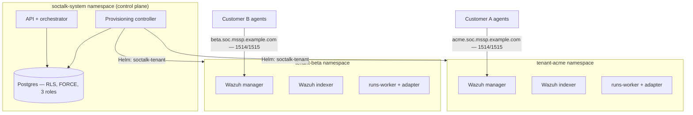

# Wazuh multi-tenant para MSSPs: padrões de arquitetura que realmente isolam tenants

O Wazuh não tem multi-tenancy de primeira classe. Não existe um objeto "tenant" no manager, nenhuma fronteira por cliente no ruleset e nenhum escopo por cliente no registro via `authd`. Todo MSSP que padroniza no Wazuh acaba construindo a tenancy em volta dele — e o padrão que você escolhe determina suas garantias de isolamento, sua velocidade de onboarding e seu piso de custo por cliente.

Este guia cobre o que um MSSP realmente precisa de uma implantação Wazuh multi-tenant, os três padrões que as equipes tentam na prática e o que o isolamento de nível de produção exige além do próprio SIEM. É a arquitetura que o SocTalk implementa como open source (Apache 2.0); as páginas de referência vinculadas ao longo do texto documentam o comportamento V1 já entregue e trazem "notas de implantação V1" explícitas sempre que uma seção descreve a arquitetura-alvo.

## O que um MSSP precisa e o Wazuh não fornece

Três requisitos aparecem em toda conversa de implantação com MSSPs:

1. **Isolamento que você consegue defender em uma revisão de segurança do cliente.** "O cliente A não pode ler os alertas do cliente B" tem que valer na camada de dados, na camada de rede e na camada de registro de agentes — não apenas no dashboard.
2. **Velocidade de onboarding.** Se provisionar o SOC de um novo cliente é uma semana de trabalho manual, o padrão não escala além de um punhado de clientes.
3. **Controle de custo por tenant.** Você precisa saber quanto um cliente custa em RAM, CPU e disco, limitar esse custo e impedir que um tenant ruidoso deixe os outros sem recursos.

## Os três padrões que os MSSPs tentam

### Padrão 1: manager compartilhado, separação em nível de índice

Um único manager Wazuh, com os agentes de todos os clientes registrados nele, e a separação feita a jusante — multi-tenancy do OpenSearch Dashboards para objetos de dashboard, index patterns e security roles para escopo de leitura. Este é o padrão descrito na maioria das discussões sobre multi-tenancy no Wazuh, porque é o único que você consegue montar sem sair do ferramental do próprio Wazuh.

O problema é que a separação é um filtro no lado da leitura, não uma fronteira. O próprio manager é compartilhado: um único ruleset, um único segredo do `authd`, uma única API, uma única janela de upgrade para todos. Uma role mal configurada expõe todos os clientes de uma vez, e pacotes de regras ou políticas de retenção por cliente são impossíveis sem afetar o restante.

### Padrão 2: manager por tenant em VMs

Uma VM (ou conjunto de VMs) por cliente, executando um manager e um indexer dedicados. O isolamento é real — processos, discos e credenciais separados. É aqui que os MSSPs desembarcam depois que o padrão de manager compartilhado os morde. O custo é operacional: onboarding significa provisionar máquinas, upgrades significam tocar cada VM, e o piso de recursos por tenant é uma VM inteira, sem scheduling compartilhado para recuperar capacidade ociosa. Funciona com 5 clientes e dói com 30.

### Padrão 3: manager por tenant no Kubernetes, atrás de um control plane

Cada cliente recebe um manager, um indexer e um dashboard Wazuh dedicados em seu próprio namespace do Kubernetes, com uma ResourceQuota e um LimitRange limitando sua pegada. Um control plane é dono do ciclo de vida: o onboarding renderiza uma release Helm por tenant, o teardown a remove, e o estado do tenant vive em um banco de dados em vez de uma planilha. O isolamento vem da fronteira do namespace mais NetworkPolicy; a densidade vem do scheduler empacotando tenants em nós compartilhados.

### Trade-offs, com honestidade

| | Manager compartilhado + separação por índice | Manager por tenant em VMs | Manager por tenant no Kubernetes |
|---|---|---|---|
| Fronteira de isolamento | Filtros de leitura sobre dados compartilhados | Fronteira de máquina | Namespace + NetworkPolicy + quota |
| Raio de dano de um comprometimento | Todos os clientes | Um cliente | Um cliente |
| Regras / retenção / upgrades por tenant | Não | Sim | Sim |
| Onboarding de um cliente | Rápido (mudança de config) | Lento (provisionar máquinas) | Rápido, se automatizado (release Helm) |
| Densidade / custo por tenant | Melhor | Pior | Bom (empacotado pelo scheduler, limitado por quota) |
| Habilidade operacional exigida | Segurança do Wazuh + OpenSearch | Automação de frota/VM | Kubernetes |
| Operações de frota com 30+ tenants | N/A (uma única stack) | Doloroso | Tratável com um control plane |

Dos três, o padrão 3 é o que foi construído para entregar tanto isolamento real quanto velocidade de onboarding — mas apenas se o control plane existir. Namespaces sozinhos são uma convenção de nomes, não uma fronteira de segurança. O restante deste guia trata do que torna a fronteira real.

## Isolamento de produção é mais do que o SIEM

Uma stack Wazuh por tenant isola os dados do SIEM. Uma plataforma MSSP também tem estado cross-tenant — casos, filas de revisão, logs de auditoria, configurações de integração — e essa camada precisa da sua própria imposição.

### Camada de dados: row-level security no Postgres, forçada e testada

Filtragem `WHERE tenant_id = ?` no nível da aplicação está a uma cláusula esquecida de um vazamento cross-tenant. O banco de dados deve impor a tenancy por conta própria. O padrão:

- Toda tabela com escopo de tenant carrega políticas de RLS chaveadas em uma configuração `app.current_tenant_id` por transação. Um contexto não definido retorna **zero linhas** — zero defensivo, não vazamento.
- `FORCE ROW LEVEL SECURITY` em toda tabela com escopo de tenant, de modo que até o dono da tabela (a role de migração) fique sujeito à política. O Postgres por padrão isenta os donos; uma migração que lê dados de tenant poderia, de outra forma, cruzar tenants silenciosamente.
- Uma divisão em três roles: um dono de migrações, uma role de runtime sujeita a RLS e uma role `BYPASSRLS` segregada, reservada para caminhos cross-tenant auditados. Nenhuma aplicação se conecta como superuser.
- Testes de isolamento no CI — sondas de endpoint, SQL bruto sob a role da aplicação, workers sem contexto, sondas com a role de dono, streams de eventos cross-tenant. O SocTalk executa sete desses testes, todos obrigatórios; nenhum opcional.
- Chaves de idempotência com escopo `UNIQUE (tenant_id, idempotency_key)`, de modo que os pipelines de alertas de dois clientes possam emitir o mesmo ID externo de alerta sem colidir.

Templates completos de política, DDL das roles e a suíte de testes: [Postgres RLS](/pt-br/reference/postgres-rls).

### Camada de rede: NetworkPolicy por namespace

A fronteira do namespace não significa nada sem um CNI que a imponha — o Flannel padrão do K3s não impõe NetworkPolicy de forma alguma. A postura-alvo é uma linha de base default-deny por namespace de tenant com liberações explícitas: tráfego intra-namespace, DNS, acesso do control plane às portas do data plane do tenant e ingress de agentes em 1514/1515. Tráfego tenant-para-tenant e egress geral do tenant são bloqueados.

O SocTalk usa Cilium como CNI suportado (imposição de NetworkPolicy, egress baseado em FQDN para endpoints de LLM endereçados por hostname, observabilidade de fluxos com Hubble para depurar dúvidas de isolamento). Fique atento à ressalva do V1: a allowlist de egress por tenant totalmente fixada por FQDN é o destino do design, e o chart atual renderiza políticas mais simples — egress permissivo do control plane e egress amplo em TCP/443 para o worker por tenant. Os templates renderizados estão no repositório; leia [NetworkPolicy design](/pt-br/reference/network-policy) para ver tanto as políticas entregues quanto a arquitetura-alvo.

### Registro de agentes: endpoints e segredos por tenant

O modo de falha mais sutil: o agente do cliente A se registrando no manager do cliente B. O protocolo de agente do Wazuh em 1514/TCP é um stream criptografado proprietário, não TLS padrão — não há SNI para rotear, então proxies L4 que inspecionam hostname quebram silenciosamente. O roteamento tem que ser por endereço de destino: cada tenant recebe seu próprio nome DNS (`acme.soc.mssp.example.com`) resolvendo para um endpoint L4 por tenant, com um fallback de porta por tenant quando IPs são escassos.

Os segredos de registro têm escopo de tenant: o segredo compartilhado do `authd` de cada tenant vive no namespace daquele tenant, de modo que um agente de posse do segredo do tenant A só consegue se registrar no manager de A — o endereçamento o roteia para lá e o manager verifica o segredo. No V1, o provisionamento de LoadBalancer e DNS é fiação manual do MSSP, não automatizada. Detalhes e o runbook de registro: [Wazuh agent ingress](/pt-br/reference/wazuh-ingress).

## Capacidade: quanto custa um tenant

Os números que os MSSPs pedem primeiro, do trabalho de dimensionamento do SocTalk:

- **Pegada por tenant (stack completa):** ~8 GB de RAM em request (~16 GB de limit), ~2,2 vCPU em request, ~120 GB de disco. O uso sustentado acompanha os requests; os limits são tetos de burst.
- **O gargalo costuma ser o indexer Wazuh por tenant** — cada um é um processo Java com seu próprio heap. Planeje ~6–8 GB de RAM e ~1,5 vCPU por tenant de produção.
- **O disco é ditado pela taxa de ingestão:** aproximadamente 5 GB/dia de índice a 10 alertas/s sustentados; o PVC padrão do indexer é de 50 GB com retenção quente de 30 dias.
- **Escala testada:** até ~50 tenants em um cluster de 3 nós (16 vCPU / 64 GB por nó). Perfis maiores de instalação única estão documentados, mas não foram validados nesta release — não planeje além desse número em uma única instalação sem testar.

Perfis de host de referência e a fórmula de máximo de tenants por nó: [Sizing](/pt-br/reference/sizing) e o [FAQ de escala](/pt-br/faq#does-it-scale-to-n-customers).

## Como o SocTalk empacota esse padrão

O SocTalk é uma implementação open source (Apache 2.0, sem divisão community/enterprise) do padrão 3: um control plane, uma release Helm `soctalk-tenant` por cliente, no seu próprio Kubernetes 1.30+ — K3s, EKS, AKS ou GKE.

O onboarding executa uma sequência de provisionamento em nove fases — preflight, emissão de segredos, namespace com quotas, instalações Helm, polling de readiness — cada fase emitindo um evento de ciclo de vida e podendo ser repetida de forma idempotente a partir de `degraded`. O estado do tenant é uma máquina imposta pelo servidor (`pending → provisioning → active`, com os estados suspended, decommissioning, archived e purged; transições inválidas retornam 409). Três perfis de onboarding cobrem demonstrações (`poc`), produção (`persistent`) e BYO-Wazuh (`provided`, em que o SocTalk se conecta à stack existente de um cliente em vez de implantar uma). O decommission derruba o data plane, mas mantém a linha do tenant e o histórico de auditoria.

O ciclo de vida completo — estados, fases, quotas, caminhos de recuperação — está em [Tenant lifecycle](/pt-br/tenant-lifecycle). Para colocá-lo em prática: o [guia de instalação](/pt-br/install) cobre um cluster de produção em cerca de uma hora, e a [VM de demonstração](/pt-br/quickstart-vm) sobe uma instalação multi-tenant funcional com um tenant de demonstração em cerca de cinco minutos.
