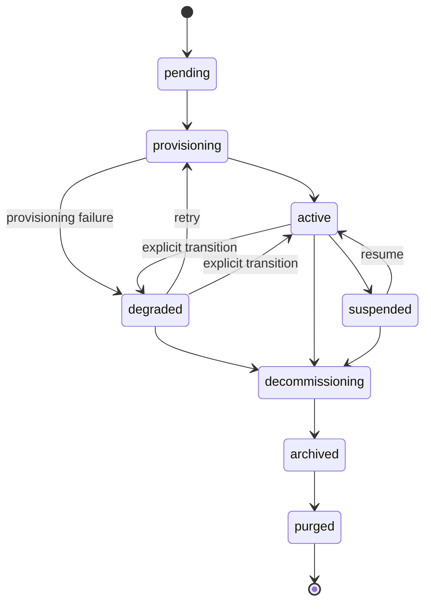

# Ciclo de vida do tenant

O que acontece com o SOC de um cliente do "onboard" ao "purge". Esta página é a companheira, voltada ao operador, do [Contrato do Chart](/pt-br/reference/chart-contract) (que documenta a renderização dos valores on-the-wire) e das [Operações diárias](/pt-br/operations) (que documentam o lado do runbook).

## Máquina de estados do tenant



As transições para `degraded` acontecem **somente pelo caminho de falha do controlador de provisionamento** (uma fase levantou `ProvisionError`). Não há endpoint de API para marcar manualmente um tenant como `degraded`, não há loop de auto-degradação observando a idade dos heartbeats do adaptador e não há degradação baseada em métricas. O gauge `soctalk_tenant_adapter_heartbeat_age_seconds` é atualizado a cada heartbeat, mas não realimenta o estado do tenant. As transições de volta para `active` acontecem como efeito colateral de um re-provisionamento `:retry` bem-sucedido.

| Estado | O que significa | O que está rodando |
|---|---|---|
| `pending` | Onboard aceito; o controlador ainda não começou o provisionamento. | nada em `tenant-<slug>` |
| `provisioning` | O controlador está criando o namespace, os secrets e fazendo o helm-install do chart do tenant. | parcial, pods surgindo |
| `active` | O tenant transicionou para `active` depois que o controlador de provisionamento viu os pods do data plane alcançarem Ready. | Wazuh manager + indexer + dashboard + soctalk-adapter + runs-worker |
| `degraded` | O controlador de provisionamento marcou o tenant como `degraded` após uma falha de provisionamento (ou um operador transicionou manualmente). **A plataforma atualmente não faz a auto-transição active→degraded com base na idade do heartbeat do adaptador**; o gauge `soctalk_tenant_adapter_heartbeat_age_seconds` é para o seu alerta | indeterminado; verifique os pods |
| `suspended` | O administrador do MSSP marcou o tenant como suspenso no banco de dados. **As cargas de trabalho NÃO são escaladas pela própria ação de suspender nesta versão**: isso requer o procedimento manual de desativação de emergência (veja [Operações diárias → Desativação de emergência](/pt-br/operations#emergency-disable-a-tenant-immediately)). O flag de estado impede que novas investigações sejam agendadas. | inalterado, os pods continuam rodando a menos que o operador os escale para baixo |
| `decommissioning` | Desmontagem em andamento. Release do Helm sendo desinstalada, PVCs sendo apagados. | encolhendo |
| `archived` | Release do Helm removida; PVCs apagados; a linha do tenant permanece para auditoria. | nada |
| `purged` | Linha do tenant apagada em definitivo (hard-delete). | nada, restam apenas entradas de log de auditoria |

As transições permitidas são impostas em `TenantController.VALID_TRANSITIONS`. Tentar suspender um tenant em `decommissioning` retorna HTTP 409 com uma lista de próximos estados válidos.

## Etapas de provisionamento

O método `provision()` do controlador roda em nove fases ordenadas. Cada fase emite uma linha `TenantLifecycleEvent` visível na página de detalhes do tenant (tabela Lifecycle Events).

| # | Evento | O que acontece |
|---|---|---|
| 1 | `preflight_ok` | As verificações de pré-voo (pré-requisitos do cluster, conflitos de nomenclatura) passam. |
| 2 | `secrets_minted` | Gera secrets por tenant (`authd`, assinatura de JWT, Postgres). |
| 3 | `namespace_ready` | Cria `tenant-<slug>` com labels, ResourceQuota e LimitRange. |
| 4 | `secrets_applied` | Empurra os secrets para o K8s como objetos `Secret/*` no novo namespace. |
| 5 | `helm_applied` (chart do tenant) | Instala o chart `soctalk-tenant` (adaptador + runs-worker + ingress). O usuário tenant_admin é provisionado automaticamente como parte desta etapa (inline `_mint_tenant_admin_user`). |
| 6 | `helm_applied` (chart do Wazuh) | Instala o chart standalone do Wazuh (manager/indexer/dashboard). O payload da linha de evento identifica qual chart foi aplicado. |
| 7 | `workloads_ready` | Faz polling até que todos os pods do data plane estejam Ready. |
| 8 | `integration_config_written` | Escreve no banco de dados as configurações de integração por tenant (LLM, URLs do TheHive, etc.). |
| 9 | `active` | Transição de estado para `active`. |

Uma falha em qualquer fase transiciona o tenant para `degraded` com o erro capturado na linha de evento. **Retry Provisioning** (`POST /api/mssp/tenants/{id}:retry`) é uma transição válida de `degraded` de volta para `provisioning` (e **não** é permitida a partir de `pending`: `pending → provisioning` só acontece automaticamente quando o controlador inicia a primeira tentativa). `provision()` é idempotente em cada fase.

## Perfis

O perfil é escolhido no momento do onboard e **fixo para o tempo de vida do tenant**. Trocar de perfil requer `decommission` + recriação.

### `poc`

Para avaliações, demos e pilotos de curta duração.

- StorageClass: `local-path` (padrão do k3s; sem garantia real de persistência)
- Heap da JVM do Wazuh indexer: 512 MiB
- Requisições de recursos no limite inferior das faixas do chart
- Sem hooks de backup configurados

Este é o perfil que a [imagem de VM de demonstração](/pt-br/quickstart-vm) usa para seu tenant `demo` embutido.

### `persistent`

Para SOCs de clientes em produção.

- StorageClass: o que a instalação marcar como padrão (Longhorn, Rook/Ceph, CSI do provedor de nuvem)
- Heap da JVM do Wazuh indexer: padrão do chart (tipicamente 2–4 GiB)
- Requisições/limites de recursos dimensionados para carga sustentada
- Hooks de backup respeitados se configurados

Escolha `persistent` para qualquer coisa voltada ao cliente. O padrão é `poc` se não especificado, o que é o padrão errado para um cliente real.

### `provided`

Para tenants que trazem seu próprio stack Wazuh implantado externamente ("BYO-SIEM"). O chart do tenant instala apenas o adaptador do SocTalk + runs-worker; nenhum Wazuh/TheHive/Cortex roda dentro do namespace do tenant.

- StorageClass: irrelevante, apenas o PVC de checkpoint do adaptador é provisionado
- Wazuh: implantação própria do tenant, acessada pela rede via as URLs do indexer (:9200) e da Manager API (:55000) fornecidas no momento do onboard
- O material de conexão do SIEM externo (`wazuh_indexer_url`, `wazuh_api_url`, credenciais basic-auth) é **obrigatório** no onboard e validado no lado do servidor (422 se incompleto)
- Credenciais de LLM por tenant também são **obrigatórias** no onboard (sem fallback compartilhado da instalação para `provided`)
- Uma allow-list de egress FQDN do Cilium é derivada automaticamente dos hostnames de indexer/API fornecidos

Escolha `provided` quando o cliente já roda o Wazuh e quer que o SocTalk o consulte no lugar. Veja o [tutorial de piloto MSSP → §3.1](/pt-br/mssp-pilot#_3-1-run-the-create-customer-wizard) para o passo a passo do wizard (a etapa External SIEM) e o [§3.4](/pt-br/mssp-pilot#_3-4-coordinating-external-wazuh-creds-for-provided-tenants) para o trabalho de coordenação upstream.

## Quotas de recursos

Cada namespace `tenant-<slug>` recebe um `ResourceQuota` e um `LimitRange` no momento da criação, escopados à pegada esperada do perfil. Veja [Dimensionamento](/pt-br/reference/sizing).

| Perfil | Requisições de CPU | Limites de CPU | Requisições de memória | Limites de memória | PVCs | Pods |
|---|---|---|---|---|---|---|
| `poc` | 2 | 4 | 4 Gi | 8 Gi | 4 | 20 |
| `persistent` | 2 | 5 | 6 Gi | 12 Gi | 6 | 30 |
| `provided` | 1 | 2 | 2 Gi | 4 Gi | 2 | 10 |

(Os números exatos ficam em `_profile_tenant_overrides` em [`render.py`](https://github.com/soctalk/soctalk/blob/main/src/soctalk/core/provisioning/render.py).)

Se uma carga de trabalho real exceder o orçamento do perfil (por exemplo, o Wazuh indexer ficar lento durante ingest pesado), aumente o ResourceQuota via `helm upgrade` com valores sobrescritos. Não edite o objeto ResourceQuota diretamente, o próximo upgrade do chart o sobrescreverá.

## Caminhos de recuperação

### Tenant travado em `pending` após o onboard

O controlador travou ou foi reagendado no meio do provisionamento antes de a primeira fase rodar. O retry não é permitido diretamente a partir de `pending`: primeiro espere a tentativa de provisionamento transicionar para `degraded` (visível nos lifecycle events), depois clique em **Retry Provisioning** na página de detalhes do tenant (ou `POST /api/mssp/tenants/{id}:retry`). O provisionamento retoma a partir da fase 1; cada fase é idempotente.

### Tenant em `provisioning` por mais de 15 minutos

Normalmente um pod travado (ImagePullBackOff, PVC `Pending`, ResourceQuota pequeno demais). Veja [Operações diárias, Tenant travado em provisionamento](/pt-br/operations#tenant-stuck-in-provisioning).

### Tenant em `degraded`

No V1, `degraded` só é alcançado após uma **falha de provisionamento**, não por perda de heartbeat. Se um tenant está em `degraded`, o controlador de provisionamento falhou em uma das 9 etapas acima, leia a linha do lifecycle event para ver qual. O data plane (Wazuh) pode ainda estar rodando dependendo de qual etapa falhou. Veja [Operações diárias, Tenant em estado degradado](/pt-br/operations#tenant-in-degraded-state).

### Tenant em `suspended`

Você fez isso deliberadamente. Retome pela UI ou com `POST /api/mssp/tenants/<id>:resume`: mas note que nesta versão o **resume só atualiza o estado no DB**, ele não restaura as contagens de réplicas. Se você escalou as cargas de trabalho para zero durante a suspensão (via o fluxo de desativação de emergência), você precisa escalá-las de volta manualmente.

### Tenant em `decommissioning` por mais de 30 minutos

Desinstalação do Helm travada. Na maioria das vezes um finalizer em um PVC que nunca rodou. `helm uninstall tenant-<slug> -n tenant-<slug> --no-hooks` e remova os finalizers manualmente:

```bash
kubectl -n tenant-<slug> get pvc -o name | \
  xargs -I {} kubectl -n tenant-<slug> patch {} -p '{"metadata":{"finalizers":null}}' --type=merge
```

Depois re-dispare o decommission. Documente isso no log de auditoria para que a trilha fique íntegra.

## Decommission vs purge

O `decommission` desmonta o data plane e transiciona o tenant para `archived`: a linha do tenant e o histórico de auditoria permanecem. `purged` é o estado terminal na máquina de estados (`archived → purged`), mas **não há endpoint de API `:purge` nesta versão**. Hoje, transicionar para `purged` requer uma atualização em nível de banco de dados; um `POST /api/mssp/tenants/{id}:purge` protegido por gate de admin está no roadmap. Até que ele seja lançado, deixe os tenants descomissionados em `archived` e trate as linhas arquivadas como a superfície de retenção de longo prazo.

## Ponteiros de código-fonte

| Conceito | Arquivo |
|---|---|
| Enum de estado do tenant + transições | [`src/soctalk/core/tenancy/models.py`](https://github.com/soctalk/soctalk/blob/main/src/soctalk/core/tenancy/models.py) |
| Controlador de provisionamento | [`src/soctalk/core/provisioning/controller.py`](https://github.com/soctalk/soctalk/blob/main/src/soctalk/core/provisioning/controller.py) |
| API de onboard + payload | [`src/soctalk/core/api/tenants.py`](https://github.com/soctalk/soctalk/blob/main/src/soctalk/core/api/tenants.py) |
| Tabela de lifecycle events | [`src/soctalk/core/tenancy/models.py`](https://github.com/soctalk/soctalk/blob/main/src/soctalk/core/tenancy/models.py) |
