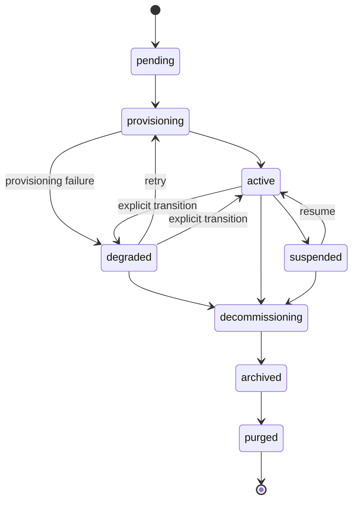

# Tenant lifecycle

What happens to a customer SOC from "onboard" to "purged." This page is the operator-facing companion to [Chart Contract](/reference/chart-contract) (which documents the on-the-wire values rendering) and [Daily Operations](/operations) (which documents the runbook side).

## Tenant state machine



Transitions to `degraded` happen **only via the provisioning controller's failure path** (a phase raised `ProvisionError`). There is no API endpoint to manually mark a tenant `degraded`, no auto-degradation loop watching adapter heartbeat age, and no metric-based degrade. The `soctalk_tenant_adapter_heartbeat_age_seconds` gauge updates on heartbeats but does not feed back into tenant state. Transitions back to `active` happen as the side effect of a successful `:retry` re-provision.

| State | What it means | What's running |
|---|---|---|
| `pending` | Onboard accepted, controller hasn't started provisioning yet. | nothing in `tenant-<slug>` |
| `provisioning` | Controller is creating the namespace, secrets, and helm-installing the tenant chart. | partial, pods appearing |
| `active` | Tenant transitioned `active` after the provisioning controller saw the data-plane pods reach Ready. | Wazuh manager + indexer + dashboard + soctalk-adapter + runs-worker |
| `degraded` | The provisioning controller marked the tenant `degraded` after a provisioning failure (or an operator manually transitioned). **The platform does not currently auto-transition active→degraded based on adapter heartbeat age**; the `soctalk_tenant_adapter_heartbeat_age_seconds` gauge is for your alerting | indeterminate; check pods |
| `suspended` | MSSP admin marked the tenant suspended in the database. **Workloads are NOT scaled by the suspend action itself in this release**: that requires the manual emergency-disable procedure (see [Daily Operations → Emergency disable](/operations#emergency-disable-a-tenant-immediately)). The state flag stops new investigations from being scheduled. | unchanged, pods continue running unless the operator scales them down |
| `decommissioning` | Tear-down in progress. Helm release uninstalling, PVCs deleting. | shrinking |
| `archived` | Helm release gone; PVCs deleted; the tenant row remains for audit. | nothing |
| `purged` | Tenant row hard-deleted. | nothing, only audit log entries remain |

Allowed transitions are enforced in `TenantController.VALID_TRANSITIONS`. Trying to suspend a tenant in `decommissioning` returns HTTP 409 with a list of valid next states.

## Provisioning steps

The controller's `provision()` method runs in nine ordered phases. Each phase emits a `TenantLifecycleEvent` row visible on the tenant detail page (Lifecycle Events table).

| # | Event | What happens |
|---|---|---|
| 1 | `preflight_ok` | Pre-flight checks (cluster prereqs, naming conflicts) pass. |
| 2 | `secrets_minted` | Generate per-tenant secrets (`authd`, JWT signing, Postgres). |
| 3 | `namespace_ready` | Create `tenant-<slug>` with labels, ResourceQuota, LimitRange. |
| 4 | `secrets_applied` | Push secrets into K8s as `Secret/*` objects in the new namespace. |
| 5 | `helm_applied` (tenant chart) | Install the `soctalk-tenant` chart (adapter + runs-worker + ingress). The tenant_admin user is auto-provisioned as part of this step (inline `_mint_tenant_admin_user`). |
| 6 | `helm_applied` (Wazuh chart) | Install the standalone Wazuh chart (manager/indexer/dashboard). Event row payload identifies which chart was applied. |
| 7 | `workloads_ready` | Poll until all data-plane pods are Ready. |
| 8 | `integration_config_written` | Write per-tenant integration configs (LLM, TheHive URLs, etc.) into the database. |
| 9 | `active` | State transition to `active`. |

A failure at any phase transitions the tenant to `degraded` with the error captured in the event row. **Retry Provisioning** (`POST /api/mssp/tenants/{id}:retry`) is a valid transition from `degraded` back to `provisioning` (and is **not** allowed from `pending`: `pending → provisioning` only happens automatically when the controller starts the first attempt). `provision()` is idempotent on each phase.

## Profiles

Profile is chosen at onboard time and **fixed for the tenant's lifetime**. Switching profiles requires `decommission` + recreate.

### `poc`

For evaluations, demos, and short-lived pilots.

- StorageClass: `local-path` (k3s default; no real persistence guarantee)
- Wazuh indexer JVM heap: 512 MiB
- Resource requests at the low end of the chart ranges
- No backup hooks wired up

This is the profile the [demo VM image](/quickstart-vm) uses for its bundled `demo` tenant.

### `persistent`

For production customer SOCs.

- StorageClass: whatever the install marks default (Longhorn, Rook/Ceph, cloud-provider CSI)
- Wazuh indexer JVM heap: chart-side default (typically 2–4 GiB)
- Resource requests/limits sized for sustained load
- Backup hooks honored if configured

Pick `persistent` for anything customer-facing. The default is `poc` if not specified, which is the wrong default for a real customer.

### `provided`

For tenants who bring their own externally-deployed Wazuh stack ("BYO-SIEM"). The tenant chart installs only the SocTalk adapter + runs-worker; no Wazuh/TheHive/Cortex run inside the tenant namespace.

- StorageClass: irrelevant, only the adapter's checkpoint PVC is provisioned
- Wazuh: tenant's own deployment, reached over the network via the indexer (:9200) and Manager API (:55000) URLs supplied at onboard time
- External-SIEM connection material (`wazuh_indexer_url`, `wazuh_api_url`, basic-auth creds) is **required** at onboard and validated server-side (422 if incomplete)
- Per-tenant LLM credentials are also **required** at onboard (no install-shared fallback for `provided`)
- A Cilium FQDN egress allow-list is auto-derived from the supplied indexer/API hostnames

Pick `provided` when the customer already runs Wazuh and wants SocTalk to query it in place. See the [MSSP pilot tutorial → §3.1](/mssp-pilot#_3-1-run-the-create-customer-wizard) for the wizard walk-through (the External SIEM step) and [§3.4](/mssp-pilot#_3-4-coordinating-external-wazuh-creds-for-provided-tenants) for the upstream coordination work.

## Resource quotas

Each `tenant-<slug>` namespace gets a `ResourceQuota` and `LimitRange` at create time, scoped to the profile's expected footprint. See [Sizing](/reference/sizing).

| Profile | CPU requests | CPU limits | Memory requests | Memory limits | PVCs | Pods |
|---|---|---|---|---|---|---|
| `poc` | 2 | 4 | 4 Gi | 8 Gi | 4 | 20 |
| `persistent` | 2 | 5 | 6 Gi | 12 Gi | 6 | 30 |
| `provided` | 1 | 2 | 2 Gi | 4 Gi | 2 | 10 |

(Exact numbers live in `_profile_tenant_overrides` in [`render.py`](https://github.com/soctalk/soctalk/blob/main/src/soctalk/core/provisioning/render.py).)

If a real workload exceeds the profile budget (e.g., Wazuh indexer slows during heavy ingest), raise the ResourceQuota via `helm upgrade` with overridden values. Don't edit the ResourceQuota object directly, the next chart upgrade will overwrite it.

## Recovery paths

### Tenant stuck in `pending` after onboard

The controller crashed or was rescheduled mid-provision before the first phase ran. Retry is not allowed directly from `pending`: first wait for the provisioning attempt to transition to `degraded` (visible in lifecycle events), then click **Retry Provisioning** on the tenant detail page (or `POST /api/mssp/tenants/{id}:retry`). Provisioning resumes from phase 1; each phase is idempotent.

### Tenant in `provisioning` for over 15 minutes

Usually a stuck pod (ImagePullBackOff, PVC `Pending`, ResourceQuota too small). See [Daily Operations, Tenant stuck in provisioning](/operations#tenant-stuck-in-provisioning).

### Tenant in `degraded`

In V1, `degraded` is only entered after a **provisioning failure**, not heartbeat loss. If a tenant is in `degraded`, the provisioning controller failed at one of the 9 steps above, read the lifecycle event row to see which one. The data plane (Wazuh) may still be running depending on which step failed. See [Daily Operations, Tenant in degraded state](/operations#tenant-in-degraded-state).

### Tenant in `suspended`

You did this deliberately. Resume from the UI or `POST /api/mssp/tenants/<id>:resume`: but note that in this release **resume only updates the DB state**, it does not restore replica counts. If you scaled workloads to zero during the suspend (via the emergency-disable flow), you must scale them back up by hand.

### Tenant in `decommissioning` for over 30 minutes

Stuck Helm uninstall. Most often a finalizer on a PVC that never ran. `helm uninstall tenant-<slug> -n tenant-<slug> --no-hooks` and remove finalizers manually:

```bash
kubectl -n tenant-<slug> get pvc -o name | \
  xargs -I {} kubectl -n tenant-<slug> patch {} -p '{"metadata":{"finalizers":null}}' --type=merge
```

Then re-trigger decommission. Document this in the audit log so the trail is intact.

## Decommission vs purge

`decommission` tears down the data plane and transitions the tenant to `archived`: the tenant row and audit history remain. `purged` is the terminal terminal state in the state machine (`archived → purged`), but there is **no `:purge` API endpoint in this release**. Today, transitioning to `purged` requires a database-level update; an admin-gated `POST /api/mssp/tenants/{id}:purge` is on the roadmap. Until it ships, leave decommissioned tenants in `archived` and treat archived rows as the long-term retention surface.

## Source pointers

| Concept | File |
|---|---|
| Tenant state enum + transitions | [`src/soctalk/core/tenancy/models.py`](https://github.com/soctalk/soctalk/blob/main/src/soctalk/core/tenancy/models.py) |
| Provisioning controller | [`src/soctalk/core/provisioning/controller.py`](https://github.com/soctalk/soctalk/blob/main/src/soctalk/core/provisioning/controller.py) |
| Onboard API + payload | [`src/soctalk/core/api/tenants.py`](https://github.com/soctalk/soctalk/blob/main/src/soctalk/core/api/tenants.py) |
| Lifecycle events table | [`src/soctalk/core/tenancy/models.py`](https://github.com/soctalk/soctalk/blob/main/src/soctalk/core/tenancy/models.py) |
