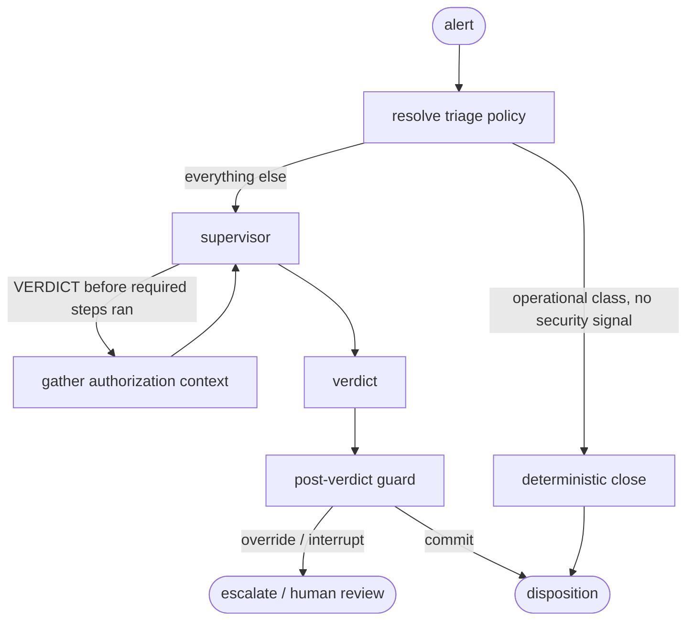
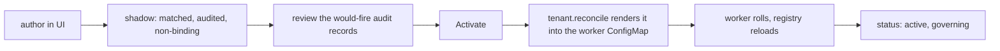

# Triage Policies

The [AI pipeline](/ai-pipeline) reasons its way to a verdict. That flexibility is the point for investigation, and it is the wrong tool for the parts of triage that have to be guaranteed: mandatory steps, safety overrides, and decisions you can make without a model. Triage policies are the layer that handles those. They are deterministic guardrails wrapped around the agentic loop, expressed as data.

The rule they follow is always the same. The LLM proposes, a deterministic gate disposes.

```
LLM node  ->  deterministic guard  ->  { commit | override | interrupt | reroute }
```

The model stays free to reason. A pure function decides whether its output takes effect. Guards fire only on edges you can prove (an authorization record that contradicts the activity, an IOC on the alert, an active incident on the same host). The ambiguous middle passes straight through to the model, which is where it belongs.

The code lives in [`src/soctalk/triage_policy/`](https://github.com/soctalk/soctalk/tree/main/src/soctalk/triage_policy).

## Why "triage policy", not "playbook"

A triage policy is **declarative governance over an autonomous triage loop** — it states which alerts it owns, what evidence must be gathered, which actions the agent may take, and which raise-only guardrails apply. It shapes *how* an alert is triaged; it never spells out an imperative sequence of response steps, and it can never lower a disposition.

In the SOC domain "playbook" means the opposite of that: an imperative SOAR workflow or a human IR checklist — a list of actions to run. Calling this artifact a playbook re-teaches that wrong mental model. So the word **"playbook" is reserved** for a future, separate document kind — **Response Playbooks**, the post-disposition workflows (notify / ticket / isolate / block) that fire *after* triage commits, outside the agentic loop.

Keep the judgment reasoned and any future response procedural. A triage policy never decides a disposition from surface features — that would reintroduce the keyword-matcher failure the whole authorization layer exists to avoid. It wraps around the engine; it does not replace it.

## Where a triage policy acts

A triage policy governs one run at four points.



1. **Resolver.** An entry node matches the alert against the registry and writes the active triage policy into the run state. If the alert belongs to a known operational class with no security indicators, the run can close deterministically here without ever calling the model.
2. **Pre-decision gate.** A policy can require deterministic steps (for example, gathering authorization context) before a verdict is legal. If the supervisor proposes a verdict too early, the gate reroutes it to the required step first. A policy can also restrict which supervisor actions are legal in each phase, and that restriction is applied to the model's structured output before the call, so an illegal action cannot even be sampled.
3. **Post-verdict guard.** After the model drafts a verdict, a pure function decides whether it commits. It can override the draft (raise a close to an escalate), interrupt it (keep the draft but route to human sign-off), or let it stand. Every override is recorded.
4. **Safety floor.** A non-overridable set of checks sits on every automatic-close path. Nothing in a triage policy can weaken it.

## The safety floor

The floor is enforced in code, not in policy data, and it applies on every plane where a case can close automatically: the worker's disposition, the server that commits it, and the ingest fast-paths (memoized close and rules-based auto-close). A close is vetoed and the case is promoted or escalated instead when any of these hold:

| Veto | When it fires |
|---|---|
| IOC present | The alert carries a malicious enrichment verdict or a MISP match. |
| Contradicted authorization | Records exist but do not cover the activity (expired, out of window, wrong scope, forbidden by policy). |
| Unverified IOC | A router-tier close with observables that no enrichment ever checked. |
| Active incident | Another active investigation shares an attach-eligible entity with this one. |
| Kill switch | Auto-close is turned off, per tenant or install-wide. |
| Volume cap | The tenant's rolling count of automatic closes is spent. |

The effective set of gates on any run is the floor plus whatever the active policy adds. A triage policy can only make things stricter. This is what makes tenant-authored policies safe to allow: a misconfigured or hostile one cannot become a channel for suppressing detections.

The kill switch and volume cap are worth knowing by name. `SOCTALK_AUTO_CLOSE_KILL` on the API process, or the `auto_close_kill` policy flag on a tenant, flips every automatic close to a promotion with no rollout needed, which is the control you reach for mid-incident. `auto_close_volume_cap` (default 500 per 24 hours) means a runaway close loop degrades to "humans look at these" rather than mass suppression.

## Built-in triage policies

Two ship with the product. Both are vetted code and read-only.

**`dual-use-privileged-exec`** handles host-auth activity like `sudo` and `su`, where the same event is routine administration under a covering change record and an incident without one. It requires the `gather_authorization_context` step before any verdict, removes `CLOSE` from the supervisor's legal actions (so the cheap router tier cannot short-circuit a case whose whole point is that benign and hostile look identical), and requires human sign-off on any close touching a PCI-classified asset.

**`agent-health-operational`** handles Wazuh agent self-monitoring noise, such as rule 202 "Agent event queue is flooded." This is an infrastructure condition, not a security event, so the policy closes it deterministically with no model call at all, which also makes the outcome consistent instead of varying run to run. Any security indicator on the alert (a MITRE technique, an IOC, high severity, a malicious signal) vetoes the deterministic close and sends the alert to full triage.

You can see both, with every gate and guardrail expanded, on the **Triage Policies** page in the MSSP dashboard.

## The schema

A triage policy is data. One generic interpreter runs any number of them.

```yaml
id: regulated-privileged-exec
version: 2
tenant: acme                       # a tenant slug or id; authored policies are always scoped
status: shadow                     # active | shadow
priority: 70                       # lower wins on a multi-match; authored/file >= 60
applies_to:
  rule_groups: [sudo]
  rule_ids: []
  authorization_tracks: [account]
required_steps: [gather_authorization_context]
decision_modules: [authorization_engine]
legal_actions:
  decide:  [VERDICT]               # an unlisted phase is unconstrained
close_signoff_data_classes: [pci]
guardrails:
  - when:
      "and":
        - "==": [{ "var": "authz.class" }, "contradicted"]
        - "==": [{ "var": "verdict" }, "close"]
    effect: override
    to: escalate
    reason: acted outside the terms of an authorization
```

Read that condition as: if the authorization class came out `contradicted` and the model drafted a `close`, raise it to `escalate`. Each node is a single operator over its arguments, and `var` reads a field from the state contract.

| Field | Meaning |
|---|---|
| `applies_to` | Which alerts the policy governs. Matched on rule groups, rule ids, or the authorization track of the alert's activity — the three are OR'd. |
| `required_steps` | Deterministic nodes that must run before a verdict is legal. |
| `decision_modules` | Vetted engines the graph consults while triaging (today: `authorization_engine`). |
| `legal_actions` | The supervisor actions allowed per phase (`triage` until the required steps have run, then `decide`). An unlisted phase is unconstrained. |
| `close_signoff_data_classes` | A committing close on an asset in one of these classes is interrupted for human sign-off. |
| `guardrails` | Declarative override or interrupt rules. See below. |
| `priority` | Registry order. Built-ins occupy 10 and 50; anything authored or file-loaded must be 60 or higher, so it can never outrank a built-in's protections. |

Some capabilities are constrained by where a policy comes from:

- **Deterministic dispositions** (the thing `agent-health-operational` uses to close without a model) are **built-in-only** — minting a new auto-close class is a code-review decision, not configuration.
- **Authored policies may not grant `CLOSE`** in `legal_actions`. Granting it adds nothing over an unconstrained phase (the baseline already permits the router close) but would let the illegal-action remap force every proposal to a verdict-less auto-close standing only on the coarse floor. Terminal decisions route through `VERDICT` instead; validation rejects `CLOSE` in any phase. Built-in and file policies may still list the full action set.

## Guardrail conditions

Conditions are the only logic an author writes, and they run in a small sandboxed language over a documented state contract. There is no attribute access, no function calls, no way to name anything outside the contract. A condition is a tree of single-operator nodes.

Operators: `var`, the comparisons (`==`, `!=`, `<`, `<=`, `>`, `>=`), the logical `and` / `or` / `!`, and `in`.

The fields a condition may read:

| Field | What it is |
|---|---|
| `authz.class` | `covered`, `contradicted`, or `absent`, derived from the engine. |
| `authz.in_scope`, `authz.sanctioned_or_routine`, `authz.actor_genuine`, `authz.policy_allowed` | The four expectedness components. |
| `verdict` | The model's draft decision. |
| `verdict_confidence` | Its confidence, `0.0` to `1.0`. |
| `asset.data_classification`, `asset.environment`, `asset.criticality` | Trust-resolved attributes of the activity's asset. |
| `enrichment.ioc` | Whether a malicious signal is present. |
| `correlation.active_incident` | Whether an active incident overlaps. |

An `effect` is either `override` or `interrupt`. Suppression is not expressible: `close` is not a valid target, and an override may only raise a decision up the ladder `close < needs_more_info < escalate`, never down it. A condition that references an undeclared field or an unknown operator is rejected when the policy is validated, before it can ever run.

## Author one in the no-code editor

Admins author triage policies from the **Triage Policies** page while a tenant is pinned — no YAML required. This walks through building one real, non-trivial policy end to end. The example, `prod-privileged-exec-strict`, governs privileged-execution alerts on an account-authorization track: it demands authorization evidence, narrows what the agent may do, and adds raise-only guardrails plus a PCI close gate.

Open **“+ New triage policy”** (or `/triage-policies/editor`). The editor is two columns — the document **form** on the left, and a live **decision-flow projection** plus a **“Try it” simulator** on the right that re-render on every edit.


**1 — Identity.** Give the policy a slug id and a **priority**: a floor-gated integer (`≥ 60`) where lower wins on a double match, so an authored policy can never outrank the built-in protections.


**2 — Which alerts does it own?** The three matchers are OR'd. Here the policy owns rule groups `sudo, su, sudoers`, rule ids `5402, 5501`, on the `account` track.


**3 — Investigation requirements.** Require the `gather_authorization_context` step, consult the `authorization_engine` module, and narrow the `decide` phase to `VERDICT` only. Note `CLOSE` is not offered — authored policies cannot grant it.


**4 — Close sign-off.** A committing close on a `pci`- or `phi`-classified asset is held for a human.


**5 — Guardrails.** Guardrails run after the safety floor, in order, first match wins. Each condition can be authored as JSON — the sandboxed `{"op": [{"var": "field"}, value]}` dialect with `and`/`or` groups…


…or in the visual builder, which round-trips with the JSON. This guardrail fires when authorization is **contradicted** *and* the asset is **critical**, and raises the decision to `escalate`.


Two more complete the policy: a low-confidence override to `needs_more_info`, and an `interrupt` that holds a PCI close for human review. Order matters — the first matching guardrail disposes.


**6 — Read the flow, then simulate.** The right column projects the whole document onto the pipeline: matchers → phases → LLM draft → **safety floor (always on)** → guardrails → sign-off → commit.


The **“Try it”** panel runs a sample context through the same guard the worker uses. Feed it a contradicted-authorization, critical-asset case and the outcome is `escalate` — but it comes from the **safety floor**, not this policy. That is the core invariant made visible: contradicted authorization is a non-overridable floor veto, and the policy's guardrails only *raise* on top of it.


`Create (shadow)` saves it. The form and the stored document are the same artifact — “View as JSON” shows exactly what gets persisted.


Validation on save is fail-closed and applies the same rules as file policies plus a few stricter ones: the id must be a slug, referenced steps and decision modules and legal-action phases must be ones the runtime actually knows, `CLOSE` may not be granted, and the definition is size-capped. An unknown reference is rejected at author time rather than silently ignored at runtime. Every saved revision is kept as append-only history.

## Shadow, then activate

An authored policy moves through a lifecycle: **draft → shadow → active → retired**.

In **shadow**, the policy is matched and its guardrails evaluated exactly as an active one would be, and its would-fire decisions are written to the audit trail — but it changes no disposition. This gives you real evidence of what it would do against live traffic before it decides anything.

**Activating** it (the **Activate** action on the Triage Policies page) makes it govern. Because the worker is a separate process whose registry loads once at startup, activation cannot just flip a database flag — it materializes the definition into the tenant's worker ConfigMap on the next `tenant.reconcile`, and the **worker rollout is the activation gate**: the policy starts governing only when a fresh worker reads it. Editing an active policy keeps it active and re-rolls with the new definition; deactivating returns it to shadow.



Operators who prefer to manage policies as code can still take the git path: write a YAML file into the mounted directory and roll the workers. The same registry loads both authored-and-activated policies and hand-written file policies.

## The wiring

Two environment variables carry it:

- `SOCTALK_TRIAGE_POLICY_DIR` on the runs-worker is the directory the registry loads from at startup.
- `SOCTALK_TENANT_TRIAGE_POLICIES_DIR` on the controller is the operator-mounted directory the provisioning path reads, validates, and renders into each tenant's chart values as a mounted ConfigMap.

On the chart-provisioned path, policies are tenant chart values (`runsWorker.triagePolicies`, rendered as the `soctalk-triage-policies` ConfigMap), and a content change stamps a checksum on the pod template so an edit rolls the worker automatically. The rollout is the activation gate: because the registry loads once per process, a policy only starts governing when a fresh worker reads it.

Every load, skip, and rejection is logged. A file that fails validation for any reason (bad schema, an unknown field, a malformed condition, a priority that would outrank a built-in) is rejected whole and never governs anything, so a bad rollout degrades to "that policy is not active," never to wrong enforcement.

::: tip Renaming in flight
The old `playbook` names still work for one release: the `/playbooks` API routes, the `playbook_id` response field, `SOCTALK_PLAYBOOK_DIR` / `SOCTALK_TENANT_PLAYBOOKS_DIR`, and `runsWorker.playbooks` are all accepted as deprecated aliases. Prefer the `triage_policy` names above.
:::

## Where it shows up

- **Triage Policies page** in the MSSP dashboard: the built-ins that govern triage, and the authored drafts for a pinned tenant, each expandable to its full definition.
- **Audit trail**: every guard override, every floor veto, and every shadow would-fire is an audit event, so you can reconstruct exactly why a case went where it did.
- **Golden evals**: the deterministic triage-policy cases in the triage golden set pin this behavior, so a regression in the guardrail logic fails the suite rather than reaching production.
