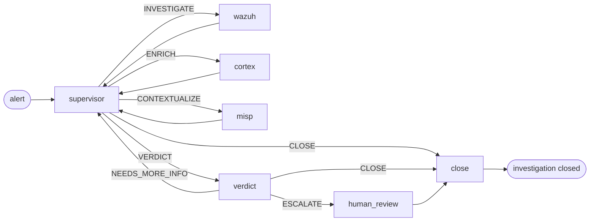

# AI 流水线

从"告警到达"到"裁决被写入"之间发生了什么。SocTalk 的分诊层是一个 LangGraph 状态机——由一个主管（supervisor）将工作路由到专职的 worker 节点，然后由裁决节点决定该案例是否需要人工审查。

本页讲的是心智模型。代码位于 [`src/soctalk/graph/`](https://github.com/soctalk/soctalk/tree/main/src/soctalk/graph)、[`src/soctalk/supervisor/`](https://github.com/soctalk/soctalk/tree/main/src/soctalk/supervisor) 与 [`src/soctalk/workers/`](https://github.com/soctalk/soctalk/tree/main/src/soctalk/workers)。

## 节点

| 节点 | 用途 | 使用的模型 |
|---|---|---|
| **supervisor** | 决定下一步做什么。纯路由——自身不做任何领域工作。 | 快速模型 |
| **wazuh_worker** | 拉取告警的上下文，提取可观测对象（IP、哈希、用户、进程），并与同一租户内近期的告警进行关联。 | 快速模型 |
| **cortex_worker** | 将可观测对象发送给 Cortex 分析器（VirusTotal、AbuseIPDB 等）进行信誉/富化。 | 快速模型 |
| **misp_worker** | 在 MISP 威胁情报源中查询可观测对象，以获取已知的攻击活动/攻击者上下文。 | 快速模型 |
| **verdict** | 对 worker 收集的所有内容进行推理。输出 `escalate | close | needs_more_info` + 置信度 + 一段简短的理由。 | **推理模型** |
| **human_review** | 暂停运行；向仪表板队列和/或 Slack 发出审查请求。等待一个 `HumanDecision`（`approve | reject | more_info`）。 | ——（人工） |
| **close** | 生成结案报告并写入处置结果（`close_fp | escalate | leave_open`）。**在 V1 中，close 节点不会向外发集成。** V1 中当前没有任何图节点会向 TheHive 发布内容（早期草稿中提到的 `thehive_worker` 节点并未接入 V1 的图构建器）。close 节点向 Slack webhook 发布内容也尚未接入。close 节点的向外集成已列入路线图。 | 快速模型 |

## 主管路由

主管的唯一职责是选择下一个节点。它的决策空间是一个固定的 5 元素枚举：

| 决策 | 含义 |
|---|---|
| `INVESTIGATE` | 我对这条告警了解得还不够。运行 Wazuh worker。 |
| `ENRICH` | 我有尚未做信誉检查的可观测对象。运行 Cortex。 |
| `CONTEXTUALIZE` | 这些可观测对象看起来值得关注；检查是否有已知的攻击活动/攻击者。运行 MISP。 |
| `VERDICT` | 我掌握的信息已经足够。交给裁决节点。 |
| `CLOSE` | 这是一个明确无疑的案例（例如显而易见的误报或已解决的告警）。跳过裁决节点。 |

主管自身从不调用外部工具。它读取累积的 `SecOpsState`（告警、可观测对象、此前的 worker 输出、裁决），并输出这五个决策之一。大多数案例会循环 supervisor → worker → supervisor → worker → supervisor → VERDICT，总共三到六跳。

## 裁决节点

推理模型会拿到全部累积的状态——原始告警、每个 worker 的发现、所有可观测对象及其富化结果，以及此前的裁决尝试（如果发生了 `NEEDS_MORE_INFO` 循环）。它输出：

| 字段 | 类型 |
|---|---|
| `decision` | `escalate | close | needs_more_info` |
| `confidence` | 枚举：`low | medium | high` |
| `rationale` | 简短 markdown |
| `evidence_strength` | `weak | moderate | strong | conclusive` |
| `verdict` | `benign | suspicious | malicious | unknown` |
| `impact` | `low | medium | high | critical` |

`escalate` 总是会经过 `human_review`。`close` 跳过人工审查，直接进入 `close`。`needs_more_info` 返回主管，并附带一段提示，说明还缺什么。

## 人工审查闸门

`human_review` 会暂停运行。该案例会出现在仪表板的[审查队列](/zh-cn/mssp-ui#reviews-human-in-the-loop)中，并（如果配置了 Slack）出现在 [Slack 双向 HIL](/zh-cn/human-review) 中。审查人员选择：

| 决策 | 对案例的影响 |
|---|---|
| `approve` | 待处理审查标记为已完成 + 反馈被审计。**不会**自动恢复运行；由分析师跟进。 |
| `reject` | 案例以 `auto_closed_fp` 关闭。终态——不再重新调用图。 |
| `more_info` | 审查标记为 `info_requested` 并附上问题列表。**不会**自动恢复运行；由分析师跟进。 |

审查人员的身份、时间戳和理由会被追加到该案例的仅追加 `case_events` 日志中。

## 运行生命周期

一次"运行"是指对一个案例执行一遍图。状态枚举：

| 状态 | 含义 |
|---|---|
| `active` | 图正在执行。 |
| `waiting_on_gate` | 在 `human_review` 处暂停。 |
| `paused` | 由 MSSP 管理员手动暂停。 |
| `halted_budget` | 达到了单次运行的 token 预算。正常的 V1 运行会从 `case_runs` 行中取 `tokens_budget = 200,000`（模型默认值）。`SOCTALK_CASE_RUN_TOKEN_BUDGET` 环境变量（默认 15,000）仅在该行未设置值时作为回退使用。 |
| `completed` | 图到达 `close` 并写入了处置结果。 |
| `failed` | 图报错或外部工具不可达。 |

Token 预算按单次运行、按租户以及全安装范围进行跟踪。指标见[可观测性](/zh-cn/observability)，成本调节项见 [LLM 提供方](/zh-cn/integrate/llm-providers)。

## runs-worker 进程

每个租户都有自己的 `runs-worker` pod（位于 `tenant-<slug>` 命名空间），负责消费队列：

1. 调用 `POST /api/internal/worker/runs/claim` 领取一个分配给其租户的运行。
2. 根据节点图构建 LangGraph。
3. 对图执行 `ainvoke()`，每 20 秒发送一次 `POST /api/internal/worker/runs/{run_id}/heartbeat`。
4. 完成后，将最终状态和处置结果发送到 `POST /api/internal/worker/runs/{run_id}/complete`。

runs-worker 是唯一按租户划分的计算 pod——将它保留在租户命名空间内，意味着一个超出预算的租户无法抢占整个安装其余部分的计算资源。supervisor + worker + verdict 逻辑本身是无状态的；繁重的工作是 LLM 调用（在集群之外，计费到该租户所配置的提供方）。

## 源码指引

| 概念 | 文件 |
|---|---|
| 图构建器 + 路由 | [`src/soctalk/graph/builder.py`](https://github.com/soctalk/soctalk/blob/main/src/soctalk/graph/builder.py) |
| 主管逻辑 | [`src/soctalk/supervisor/node.py`](https://github.com/soctalk/soctalk/blob/main/src/soctalk/supervisor/node.py) |
| 裁决节点 | [`src/soctalk/supervisor/verdict.py`](https://github.com/soctalk/soctalk/blob/main/src/soctalk/supervisor/verdict.py) |
| Worker 节点 | [`src/soctalk/workers/`](https://github.com/soctalk/soctalk/tree/main/src/soctalk/workers) |
| 结案 / 处置 | [`src/soctalk/graph/close.py`](https://github.com/soctalk/soctalk/blob/main/src/soctalk/graph/close.py) |
| Runs worker 循环 | [`src/soctalk/runs_worker/main.py`](https://github.com/soctalk/soctalk/blob/main/src/soctalk/runs_worker/main.py) |
| 状态 schema | [`src/soctalk/models/state.py`](https://github.com/soctalk/soctalk/blob/main/src/soctalk/models/state.py) |
