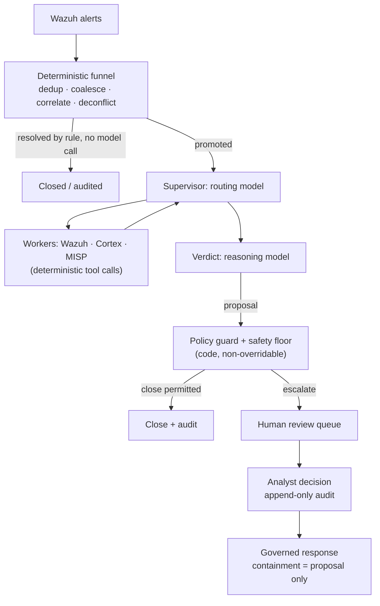

# Wazuh 告警的 AI 分诊：生产环境中什么可行（什么不可行）

每个 Wazuh 运维人员都有过同样的想法：管理器每天产生数千条告警，其中大多数是噪音，而 LLM 非常擅长读取一条告警并判断"这是暴力破解尝试"或"这是一个 cron 任务"。于是你从 Wazuh 接一个 webhook 到工作流工具，把告警 JSON 塞进提示词，再把模型的回答发布到某个地方。

这个原型能跑起来。但它在生产环境中会以可预测的方式失效。本指南解释其原因，并介绍当 Wazuh 告警的 AI 分诊必须在真实告警量下无人值守运行时依然站得住的架构——也就是 SocTalk 所实现的架构。

## 为什么"把每条告警都灌给 LLM"会崩溃

这种朴素模式——Wazuh webhook → LLM 提示词 → 裁决——有三个结构性问题，任何更好的提示词都无法修复。

**成本随噪音而非信号扩张。**一次扫描就能产生数千条告警。如果每条原始告警都要消耗一次模型调用，你的开销就与环境的嘈杂程度成正比，而费用压力会把你推向更弱的模型——恰恰在最需要判断力的场景上。

**模型没有上下文，也没有底线。**孤立读取单条告警的 LLM 不记得分析师昨天做过什么决定，也不了解该组织自身的状态——因此它无法区分一次经批准的变更与一次产生逐字节相同告警的攻击——更无法保证它不会自信地关闭一个真实的失陷指标。对真实入侵给出幻觉式的"良性"裁决，不是任何比例下都可以容忍的质量问题；那是被压制的检测。

**没有审计轨迹，也没有闸门。**把模型裁决直接发到频道的工作流，既没有记录裁决依据了哪些证据，也没有审查者身份，更没有机制阻止一个错误裁决变成已关闭的案件。

公平地说：webhook 原型是让你自己相信 LLM 能对告警进行推理的好办法。缺失的是模型*周围的架构*。

## 可行的架构：在任何模型调用之前的确定性漏斗

第一个修正是反直觉的：AI 分诊流水线的大部分不应该是 AI。在 SocTalk 中，摄取平面在服务端运行且完全确定性——没有任何模型触碰它：

- **去重**丢弃携带已见过 ID 的重放事件。
- **合并**将五分钟窗口内同一资产上同一规则的重复告警归入单个案件——一次检测的爆发变成一个案件，而不是数千个。
- **实体关联**把与进行中的调查共享强实体（主机、文件哈希）的新告警作为证据附加，而不是启动一次全新的无上下文运行。
- **交战去冲突**按来源、主机、技术和时间匹配已申报的渗透测试与红队窗口——经批准的测试会被标记并审计，绝不自动关闭；超出范围的测试人员活动则强制交由人工处理。
- **确定性关闭**按规则处理低严重度、高置信度的误报，无需模型调用。

许多告警根本到不了模型。凡是存活下来的都会被提升为调查，即便如此，模型也只在两个角色中被咨询：一个**supervisor**（监督者），负责为调查路由（从 Wazuh 拉取主机上下文、通过 Cortex 分析器检查可观测对象信誉、查询 MISP 威胁情报——全部是确定性工具调用，模型只*读取*其结果）；以及一个**裁决**节点，由推理模型权衡收集到的一切，并提出 `escalate`、`close` 或 `needs_more_info`，附带置信度、理由和证据强度。

## 护栏是数据，裁决由代码把关

第二个修正：模型的裁决是提议，而不是提交。SocTalk 的规则是*"LLM 提议；确定性闸门裁定"*。

[分诊策略](/zh-cn/triage-policies)是数据——由单一解释器执行的声明式规则——作用于四道闸门：一个解析器、一道决策前闸门（在必需的取证步骤运行完毕之前，裁决不被允许生效）、一道裁决后守卫，以及一个**安全底线**。底线是代码级且不可覆盖的，在三个独立位置（worker、服务端、摄取）强制执行。任何自动关闭都不能越过已知 IOC、相互矛盾的授权记录、未核实的指标、活跃的相关事件、断路开关，或超出量上限（默认每 24 小时 500 次自动关闭）。断路开关（安装级的 `SOCTALK_AUTO_CLOSE_KILL`，或按租户）会即刻把每一次自动关闭翻转为提升——这是你在事件处置中途会去按的那个控制。

让租户自编策略变得安全的性质在于：它们只能让分诊**更严格**，绝不能更宽松。护栏覆盖只能沿阶梯 `close < needs_more_info < escalate` 向上抬升决策；压制在条件语言中不可表达——该语言是沙箱化的：基于文档化状态契约的单运算符树，无属性访问，无函数调用，无效策略在校验时整体拒绝。配置错误或怀有恶意的策略无法成为压制检测的通道。

## 人在回路是硬性质，不是设置项

每个 `escalate` 裁决都要经过人工审查。没有绕行通道：SocTalk 未实现纯 AI 的"自动批准"模式（移除该闸门是路线图项目，规划为管理员管控、留有审计的开关——而非静默默认）。在 V1 中，审查界面是仪表盘队列，展示 AI 的完整理由以及可观测证据及其富化结果。分析师的决定——批准、拒绝、需要更多信息——写入只追加的审计记录，包含身份、时间戳和理由，提交后永不可编辑。触及敏感资产（比如一台 PCI 分级主机）的关闭提议，即使模型很自信，也会被扣留等待人工签核。

同样的立场也约束响应：隔离端点或禁用账户之类的遏制动作*始终*作为提议提出，由分析师先行批准。模型绝不会自行执行遏制动作，且派发在服务端进行，绝不出自模型的循环。SocTalk 是副驾驶，不是分析师替代品——其价值在于压缩：同一支分析师团队可以处理 5–10 倍的告警量，因为例行案件会自动关闭，只有不明确的案件才会到达人工审查。

## 成本工程

由于漏斗在无模型调用的情况下解决了许多告警，成本跟随歧义度而非告警量。剩余的调节杠杆：

- **快速/推理模型分工。**路由和 worker 使用快速模型；只有裁决使用推理模型。两者默认均为 `claude-sonnet-4-20250514`，可按租户覆盖（`SOCTALK_FAST_MODEL` / `SOCTALK_REASONING_MODEL`）。
- **按运行的 token 预算。**每次运行携带一个 token 预算（模型默认 200,000），按运行、按租户和安装级分别跟踪。失控的调查会被中止，而不是无限计费。
- **到底要花多少钱？**高度可变，但作为数量级参考：在预算型 OpenAI 兼容配置下，约 30 条告警/天时大约**每租户每天 $9**，换用更便宜的快速模型可降低 5–10 倍。请把它当作起点估算，而不是报价。
- **零按 token 计费选项。**通过 [Ollama](/zh-cn/integrate/ollama) 完全本地运行：无云端 LLM，无按 token 成本，数据留在你的基础设施上。选择一个支持工具调用的模型（qwen2.5、llama3.1、mistral-nemo）——并且要知道 CPU 推理慢到每次调查以分钟计；要获得可用的延迟请使用 GPU 主机。

## 自带 LLM

SocTalk 的运行时支持两个提供商：`anthropic`（Claude）和 `openai`——后者指 OpenAI 或任何 OpenAI 兼容端点：Azure OpenAI、vLLM、Ollama、LiteLLM。提供商、模型、base URL 和 API key 都可**按租户**覆盖，客户可以自带密钥以实现计费隔离——以 Kubernetes Secret 形式挂载到该租户自己命名空间中的 runs-worker。（存在一个已记录的 V1 例外：该密钥也以明文保存在 SocTalk 数据库中，即 `IntegrationConfig.llm_api_key_plain`——姿态与轮换建议见[密钥管理](/zh-cn/reference/secrets)。）模型只会看到当前调查状态（告警正文、可观测对象、worker 输出）；若需更严格的姿态，可将租户指向本地部署的端点。详情见 [LLM 提供商](/zh-cn/integrate/llm-providers)。

## 这在 SocTalk 中是什么样子

SocTalk 是面向 MSP 与 MSSP 的 Apache 2.0、AI 优先的 SOC 平台：在你自己的 Kubernetes 上为每个客户提供专属 Wazuh 栈，置于单一控制平面之后，上述分诊流水线按租户运行。深入了解：

- [工作原理](/zh-cn/how-it-works)——完整的流水线故事：确定性漏斗、两个模型角色、三点安全底线。
- [AI 流水线](/zh-cn/ai-pipeline)——LangGraph 状态机：supervisor、worker、裁决、运行生命周期。
- [分诊策略](/zh-cn/triage-policies)——在无代码编辑器中编写确定性护栏，先影子运行再激活。
- [人工审查](/zh-cn/human-review)——审查队列与分析师决策契约。

或者跳过阅读：[演示 VM](/zh-cn/quickstart-vm) 让你在大约五分钟内得到一个运行中的多租户安装，并预先接入一个演示租户。
