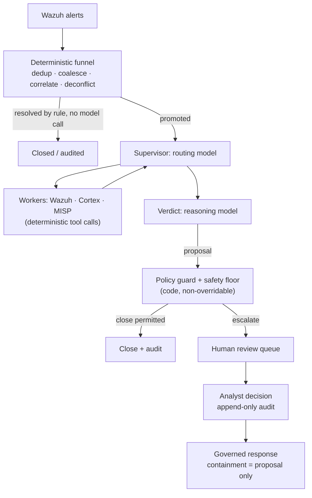

# Wazuh 告警的 AI 分诊：生产环境中哪些可行（哪些不可行）

每个 Wazuh 运维人员都有过同样的想法：管理器每天产出成千上万条告警，其中大多数是噪音，而 LLM 很擅长读一条告警并判断"这是暴力破解尝试"或"这是一个 cron 任务"。于是你从 Wazuh 接一个 webhook 到工作流工具，把告警 JSON 塞进提示词，再把模型的回答发到某个地方。

这个原型是能跑的。但它在生产环境中会以可预见的方式失败。本指南讲清楚原因，并给出当 Wazuh 告警的 AI 分诊必须在无人值守下应对真实告警量时依然站得住的架构。这也是 SocTalk 实现的架构。

## 为什么"把每条告警都送进 LLM"会崩

这种朴素模式（Wazuh webhook → LLM 提示词 → 裁决）有三个结构性问题，没有一个是靠更好的提示词能解决的。

**成本随噪音增长，而不是随信号增长。** 一次扫描就能产生成千上万条告警。如果每条原始告警都要花一次模型调用，你的开销就与环境有多吵成正比，而费用压力会把你推向更弱的模型，恰恰用在最需要判断力的场景上。

**模型没有上下文，也没有兜底。** 孤立读取一条告警的 LLM 不记得分析师昨天做过什么决定，也看不到组织自身的状态，因此它无法把一次经过批准的变更与产生字节级相同告警的攻击区分开。没有任何机制保证它不会自信地把一个真实的入侵指标关闭掉，而对真实入侵给出一个幻觉式的"良性"裁决，等于压制了一次检测；这种情况的任何发生率都是不可容忍的。

**没有审计痕迹，也没有闸门。** 一个把模型裁决直接发到频道的工作流，既没有记录裁决基于哪些证据，也没有审查者身份，更没有阻止错误裁决变成已关闭案件的机制。

webhook 原型仍然是让你确信 LLM 能对告警进行推理的好办法。缺失的部分是围绕模型的架构。

## 可行的架构：在任何模型调用之前先过确定性漏斗

第一个修正是反直觉的：AI 分诊流水线的大部分不应该是 AI。在 SocTalk 中，摄取平面位于服务端且完全确定性，任何模型都不会触碰它：

- **去重** 丢弃携带已见过 ID 的重放事件。
- **合并** 将五分钟窗口内同一资产上同一规则的重复告警归入单个案件。一次检测的爆发变成一个案件，而不是成千上万个。
- **实体关联** 将与活跃调查共享强实体（主机、文件哈希）的新告警作为证据附加进去，而不是启动一次全新的、没有上下文的运行。
- **演练去冲突** 按来源、主机、技术和时间匹配已申报的渗透测试和红队窗口。经批准的测试会被标记并审计，绝不自动关闭，而超出范围的测试人员活动会被强制交给人工处理。
- **确定性关闭** 按规则处理低严重度、高置信度的误报，不做任何模型调用。

许多告警根本到不了模型。存活下来的会被提升为调查，即便如此，模型也只在两个角色中被咨询：一个是负责为调查做路由的**监督者**（从 Wazuh 拉取主机上下文、通过 Cortex 分析器查询可观测对象信誉、查询 MISP 威胁情报；这些都是确定性的工具调用，模型只是*读取*其结果），另一个是**裁决**节点，由一个推理模型权衡收集到的一切，并给出 `escalate`、`close` 或 `needs_more_info` 的提议，附带置信度、理由和证据强度。

## 护栏是数据，裁决由代码把关

第二个修正是把模型的裁决当作提议，只有确定性闸门才能把它变成最终决定。SocTalk 的规则是*"LLM 提议，确定性闸门定夺"*。

[分诊策略](/zh-cn/triage-policies)是数据，是由同一个解释器执行的声明式规则，作用于四道闸门：一个解析器、一道决策前闸门（在必需的证据步骤运行完成之前，裁决不具备生效资格）、一道裁决后守卫，以及一个**安全底线**。底线是代码级且不可覆盖的，在三个相互独立的位置（worker、服务端、摄取）强制执行。任何自动关闭都不能越过已知 IOC、被推翻的授权记录、未经验证的指标、活跃的关联事件、断路开关，也不能超过总量上限（默认每 24 小时 500 次自动关闭）。断路开关（`SOCTALK_AUTO_CLOSE_KILL` 作用于全安装范围，也可按租户设置）会立即把所有自动关闭改为提升。这是事件处置过程中你会伸手去按的那个控制。

让租户自行编写的策略变得安全的性质是：它们只能让分诊变得**更严格**，绝不能更宽松。护栏覆盖只能沿 `close < needs_more_info < escalate` 的阶梯把决定往上抬；条件语言中无法表达压制，且该语言是沙箱化的：只允许基于已文档化状态契约的单运算符表达式树，不允许属性访问，不允许函数调用，无效策略在校验时整体拒绝。配置错误或怀有恶意的策略都不可能成为压制检测的通道。

## 人在环中是一项硬性属性

每个 `escalate` 裁决都要经过人工审查。没有旁路：SocTalk 没有实现纯 AI 的"自动批准"模式（移除这道闸门在路线图上，计划做成需要管理员开启、带审计的开关，而不是悄悄成为默认）。在 V1 中，审查界面是仪表盘队列，展示 AI 的完整理由以及可观测对象证据及其富化信息。分析师做出的批准、拒绝或要求补充信息的决定会写入只追加的审计记录，包含身份、时间戳和理由，提交后永不可编辑。涉及敏感资产（比如一台 PCI 分类主机）的关闭提议，即使模型很有把握，也会被扣住等待人工签核。

同样的立场也约束响应：隔离终端或禁用账户这类遏制动作*永远*以提议形式提出，先由分析师批准。模型绝不会自行执行遏制动作，而且动作的派发发生在服务端，绝不来自模型的循环内部。SocTalk 以副驾驶的方式工作，而不是替代分析师。价值在于压缩：同一支分析师团队可以处理 5–10 倍的告警量，因为常规案件自动关闭，只有不明确的案件才会进入人工审查。

## 成本工程

由于漏斗在不调用模型的情况下就解决了许多告警，成本跟随的是不确定性而不是数量。剩下的调节手段：

- **快速/推理模型分工。** 路由和 worker 使用快速模型；只有裁决使用推理模型。两者默认都是 `claude-sonnet-4-20250514`，可按租户覆盖（`SOCTALK_FAST_MODEL` / `SOCTALK_REASONING_MODEL`）。
- **按运行计的 token 预算。** 每次运行都带有 token 预算（模型默认 200,000），按运行、按租户和全安装范围分别追踪。失控的调查会被停止，而不是无限计费。
- **真实开销。** 波动很大，但作为数量级参考：在预算型 OpenAI 兼容配置下，约 30 条告警/天时大致为**每租户每天 9 美元**，换用更便宜的快速模型可降低 5–10 倍。把它当作起步估算，而不是报价。
- **零 token 成本选项。** 用 [Ollama](/zh-cn/integrate/ollama) 完全本地运行：没有云端 LLM，没有按 token 计费，数据留在你自己的基础设施上。选择一个支持工具调用的模型（qwen2.5、llama3.1、mistral-nemo），并且要知道 CPU 推理慢到每次调查需要数分钟；想要可用的延迟就用 GPU 主机。

## 自带 LLM

SocTalk 的运行时支持两种提供方：`anthropic`（Claude）和 `openai`，后者涵盖 OpenAI 本身或任何 OpenAI 兼容端点，例如 Azure OpenAI、vLLM、Ollama 和 LiteLLM。提供方、模型、基础 URL 和 API 密钥都可以**按租户**覆盖，客户可以自带密钥实现账单隔离，密钥以 Kubernetes Secret 的形式挂载到该租户自己命名空间中的 runs-worker 上。（有一个已记录的 V1 例外：密钥同时以明文保存在 SocTalk 数据库中，即 `IntegrationConfig.llm_api_key_plain`；安全姿态与轮换建议见[密钥](/zh-cn/reference/secrets)。）模型只会看到当前调查状态（告警正文、可观测对象、worker 输出）；如需更严格的姿态，把租户指向本地部署的端点即可。详见 [LLM 提供方](/zh-cn/integrate/llm-providers)。

## 在 SocTalk 中的样子

SocTalk 是一个 Apache 2.0 许可、AI 优先的 SOC 平台，面向 MSP 和 MSSP：在你自己的 Kubernetes 上为每个客户部署一套独立的 Wazuh 栈，统一置于一个控制平面之后，上述分诊流水线按租户运行。想深入了解：

- [工作原理](/zh-cn/how-it-works)完整讲述流水线：确定性漏斗、两种模型角色、三点位安全底线。
- [AI 流水线](/zh-cn/ai-pipeline)介绍 LangGraph 状态机：监督者、worker、裁决、运行生命周期。
- [分诊策略](/zh-cn/triage-policies)展示如何在无代码编辑器中编写确定性护栏，先影子运行再激活。
- [人工审查](/zh-cn/human-review)记录审查队列和分析师决策契约。

或者跳过阅读：[演示 VM](/zh-cn/quickstart-vm) 大约五分钟就能给你一个运行中的多租户安装，并预先接入一个演示租户。
