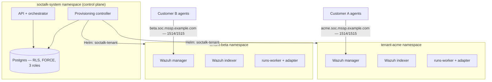

# 面向 MSSP 的多租户 Wazuh：真正实现租户隔离的架构模式

Wazuh 没有原生的多租户能力。manager 中没有"租户"对象，规则集中没有按客户划分的边界，`authd` 注册也没有按客户的作用域限制。每一家以 Wazuh 为标准的 MSSP 最终都要围绕它自行构建租户体系——而你选择的模式决定了你的隔离保证、上线速度以及每客户的成本下限。

本指南涵盖 MSSP 对多租户 Wazuh 部署的真实需求、团队在实践中尝试的三种模式，以及生产级隔离在 SIEM 本身之外还需要什么。这正是 SocTalk 以开源方式（Apache 2.0）实现的架构；全文链接的参考页面记录了已交付的 V1 行为，凡描述目标架构的章节都会明确标注"V1 部署说明"。

## MSSP 需要而 Wazuh 未提供的能力

每一次 MSSP 部署讨论中都会出现三项需求：

1. **能在客户安全审查中站得住脚的隔离。**"客户 A 无法读取客户 B 的告警"必须在数据层、网络层和 agent 注册层同时成立——而不仅仅是在仪表板层面。
2. **上线速度。**如果为新客户开通一个 SOC 需要一周的手工操作，这种模式在客户数超过个位数后就无法扩展。
3. **每租户成本控制。**你需要知道单个客户在 RAM、CPU 和磁盘上的开销，为其设置上限，并阻止一个高噪声租户挤占其他租户的资源。

## MSSP 尝试的三种模式

### 模式一：共享 manager，索引级分离

一个 Wazuh manager，所有客户的 agent 都注册到它上面，分离在下游完成——用 OpenSearch Dashboards 多租户机制隔离仪表板对象，用索引模式和安全角色限定读取范围。这是大多数 Wazuh 多租户讨论帖描述的模式，因为它是唯一无需跳出 Wazuh 自带工具就能构建的模式。

问题在于这种分离只是读取侧的过滤器，而不是边界。manager 本身是共享的：一套规则集、一个 `authd` 密钥、一个 API、所有人共用一个升级窗口。一个配置错误的角色会同时暴露所有客户，而且在不影响其他客户的前提下，无法实现按客户的规则包或保留策略。

### 模式二：VM 上的每租户独立 manager

每个客户一台 VM（或一组 VM），运行专属的 manager 和 indexer。隔离是真实的——独立的进程、磁盘和凭据。MSSP 在被共享 manager 模式坑过之后通常会落到这里。代价在运维侧：上线意味着开通机器，升级意味着逐台 VM 操作，而每租户的资源下限是一整台 VM，没有共享调度可以回收闲置容量。5 个客户时还能运转，到 30 个客户时就痛苦不堪。

### 模式三：Kubernetes 上的每租户独立 manager，置于控制平面之后

每个客户在自己的 Kubernetes 命名空间中获得专属的 Wazuh manager、indexer 和仪表板，由 ResourceQuota 和 LimitRange 限定其资源占用。控制平面掌管生命周期：上线时为每个租户渲染一个 Helm release，下线时将其移除，租户状态保存在数据库中而不是电子表格里。隔离来自命名空间边界加 NetworkPolicy；密度来自调度器将租户紧凑地安排到共享节点上。

### 坦率的权衡对比

| | 共享 manager + 索引分离 | VM 上的每租户 manager | Kubernetes 上的每租户 manager |
|---|---|---|---|
| 隔离边界 | 共享数据上的读取侧过滤器 | 机器边界 | 命名空间 + NetworkPolicy + 配额 |
| 单次失陷的爆炸半径 | 所有客户 | 单个客户 | 单个客户 |
| 按租户的规则/保留策略/升级 | 否 | 是 | 是 |
| 客户上线 | 快（改配置） | 慢（开通机器） | 自动化后很快（Helm release） |
| 密度/每租户成本 | 最优 | 最差 | 良好（调度器紧凑排布、配额封顶） |
| 所需运维技能 | Wazuh + OpenSearch 安全 | 机群/VM 自动化 | Kubernetes |
| 30+ 租户规模下的机群运维 | 不适用（单一堆栈） | 痛苦 | 有控制平面即可掌控 |

三种模式中，模式三是唯一为同时提供真实隔离和上线速度而生的——但前提是控制平面必须存在。仅有命名空间只是一种命名约定，而不是安全边界。本指南余下的部分讲的就是如何让这个边界真正成立。

## 生产级隔离不止于 SIEM

每租户的 Wazuh 堆栈隔离的是 SIEM 数据。MSSP 平台还有跨租户状态——案例、审查队列、审计日志、集成配置——这一层需要自己的强制机制。

### 数据层：Postgres 行级安全，强制启用并经测试

应用层的 `WHERE tenant_id = ?` 过滤，只要漏掉一个子句就会造成跨租户泄漏。数据库本身应当强制执行租户隔离。具体模式如下：

- 每张租户作用域的表都携带以每事务 `app.current_tenant_id` 设置为键的 RLS 策略。上下文未设置时返回**零行**——防御性归零，而不是泄漏。
- 在每张租户作用域的表上启用 `FORCE ROW LEVEL SECURITY`，使表所有者（迁移角色）同样受策略约束。Postgres 默认豁免所有者；否则一次读取租户数据的迁移可能悄无声息地跨越租户。
- 三角色划分：一个迁移所有者角色、一个受 RLS 约束的运行时角色，以及一个隔离的 `BYPASSRLS` 角色，仅用于受审计的跨租户路径。任何应用都不以超级用户身份连接。
- CI 中的隔离测试——端点探测、以应用角色执行的原生 SQL、无上下文的 worker、所有者角色探测、跨租户事件流。SocTalk 运行七项此类测试，全部必须通过；无一可选。
- 幂等键以 `UNIQUE (tenant_id, idempotency_key)` 限定作用域，因此两个客户的告警管道可以发出相同的外部告警 ID 而不会冲突。

完整的策略模板、角色 DDL 和测试套件见：[Postgres RLS](/zh-cn/reference/postgres-rls)。

### 网络层：每命名空间的 NetworkPolicy

如果没有强制执行的 CNI，命名空间边界毫无意义——K3s 默认的 Flannel 完全不执行 NetworkPolicy。目标姿态是每个租户命名空间默认拒绝的基线，加上显式放行：命名空间内部流量、DNS、控制平面对租户数据平面端口的访问，以及 1514/1515 上的 agent 入站流量。租户到租户的流量和租户的通用出站流量均被阻断。

SocTalk 采用 Cilium 作为受支持的 CNI（NetworkPolicy 强制执行、面向以主机名寻址的 LLM 端点的基于 FQDN 的出站控制、用于排查隔离问题的 Hubble 流量可观测性）。请注意 V1 的保留项：完全按 FQDN 固定的每租户出站允许清单是设计目标，当前 chart 渲染的是较简单的策略——宽松的控制平面出站规则，以及面向每租户 worker 的宽泛 TCP/443 出站规则。渲染后的模板在仓库中；已交付的策略与目标架构均见 [NetworkPolicy 设计](/zh-cn/reference/network-policy)。

### Agent 注册：每租户的端点与密钥

最隐蔽的故障模式：客户 A 的 agent 注册到了客户 B 的 manager。Wazuh 在 1514/TCP 上的 agent 协议是专有加密流，不是标准 TLS——没有可用于路由的 SNI，因此检查主机名的 L4 代理会悄无声息地失效。路由必须基于目标地址：每个租户获得自己的 DNS 名称（`acme.soc.mssp.example.com`），解析到每租户的 L4 端点，在 IP 稀缺时回退到每租户端口方案。

注册密钥按租户限定作用域：每个租户的 `authd` 共享密钥存放在该租户自己的命名空间中，因此持有租户 A 密钥的 agent 只能注册到 A 的 manager——寻址将其路由到那里，manager 再校验密钥。在 V1 中，LoadBalancer 和 DNS 的开通是 MSSP 的手工接线，尚未自动化。详细信息与注册运维手册见：[Wazuh agent 入站](/zh-cn/reference/wazuh-ingress)。

## 容量：单个租户的成本

MSSP 最先问的数字，来自 SocTalk 的容量规划工作：

- **每租户占用（完整堆栈）：**约 8 GB RAM request（约 16 GB limit）、约 2.2 vCPU request、约 120 GB 磁盘。持续用量跟随 request；limit 是突发上限。
- **瓶颈通常是每租户的 Wazuh indexer**——每个都是带独立堆内存的 Java 进程。按每个生产租户约 6–8 GB RAM、约 1.5 vCPU 规划。
- **磁盘由摄取速率决定：**在持续 10 告警/秒的情况下约为每天 5 GB 索引；默认 indexer PVC 为 50 GB，热数据保留 30 天。
- **已验证规模：**在 3 节点集群（每节点 16 vCPU / 64 GB）上最多约 50 个租户。更大的单实例安装配置有文档记录，但未在本版本中验证——未经测试不要在单个安装上规划超过这个数字。

参考主机配置与每节点最大租户数公式见：[容量规划](/zh-cn/reference/sizing)以及[扩展性 FAQ](/zh-cn/faq#does-it-scale-to-n-customers)。

## SocTalk 如何将这一模式产品化

SocTalk 是模式三的开源实现（Apache 2.0，无社区版/企业版之分）：一个控制平面，每个客户一个 `soctalk-tenant` Helm release，运行在你自己的 Kubernetes 1.30+ 上——K3s、EKS、AKS 或 GKE。

上线执行一个九阶段的开通序列——预检、密钥铸造、带配额的命名空间、Helm 安装、就绪轮询——每个阶段都发出生命周期事件，并可从 `degraded` 状态幂等重试。租户状态是服务端强制的状态机（`pending → provisioning → active`，另有 suspended、decommissioning、archived 和 purged 状态；非法状态转换返回 409）。三种上线配置分别覆盖演示（`poc`）、生产（`persistent`）和 BYO-Wazuh（`provided`，即 SocTalk 连接客户已有的堆栈而不是新部署一套）。下线会拆除数据平面，但保留租户记录行和审计历史。

完整的生命周期——状态、阶段、配额、恢复路径——见[租户生命周期](/zh-cn/tenant-lifecycle)。实际运行：[安装指南](/zh-cn/install)介绍如何在约一小时内搭建生产集群，[演示 VM](/zh-cn/quickstart-vm) 可在约五分钟内启动一个带演示租户的可用多租户安装。
