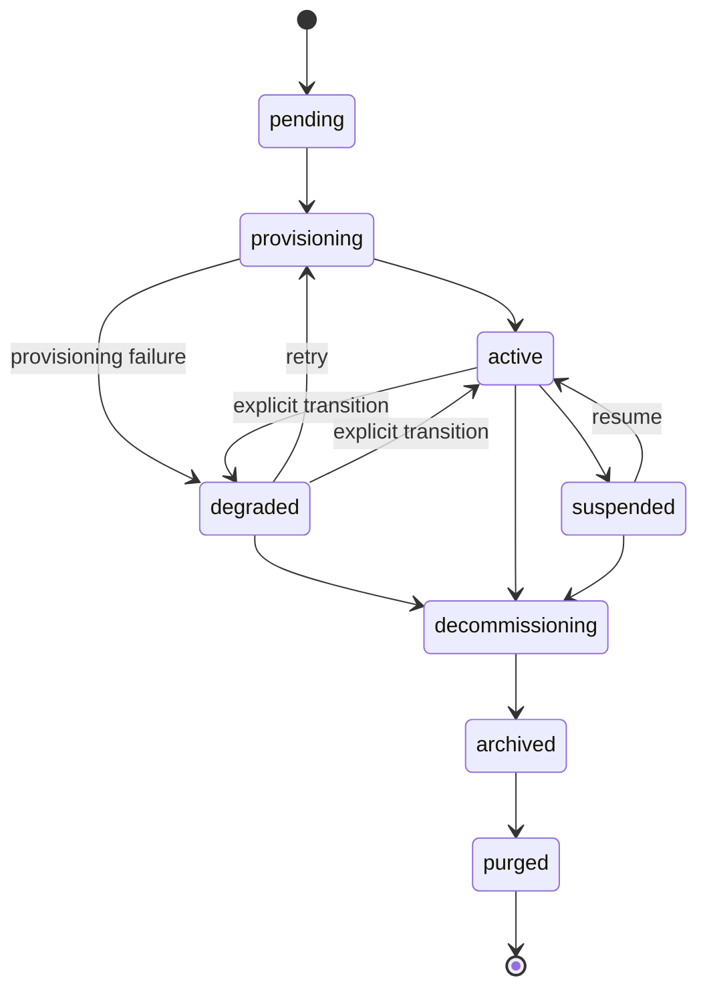

# 租户生命周期

从"上线"到"清除"过程中,客户 SOC 会经历什么。本页是面向操作者的配套文档,与[图表契约](/zh-cn/reference/chart-contract)(记录传输中的值渲染)和[日常运维](/zh-cn/operations)(记录运行手册一侧)相对应。

## 租户状态机



向 `degraded` 的转换**仅通过预配控制器的失败路径发生**(某个阶段抛出了 `ProvisionError`)。没有任何 API 端点可以手动将租户标记为 `degraded`,没有监视适配器心跳时长的自动降级循环,也没有基于指标的降级。`soctalk_tenant_adapter_heartbeat_age_seconds` 度量值会在心跳时更新,但不会反馈到租户状态中。回到 `active` 的转换,是一次成功的 `:retry` 重新预配所产生的副作用。

| 状态 | 含义 | 正在运行什么 |
|---|---|---|
| `pending` | 上线请求已接受,控制器尚未开始预配。 | `tenant-<slug>` 中什么都没有 |
| `provisioning` | 控制器正在创建命名空间、密钥,并通过 helm 安装租户图表。 | 部分——Pod 正在出现 |
| `active` | 预配控制器观察到数据平面 Pod 达到 Ready 后,租户转换为 `active`。 | Wazuh manager + indexer + dashboard + soctalk-adapter + runs-worker |
| `degraded` | 预配控制器在一次预配失败后将租户标记为 `degraded`(或由操作者手动转换)。**本平台当前不会基于适配器心跳时长自动执行 active→degraded 转换**;`soctalk_tenant_adapter_heartbeat_age_seconds` 度量值供你自己告警使用 | 不确定;请检查 Pod |
| `suspended` | MSSP 管理员在数据库中将租户标记为已暂停。**在本版本中,暂停操作本身并不会缩减工作负载**——那需要手动的紧急禁用流程(参见[日常运维 → 紧急禁用](/zh-cn/operations#emergency-disable-a-tenant-immediately))。该状态标志会阻止新调查被调度。 | 不变——除非操作者将其缩减,否则 Pod 继续运行 |
| `decommissioning` | 拆除进行中。Helm release 正在卸载,PVC 正在删除。 | 正在收缩 |
| `archived` | Helm release 已消失;PVC 已删除;租户行为审计目的而保留。 | 什么都没有 |
| `purged` | 租户行已硬删除。 | 什么都没有——只剩审计日志条目 |

允许的转换在 `TenantController.VALID_TRANSITIONS` 中强制执行。尝试暂停一个处于 `decommissioning` 状态的租户会返回 HTTP 409,并附带一份有效的下一状态列表。

## 预配步骤

控制器的 `provision()` 方法按九个有序阶段运行。每个阶段都会发出一条 `TenantLifecycleEvent` 行,可在租户详情页(Lifecycle Events 表)中查看。

| # | 事件 | 发生了什么 |
|---|---|---|
| 1 | `preflight_ok` | 预检检查(集群前置条件、命名冲突)通过。 |
| 2 | `secrets_minted` | 生成每租户密钥(`authd`、JWT 签名、Postgres)。 |
| 3 | `namespace_ready` | 创建带标签、ResourceQuota、LimitRange 的 `tenant-<slug>`。 |
| 4 | `secrets_applied` | 将密钥作为 `Secret/*` 对象推送到新命名空间中的 K8s。 |
| 5 | `helm_applied`(租户图表) | 安装 `soctalk-tenant` 图表(adapter + runs-worker + ingress)。作为此步骤的一部分,tenant_admin 用户会被自动预配(内联 `_mint_tenant_admin_user`)。 |
| 6 | `helm_applied`(Wazuh 图表) | 安装独立的 Wazuh 图表(manager/indexer/dashboard)。事件行的负载标识出应用了哪个图表。 |
| 7 | `workloads_ready` | 轮询直到所有数据平面 Pod 都达到 Ready。 |
| 8 | `integration_config_written` | 将每租户集成配置(LLM、TheHive URL 等)写入数据库。 |
| 9 | `active` | 状态转换到 `active`。 |

任何阶段的失败都会将租户转换为 `degraded`,并将错误记录在事件行中。**重试预配**(`POST /api/mssp/tenants/{id}:retry`)是从 `degraded` 回到 `provisioning` 的有效转换(并且**不**允许从 `pending` 发起——`pending → provisioning` 只在控制器启动首次尝试时自动发生)。`provision()` 在每个阶段上都是幂等的。

## 配置档

配置档在上线时选定,并**在租户的整个生命周期内固定不变**。切换配置档需要 `decommission` + 重建。

### `poc`

用于评估、演示和短期试点。

- StorageClass:`local-path`(k3s 默认;没有真正的持久化保证)
- Wazuh indexer JVM 堆:512 MiB
- 资源请求处于图表范围的低端
- 未接入备份钩子

这是[演示 VM 镜像](/zh-cn/quickstart-vm)为其捆绑的 `demo` 租户所使用的配置档。

### `persistent`

用于生产客户 SOC。

- StorageClass:安装时标记为默认的任意存储(Longhorn、Rook/Ceph、云厂商 CSI)
- Wazuh indexer JVM 堆:图表侧默认值(通常为 2–4 GiB)
- 资源请求/限制按持续负载调整规模
- 若已配置则遵循备份钩子

任何面向客户的场景都请选 `persistent`。若未指定,默认是 `poc`,而这对于真实客户来说是错误的默认值。

### `provided`

用于自带外部部署的 Wazuh 栈的租户("BYO-SIEM")。租户图表只安装 SocTalk adapter + runs-worker;租户命名空间内不运行 Wazuh/TheHive/Cortex。

- StorageClass:无关紧要——只会预配适配器的检查点 PVC
- Wazuh:租户自有的部署,通过 indexer(:9200)和 Manager API(:55000)URL 经网络访问,这些 URL 在上线时提供
- 外部 SIEM 连接材料(`wazuh_indexer_url`、`wazuh_api_url`、basic-auth 凭据)在上线时**必填**,并在服务端验证(不完整则返回 422)
- 每租户 LLM 凭据在上线时同样**必填**(`provided` 没有安装级共享回退)
- 会从提供的 indexer/API 主机名自动派生出一份 Cilium FQDN 出站允许列表

当客户已经在运行 Wazuh 并希望 SocTalk 就地查询它时,请选 `provided`。向导演练(External SIEM 步骤)参见 [MSSP 试点教程 → §3.1](/zh-cn/mssp-pilot#_3-1-run-the-create-customer-wizard),上游协调工作参见 [§3.4](/zh-cn/mssp-pilot#_3-4-coordinating-external-wazuh-creds-for-provided-tenants)。

## 资源配额

每个 `tenant-<slug>` 命名空间在创建时都会获得一个 `ResourceQuota` 和 `LimitRange`,范围限定于该配置档的预期占用。参见[规模规划](/zh-cn/reference/sizing)。

| 配置档 | CPU 请求 | CPU 限制 | 内存请求 | 内存限制 | PVC | Pod |
|---|---|---|---|---|---|---|
| `poc` | 2 | 4 | 4 Gi | 8 Gi | 4 | 20 |
| `persistent` | 2 | 5 | 6 Gi | 12 Gi | 6 | 30 |
| `provided` | 1 | 2 | 2 Gi | 4 Gi | 2 | 10 |

(确切数字位于 [`render.py`](https://github.com/soctalk/soctalk/blob/main/src/soctalk/core/provisioning/render.py) 中的 `_profile_tenant_overrides`。)

如果真实工作负载超出了配置档预算(例如 Wazuh indexer 在高强度摄取期间变慢),请通过带覆盖值的 `helm upgrade` 提高 ResourceQuota。不要直接编辑 ResourceQuota 对象——下一次图表升级会覆盖它。

## 恢复路径

### 上线后租户卡在 `pending`

控制器在第一个阶段运行之前崩溃或被重新调度。不允许直接从 `pending` 重试——先等待预配尝试转换到 `degraded`(在生命周期事件中可见),然后在租户详情页点击**重试预配**(或 `POST /api/mssp/tenants/{id}:retry`)。预配将从阶段 1 恢复;每个阶段都是幂等的。

### 租户处于 `provisioning` 超过 15 分钟

通常是某个卡住的 Pod(ImagePullBackOff、PVC `Pending`、ResourceQuota 太小)。参见[日常运维 — 租户卡在 provisioning](/zh-cn/operations#tenant-stuck-in-provisioning)。

### 租户处于 `degraded`

在 V1 中,`degraded` 只在**预配失败**后进入,而非心跳丢失。如果某租户处于 `degraded`,说明预配控制器在上述 9 个步骤之一失败了——读取生命周期事件行以查看是哪一个。数据平面(Wazuh)可能仍在运行,取决于是哪一步失败。参见[日常运维 — 租户处于 degraded 状态](/zh-cn/operations#tenant-in-degraded-state)。

### 租户处于 `suspended`

这是你有意为之的。从 UI 或 `POST /api/mssp/tenants/<id>:resume` 恢复——但请注意,在本版本中**恢复只更新数据库状态**,它不会恢复副本数量。如果你在暂停期间(通过紧急禁用流程)将工作负载缩减到零,你必须手动将它们扩容回来。

### 租户处于 `decommissioning` 超过 30 分钟

Helm 卸载卡住。最常见的是某个从未运行的 PVC 终结器(finalizer)。执行 `helm uninstall tenant-<slug> -n tenant-<slug> --no-hooks` 并手动移除终结器:

```bash
kubectl -n tenant-<slug> get pvc -o name | \
  xargs -I {} kubectl -n tenant-<slug> patch {} -p '{"metadata":{"finalizers":null}}' --type=merge
```

然后重新触发 decommission。请在审计日志中记录此操作,以保持记录链完整。

## Decommission 与 purge

`decommission` 会拆除数据平面并将租户转换为 `archived`——租户行和审计历史会保留。`purged` 是状态机中的最终终态(`archived → purged`),但**本版本中没有 `:purge` API 端点**。目前,转换到 `purged` 需要一次数据库级更新;受管理员权限门控的 `POST /api/mssp/tenants/{id}:purge` 在路线图上。在它发布之前,请将已下线的租户保留在 `archived`,并将已归档的行视为长期留存面。

## 源码指引

| 概念 | 文件 |
|---|---|
| 租户状态枚举 + 转换 | [`src/soctalk/core/tenancy/models.py`](https://github.com/soctalk/soctalk/blob/main/src/soctalk/core/tenancy/models.py) |
| 预配控制器 | [`src/soctalk/core/provisioning/controller.py`](https://github.com/soctalk/soctalk/blob/main/src/soctalk/core/provisioning/controller.py) |
| 上线 API + 负载 | [`src/soctalk/core/api/tenants.py`](https://github.com/soctalk/soctalk/blob/main/src/soctalk/core/api/tenants.py) |
| 生命周期事件表 | [`src/soctalk/core/tenancy/models.py`](https://github.com/soctalk/soctalk/blob/main/src/soctalk/core/tenancy/models.py) |
